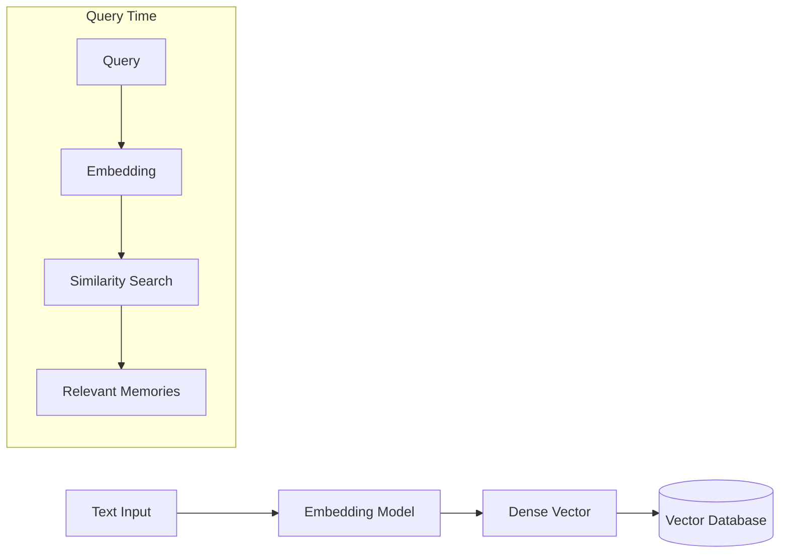

# 📍 Vector Memory — Semantic Recall for Agents
> **Level:** Core Engineering | **Language:** Hinglish | **Goal:** Master the use of Vector Databases to implement fuzzy, semantic memory for large-scale agentic systems.

---

## 🧭 1. Beginner-Friendly Hinglish Explanation
Vector Memory ka matlab hai **"Feeling based yaaddasht"**. 

Insaan ki tarah, AI bhi keywords nahi, balki "Meaning" se cheezein yaad rakhta hai. 
Example: Agar aapne agent ko bola "Mujhe thandi jagah pasand hai", aur 2 din baad pucha "Main kahan ghumne jaun?", toh Vector Memory dhoondh legi ki "Thandi jagah" ka matlab "Shimla ya Switzerland" ho sakta hai. 

Ye kaise hota hai? Text ko numbers (**Vectors**) mein badal kar unhe ek map par plot karke. Jo baatein similar hoti hain, wo map par paas-paas hoti hain.

---

## 🧠 2. Deep Technical Explanation
Vector memory enables **Semantic Search** (instead of Keyword search).
- **Embedding Models:** We use models like `text-embedding-3-small` or `nomic-embed-text` to turn strings into fixed-length arrays of floats (Vectors).
- **Vector Database:** Specialized stores like **Pinecone**, **Milvus**, or **Chroma** that can perform **Cosine Similarity** or **Euclidean Distance** calculations across millions of vectors in milliseconds.
- **Recall Cycle:** 
    1. User Query → Vector.
    2. Search Vector DB for closest matches.
    3. Inject matches into Prompt.
- **Hybrid Search:** 2026 standard is combining Vector Search (Meaning) with BM25 (Exact Keywords) for the best results.

---

## 🏗️ 3. Architecture Diagrams



---

## 💻 4. Production-Ready Code Example (Simple Vector Memory)

```python
# Using ChromaDB as an example (Local & Fast)
import chromadb

def setup_vector_memory():
    # Hinglish Logic: Ek digital map (Collection) banao
    client = chromadb.Client()
    collection = client.create_collection(name="agent_memory")
    return collection

def store_fact(collection, doc_id, text):
    collection.add(
        documents=[text],
        ids=[doc_id]
    )

def recall_fact(collection, query):
    results = collection.query(
        query_texts=[query],
        n_results=1
    )
    return results['documents'][0][0]

# memory = setup_vector_memory()
# store_fact(memory, "id1", "User's favorite color is Deep Blue.")
# print(recall_fact(memory, "What color does the user like?"))
```

---

## 🌍 5. Real-World Use Cases
- **Document Q&A:** Asking questions about a 500-page manual. The agent uses vector memory to find the exact page.
- **Customer Profiling:** Automatically retrieving a customer's past complaints when they start a new chat.
- **Dynamic Coding:** Finding similar code snippets from a large repository to help the agent write new functions.

---

## ❌ 6. Failure Cases
- **Semantic Noise:** Agent ko aisi info milti hai jo mathematically similar hai par contextually galat (e.g., "Apple" fruit vs "Apple" company).
- **Stale Embeddings:** Model change karne par purane vectors kaam nahi karte (Re-indexing required).
- **Metadata Filtering Failure:** Retrieval bina date filter ke hoti hai, isliye agent ko 2 saal purani (outdated) info mil jati hai.

---

## 🛠️ 7. Debugging Guide
- **Visualize the Clusters:** `t-SNE` ya `UMAP` use karke dekhein ki aapka data vector space mein kahan clustered hai.
- **Similarity Threshold:** Agar score 0.7 se kam hai, toh use "High Confidence" na maanein.

---

## ⚖️ 8. Tradeoffs
- **Vector Search:** Handles "Fuzzy" questions perfectly but can be slow and expensive to index.
- **Keyword Search:** Precise for names/dates but fails if the user uses a synonym.

---

## ✅ 9. Best Practices
- **Chunking:** Poore document ko ek vector na banayein. Use **Recursive Character Splitting** (300-500 tokens per chunk).
- **Re-ranking:** Retrieval ke baad ek smaller LLM (Cross-encoder) use karein to re-rank the top 5 results for accuracy.

---

## 🛡️ 10. Security Concerns
- **Vector Inversion:** Research shows that sometimes raw text can be reconstructed from vectors. Don't store plain PII in vector memory.
- **Access Control at Chunk Level:** Ensure metadata includes "Owner ID" so one user's search doesn't see another's vectors.

---

## 📈 11. Scaling Challenges
- **Indexing Latency:** 10 Million vectors index karne mein hours lag sakte hain.
- **HNSW Algorithm:** Understanding how graphs (Hierarchical Navigable Small World) speed up search but consume more RAM.

---

## 💰 12. Cost Considerations
- **Managed Vector DBs:** Pinecone/Weaviate can be expensive. For low budget, use **Postgres + pgvector** on a standard server.

---

## 📝 13. Interview Questions
1. **"Cosine Similarity vs Euclidean Distance mein kab kya use karoge?"**
2. **"Semantic search hallucinations ko kaise minimize karta hai?"**
3. **"Chunking strategy vector memory quality ko kaise affect karti hai?"**

---

## ⚠️ 14. Common Mistakes
- **No Overlap:** Chunks ke beech mein overlap na rakhna (Information cut jati hai).
- **Ignoring Metadata:** Sirf vector par depend karna bina categories ya user_ids ke.

---

## 🚀 15. Latest 2026 Industry Patterns
- **ColBERT / Multi-vector retrieval:** Each token is a vector, allowing for much more granular "Token-level" similarity.
- **Graph-Vector Hybrid:** Linking vector memories into a Graph so the agent can traverse from one memory to a "Related" one.

---

> **Expert Tip:** Vector memory is the **Search Engine** of the agent's brain. Without it, the agent is restricted to only what it can "Attentively" hold in its context window.
