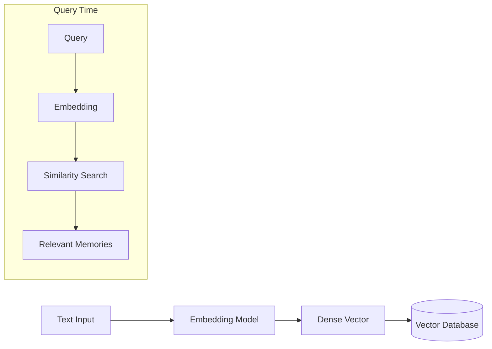

# 📍 Vector Memory — Agents Ke Liye Semantic Recall
> **Level:** Core Engineering | **Language:** Hinglish | **Goal:** Large-scale agentic systems ke liye fuzzy, semantic memory implement karne me Vector Databases ka use master karna.

---

## 🧭 1. Beginner-Friendly Hinglish Explanation
Vector Memory ka matlab hai **"Feeling based yaaddasht"**. 

Insaan ki tarah, AI bhi keywords nahi, balki "Meaning" se cheezein yaad rakhta hai. 
Example: Agar aapne agent ko bola "Mujhe thandi jagah pasand hai", aur 2 din baad pucha "Main kahan ghumne jaun?", toh Vector Memory dhoondh legi ki "Thandi jagah" ka matlab "Shimla ya Switzerland" ho sakta hai. 

Ye kaise hota hai? Text ko numbers (**Vectors**) mein badal kar unhe ek map par plot karke. Jo baatein similar hoti hain, wo map par paas-paas hoti hain.

---

## 🧠 2. Deep Technical Explanation
Vector memory **Semantic Search** enable karti hai (Keyword search ke bajay).
- **Embedding Models:** Hum `text-embedding-3-small` ya `nomic-embed-text` jaise models use karte hain jo strings ko fixed-length floats arrays (Vectors) me convert karte hain.
- **Vector Database:** **Pinecone**, **Milvus**, ya **Chroma** jaise specialized stores jo millions of vectors across milliseconds me **Cosine Similarity** ya **Euclidean Distance** calculations perform kar sakte hain.
- **Recall Cycle:** 
    1. User Query → Vector.
    2. Closest matches ke liye Vector DB search.
    3. Matches ko Prompt me inject.
- **Hybrid Search:** 2026 standard best results ke liye Vector Search (Meaning) ko BM25 (Exact Keywords) ke saath combine karna hai.

---

## 🏗️ 3. Architecture Diagrams


```mermaid
graph LR
    T[Text Input] --> E[Embedding Model]
    E --> V[Dense Vector]
    V --> DB[(Vector Database)]
    
    subgraph "Query Time"
    Q[Query] --> QE[Embedding]
    QE --> S[Similarity Search]
    S --> R[Relevant Memories]
    end
```

---

## 💻 4. Production-Ready Code Example (Simple Vector Memory)

```python
# ChromaDB ko example ke roop me use kar rahe hain (Local & Fast)
import chromadb

def setup_vector_memory():
    # Hinglish Logic: Ek digital map (Collection) banao
    client = chromadb.Client()
    collection = client.create_collection(name="agent_memory")
    return collection

def store_fact(collection, doc_id, text):
    collection.add(
        documents=[text],
        ids=[doc_id]
    )

def recall_fact(collection, query):
    results = collection.query(
        query_texts=[query],
        n_results=1
    )
    return results['documents'][0][0]

# memory = setup_vector_memory()
# store_fact(memory, "id1", "User ka favorite color Deep Blue hai.")
# print(recall_fact(memory, "User ko kaunsa color pasand hai?"))
```

---

## 🌍 5. Real-World Use Cases
- **Document Q&A:** 500-page manual ke baare me questions puchna. Agent exact page find karne ke liye vector memory use karta hai.
- **Customer Profiling:** Jab customer new chat start karta hai to automatically uski past complaints retrieve karna.
- **Dynamic Coding:** Agent ko new functions likhne me help karne ke liye large repository se similar code snippets find karna.

---

## ❌ 6. Failure Cases
- **Semantic Noise:** Agent ko aisi info milti hai jo mathematically similar hai par contextually galat (e.g., "Apple" fruit vs "Apple" company).
- **Stale Embeddings:** Model change karne par purane vectors kaam nahi karte (Re-indexing required).
- **Metadata Filtering Failure:** Retrieval bina date filter ke hoti hai, isliye agent ko 2 saal purani (outdated) info mil jati hai.

---

## 🛠️ 7. Debugging Guide
- **Visualize the Clusters:** `t-SNE` ya `UMAP` use karke dekhein ki aapka data vector space mein kahan clustered hai.
- **Similarity Threshold:** Agar score 0.7 se kam hai, toh use "High Confidence" na maanein.

---

## ⚖️ 8. Tradeoffs
- **Vector Search:** "Fuzzy" questions perfectly handle karta hai, lekin index karne me slow aur expensive ho sakta hai.
- **Keyword Search:** Names/dates ke liye precise hota hai, lekin user synonym use kare to fail ho jata hai.

---

## ✅ 9. Best Practices
- **Chunking:** Poore document ko ek vector na banayein. Use **Recursive Character Splitting** (300-500 tokens per chunk).
- **Re-ranking:** Retrieval ke baad accuracy ke liye top 5 results re-rank karne ko smaller LLM (Cross-encoder) use karein.

---

## 🛡️ 10. Security Concerns
- **Vector Inversion:** Research dikhati hai ki kabhi-kabhi vectors se raw text reconstruct ho sakta hai. Vector memory me plain PII store na karein.
- **Access Control at Chunk Level:** Ensure karein ki metadata me "Owner ID" ho taaki ek user ki search doosre ke vectors na dekhe.

---

## 📈 11. Scaling Challenges
- **Indexing Latency:** 10 Million vectors index karne mein hours lag sakte hain.
- **HNSW Algorithm:** Understanding how graphs (Hierarchical Navigable Small World) speed up search but consume more RAM.

---

## 💰 12. Cost Considerations
- **Managed Vector DBs:** Pinecone/Weaviate expensive ho sakte hain. Low budget ke liye standard server par **Postgres + pgvector** use karein.

---

## 📝 13. Interview Questions
1. **"Cosine Similarity vs Euclidean Distance mein kab kya use karoge?"**
2. **"Semantic search hallucinations ko kaise minimize karta hai?"**
3. **"Chunking strategy vector memory quality ko kaise affect karti hai?"**

---

## ⚠️ 14. Common Mistakes
- **No Overlap:** Chunks ke beech mein overlap na rakhna (Information cut jati hai).
- **Ignoring Metadata:** Sirf vector par depend karna bina categories ya user_ids ke.

---

## 🚀 15. Latest 2026 Industry Patterns
- **ColBERT / Multi-vector retrieval:** Har token ek vector hota hai, jisse much more granular "Token-level" similarity possible hoti hai.
- **Graph-Vector Hybrid:** Vector memories ko Graph me link karna taaki agent ek memory se "Related" memory tak traverse kar sake.

---

> **Expert Tip:** Vector memory agent ke brain ka **Search Engine** hai. Iske bina agent sirf wahi tak restricted hai jo wo apne context window me "Attentively" hold kar sakta hai.
