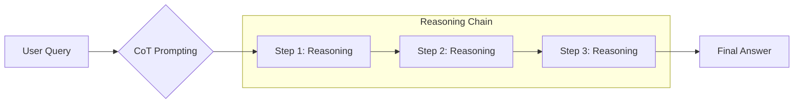

# ⛓️ Chain-of-Thought (CoT) — Teaching Agents to Think
> **Level:** Core Engineering | **Language:** Hinglish | **Goal:** Master the fundamental reasoning technique that enables LLMs to solve complex problems by breaking them into logical steps.

---

## 🧭 1. Beginner-Friendly Hinglish Explanation
Chain-of-Thought (CoT) ka matlab hai **"Sawal ko step-by-step solve karna"**. 

Imagine aapne bache se pucha: "Agar 5 apple hain aur 2 khaye, toh kitne bache?" Baccha turant "3" bolega. Lekin agar aap mushkil sawal puchenge, toh aap use bolenge "Beta, pehle socho, phir likho." 

AI ke liye bhi yahi logic hai. Jab hum model ko "Let's think step by step" bolte hain, toh wo direct answer dene ki bajah pehle apna "Dimaag" (Reasoning) papel par utarta hai. Isse galti hone ke chances bahut kam ho jate hain.

---

## 🧠 2. Deep Technical Explanation
CoT is a **Zero-shot or Few-shot Prompting Technique** that leverages the LLM's autoregressive nature.
- **The Mechanism:** By forcing the model to generate intermediate reasoning tokens, the probability of the final answer token becomes conditioned on the correct logical sequence.
- **Zero-shot CoT:** Simply adding "Let's think step by step" to the prompt.
- **Few-shot CoT:** Providing examples that include a `Reasoning:` section before the `Answer:`.
- **Cognitive Trace:** CoT creates a "trace" that can be audited. If the agent fails, you can see *exactly* at which logical step it went wrong.
- **Limitations:** CoT is slow (more tokens generated) and doesn't guarantee accuracy for highly non-linear problems.

---

## 🏗️ 3. Architecture Diagrams



---

## 💻 4. Production-Ready Code Example (Few-shot CoT Prompt)

```python
COT_PROMPT = """
Q: If John has 5 apples and eats 2, how many are left?
A: Let's think step by step. 
1. John starts with 5 apples.
2. He eats 2, so we subtract 2 from 5.
3. 5 - 2 = 3.
Answer: 3

Q: If a train leaves at 2 PM and travels for 3 hours, what time does it arrive?
A: Let's think step by step.
1. Starting time is 2 PM.
2. Duration is 3 hours.
3. 2 + 3 = 5.
Answer: 5 PM

Q: {user_query}
A: Let's think step by step.
"""

def get_cot_response(query: str):
    # Hinglish Logic: User query ko template mein dalo taaki model step-by-step soche
    full_prompt = COT_PROMPT.format(user_query=query)
    print(f"Sending prompt to LLM...")
    # llm.generate(full_prompt)
```

---

## 🌍 5. Real-World Use Cases
- **Mathematical Problem Solving:** Breaking down complex equations into arithmetic steps.
- **Legal Reasoning:** Comparing a case against multiple laws step-by-step.
- **Logic Puzzles:** Solving riddles where direct intuition often fails.

---

## ❌ 6. Failure Cases
- **Logical Hallucination:** Agent step 1 mein sahi hota hai, par step 2 mein galat logic apply kar deta hai (Reasoning drift).
- **Infinite Looping:** Agent ek hi step ko baar-baar repeat karta hai (Common in smaller models).
- **Over-thinking:** Simple sawal (2+2) ke liye bhi 10 steps ka explanation likhna (Token waste).

---

## 🛠️ 7. Debugging Guide
- **Trace Analysis:** Check karein ki reasoning kahan diverge hui.
- **Stop Sequences:** Use stop sequences like `Answer:` to extract the final result easily.

---

## ⚖️ 8. Tradeoffs
- **Accuracy:** Bahut high ho jati hai logical tasks ke liye.
- **Cost/Latency:** Response slow ho jata hai aur tokens double/triple ho sakte hain.

---

## ✅ 9. Best Practices
- **Use for Logic, not Creative:** Creative writing mein CoT ki zarurat nahi hoti.
- **Self-Consistency:** CoT ke saath 3-5 paths generate karein aur majority answer pick karein.

---

## 🛡️ 10. Security Concerns
- **Reasoning Leaks:** CoT mein agent kabhi-kabhi private data ya internal system logic reveal kar deta hai jo "Final Answer" mein nahi hona chahiye tha.

---

## 📈 11. Scaling Challenges
- **Token Limits:** Bahut complex problem ke liye reasoning itni lambi ho sakti hai ki context window exceed ho jaye.

---

## 💰 12. Cost Considerations
- **Output Token Heavy:** Since reasoning is part of the output, you pay for every thought token.

---

## 📝 13. Interview Questions
1. **"Zero-shot vs Few-shot CoT mein kya difference hai?"**
2. **"CoT models ko hallucinate karne se kaise rokte hain?"**
3. **"CoT latency production mein kaise manage karenge?"**

---

## ⚠️ 14. Common Mistakes
- **No 'Think Step by Step':** Instruction bhool jana (Model will jump to wrong answer).
- **Small Models:** 7B models par CoT try karna (Often reasoning quality poor hoti hai).

---

## 🚀 15. Latest 2026 Industry Patterns
- **Active CoT:** The model dynamically decides *when* it needs to use CoT and when it can answer directly.
- **Chain-of-Verification (CoVe):** After the reasoning chain, the model creates "Verification questions" for its own steps to double-check accuracy.

---

> **Expert Tip:** CoT is the **Scratchpad** of the LLM. Use it whenever the path from Query to Answer involves more than one logical jump.
