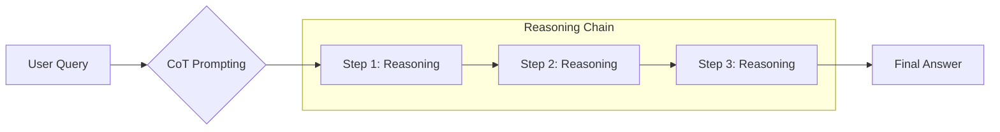

# ⛓️ Chain-of-Thought (CoT) — Agents Ko Sochna Sikhana
> **Level:** Core Engineering | **Language:** Hinglish | **Goal:** Fundamental reasoning technique master karna jo LLMs ko complex problems ko logical steps me tod kar solve karne me help karti hai.

---

## 🧭 1. Beginner-Friendly Hinglish Explanation
Chain-of-Thought (CoT) ka matlab hai **"Sawal ko step-by-step solve karna"**. 

Imagine aapne bache se pucha: "Agar 5 apple hain aur 2 khaye, toh kitne bache?" Baccha turant "3" bolega. Lekin agar aap mushkil sawal puchenge, toh aap use bolenge "Beta, pehle socho, phir likho." 

AI ke liye bhi yahi logic hai. Jab hum model ko "Let's think step by step" bolte hain, toh wo direct answer dene ki bajah pehle apna "Dimaag" (Reasoning) papel par utarta hai. Isse galti hone ke chances bahut kam ho jate hain.

---

## 🧠 2. Deep Technical Explanation
CoT ek **Zero-shot ya Few-shot Prompting Technique** hai jo LLM ki autoregressive nature ka use karti hai.
- **Mechanism:** Model ko intermediate reasoning tokens generate karne ke liye force karne se final answer token ki probability correct logical sequence par conditioned ho jati hai.
- **Zero-shot CoT:** Prompt me simply "Let's think step by step" add karna.
- **Few-shot CoT:** Aise examples provide karna jisme `Answer:` se pehle `Reasoning:` section ho.
- **Cognitive Trace:** CoT ek "trace" create karta hai jise audit kiya ja sakta hai. Agar agent fail ho, to aap *exactly* dekh sakte ho ki kaunse logical step par galti hui.
- **Limitations:** CoT slow hota hai (zyada tokens generate hote hain) aur highly non-linear problems ke liye accuracy guarantee nahi karta.

---

## 🏗️ 3. Architecture Diagrams


```mermaid
graph LR
    U[User Query] --> C{CoT Prompting}
    C --> S1[Step 1: Reasoning]
    S1 --> S2[Step 2: Reasoning]
    S2 --> S3[Step 3: Reasoning]
    S3 --> A[Final Answer]
    
    subgraph "Reasoning Chain"
    S1
    S2
    S3
    end
```

---

## 💻 4. Production-Ready Code Example (Few-shot CoT Prompt)

```python
COT_PROMPT = """
Q: Agar John ke paas 5 apples hain aur wo 2 kha leta hai, to kitne bachte hain?
A: Let's think step by step. 
1. John 5 apples ke saath start karta hai.
2. Wo 2 kha leta hai, isliye hum 5 me se 2 subtract karte hain.
3. 5 - 2 = 3.
Answer: 3

Q: Agar train 2 PM par nikalti hai aur 3 hours travel karti hai, to kis time arrive karegi?
A: Let's think step by step.
1. Start ka time 2 PM hai.
2. Duration 3 hours hai.
3. 2 + 3 = 5.
Answer: 5 PM

Q: {user_query}
A: Let's think step by step.
"""

def get_cot_response(query: str):
    # Hinglish Logic: User query ko template mein dalo taaki model step-by-step soche
    full_prompt = COT_PROMPT.format(user_query=query)
    print(f"Prompt LLM ko bhej rahe hain...")
    # llm.generate(full_prompt)
```

---

## 🌍 5. Real-World Use Cases
- **Math Problems Solve Karna:** Complex equations ko arithmetic steps me break down karna.
- **Legal Reasoning:** Ek case ko multiple laws ke against step-by-step compare karna.
- **Logic Puzzles:** Aise riddles solve karna jahan direct intuition aksar fail ho jati hai.

---

## ❌ 6. Failure Cases
- **Logical Hallucination:** Agent step 1 mein sahi hota hai, par step 2 mein galat logic apply kar deta hai (Reasoning drift).
- **Infinite Looping:** Agent ek hi step ko baar-baar repeat karta hai (Common in smaller models).
- **Over-thinking:** Simple sawal (2+2) ke liye bhi 10 steps ka explanation likhna (Token waste).

---

## 🛠️ 7. Debugging Guide
- **Trace Analysis:** Check karein ki reasoning kahan diverge hui.
- **Stop Sequences:** Final result easily extract karne ke liye `Answer:` jaise stop sequences use karein.

---

## ⚖️ 8. Tradeoffs
- **Accuracy:** Bahut high ho jati hai logical tasks ke liye.
- **Cost/Latency:** Response slow ho jata hai aur tokens double/triple ho sakte hain.

---

## ✅ 9. Best Practices
- **Logic Ke Liye Use Karein, Creative Ke Liye Nahi:** Creative writing me CoT ki zarurat nahi hoti.
- **Self-Consistency:** CoT ke saath 3-5 paths generate karein aur majority answer pick karein.

---

## 🛡️ 10. Security Concerns
- **Reasoning Leaks:** CoT mein agent kabhi-kabhi private data ya internal system logic reveal kar deta hai jo "Final Answer" mein nahi hona chahiye tha.

---

## 📈 11. Scaling Challenges
- **Token Limits:** Bahut complex problem ke liye reasoning itni lambi ho sakti hai ki context window exceed ho jaye.

---

## 💰 12. Cost Considerations
- **Output Token Heavy:** Kyunki reasoning output ka part hoti hai, aap har thought token ke liye pay karte hain.

---

## 📝 13. Interview Questions
1. **"Zero-shot vs Few-shot CoT mein kya difference hai?"**
2. **"CoT models ko hallucinate karne se kaise rokte hain?"**
3. **"CoT latency production mein kaise manage karenge?"**

---

## ⚠️ 14. Common Mistakes
- **'Think Step by Step' Nahi Dena:** Instruction bhool jana (model wrong answer par jump kar sakta hai).
- **Small Models:** 7B models par CoT try karna (aksar reasoning quality poor hoti hai).

---

## 🚀 15. Latest 2026 Industry Patterns
- **Active CoT:** Model dynamically decide karta hai ki *kab* CoT use karna hai aur kab directly answer kar sakta hai.
- **Chain-of-Verification (CoVe):** Reasoning chain ke baad model accuracy double-check karne ke liye apne steps ke liye "Verification questions" create karta hai.

---

> **Expert Tip:** CoT LLM ka **Scratchpad** hai. Jab Query se Answer tak ka path ek se zyada logical jumps involve kare, tab ise use karein.
