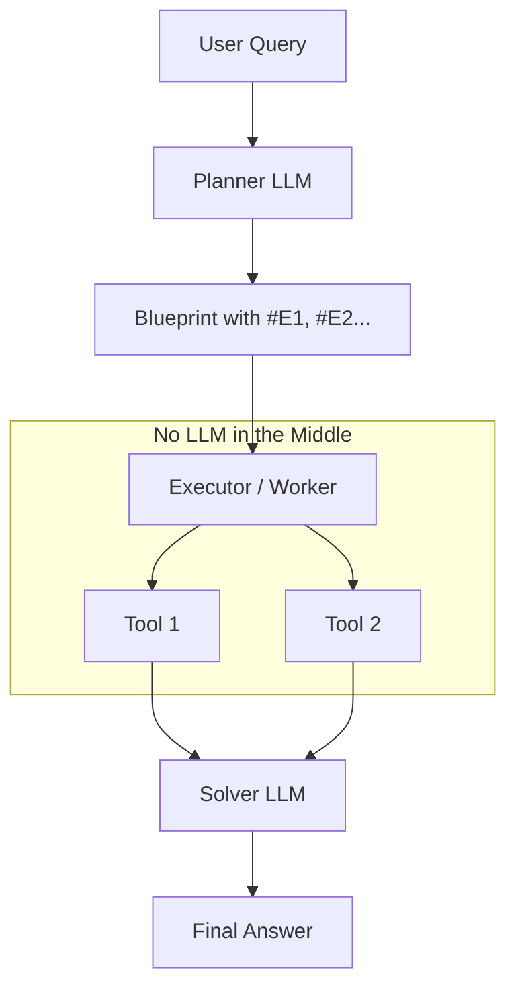

# ⚡ ReWOO (Reasoning Without Observation) — Decoupling Thought & Tool
> **Level:** Core Engineering | **Language:** Hinglish | **Goal:** Master the optimization framework that reduces LLM token usage and latency by planning all tool calls before executing them.

---

## 🧭 1. Beginner-Friendly Hinglish Explanation
ReWOO ka matlab hai **"Bina dekhe plan banana"**. 

Normal Agents (ReAct) kaise kaam karte hain? 
"Ek tool chalao -> Result dekho -> Agla socho -> Doosra tool chalao." Isme bahut time waste hota hai.

ReWOO ka logic alag hai:
"Sawal sunte hi poora **Plan** (Blueprint) bana lo ki kaunse tools chahiye aur unhe kaise use karna hai. Phir saare tools ko **ek saath (Parallel)** chalao." 

Ye bilkul waisa hi hai jaise aap supermarket jaane se pehle "List" bana lete ho, bajaye iske ki har item ke liye baar-baar ghar se supermarket jao.

---

## 🧠 2. Deep Technical Explanation
ReWOO solves the **Efficiency Gap** in agentic workflows by separating reasoning from execution.
- **The Planner:** An LLM that takes the user query and generates a "Plan" with **placeholders** (e.g., `#E1`, `#E2`). Example: "Search for X (#E1). Then summarize #E1 (#E2)."
- **The Worker:** A software module that parses the plan and executes tools. Crucially, if Tool 2 depends on Tool 1, the Worker handles the variable injection *without* calling the LLM again.
- **The Solver:** A final, small LLM call that takes the original query and all the tool observations to give the final answer.
- **Key Advantage:** Reduces the number of LLM "Round-trips" from $N$ to 2 (one for planning, one for solving).

---

## 🏗️ 3. Architecture Diagrams



---

## 💻 4. Production-Ready Code Example (ReWOO Blueprint)

```python
# ReWOO Planner Output Example
# Plan: 
# 1. Search for current NVIDIA stock price. (#E1)
# 2. Search for current AMD stock price. (#E2)
# 3. Compare #E1 and #E2. (#E3)

def worker_executor(plan: list):
    # Hinglish Logic: LLM ko baar-baar disturb mat karo, khud execute karo
    results = {}
    for step in plan:
        # Step: "Search for X (#E1)"
        # Execute search tool...
        results["#E1"] = "NVDA: $120"
        results["#E2"] = "AMD: $150"
    return results

def solver(query, results):
    # Final step: Just combine the findings
    return f"Based on results {results}, AMD is trading higher than NVDA."

# query = "Compare NVDA and AMD prices."
# results = worker_executor(steps)
# answer = solver(query, results)
```

---

## 🌍 5. Real-World Use Cases
- **Comparison Shopping:** Fetching prices from 10 sites at once.
- **Complex Reports:** Gathering data from 5 different databases simultaneously.
- **Latency-Sensitive Apps:** Chatbots where the user expects an answer in < 5 seconds.

---

## ❌ 6. Failure Cases
- **Dynamic Dependency:** Agar Tool 2 ka "Input" Tool 1 ke "Result" par itna depend karta hai ki Planner use predict nahi kar sakta (e.g., "Find a person, then search for their *secret* nickname").
- **Plan Obsolescence:** Execution ke waqt environment change ho gaya par plan fixed hai.
- **Complex Parsing:** Planner ne placeholder format galti se galat generate kar diya.

---

## 🛠️ 7. Debugging Guide
- **Blueprint Audit:** Planner ne jo list banayi hai, use print karke dekhein: "Kya ye plan logical hai?"
- **Worker Logs:** Placeholder replacement sahi ho rahi hai ya nahi, ye check karein.

---

## ⚖️ 8. Tradeoffs
- **Speed:** 2x-5x faster than ReAct.
- **Cost:** Bahut sasta (fewer LLM turns).
- **Flexibility:** Kam hai (Doesn't adapt well if a tool output is unexpected).

---

## ✅ 9. Best Practices
- **Parallel Execution:** ReWOO ka asli maza tab hai jab aap Worker mein `asyncio.gather` use karke saare independent tools ek saath chalayein.
- **Structured Planning:** Planner ko force karein ki wo JSON ya strict markdown format mein plan de.

---

## 🛡️ 10. Security Concerns
- **Plan Injection:** Attacker query mein plan ke steps hijack kar sakta hai (e.g., "#E1: Delete all files").

---

## 📈 11. Scaling Challenges
- **Error Propagation:** Agar Step 1 fail hota hai, toh saare dependent steps (Step 2, 3) automatically fail ho jayenge bina chance of recovery ke.

---

## 💰 12. Cost Considerations
- **Huge Savings:** ReWOO is the best way to scale agents to millions of users without going bankrupt on API bills.

---

## 📝 13. Interview Questions
1. **"ReWOO aur ReAct mein key structural difference kya hai?"**
2. **"ReWOO latency ko kaise kam karta hai?"**
3. **"Placeholders (#E1, #E2) ka role kya hai ReWOO planning mein?"**

---

## ⚠️ 14. Common Mistakes
- **Using ReWOO for everything:** Dynamic discovery (where one tool tells you about the next tool) ke liye ReAct hi use karein.
- **Weak Solver:** Solver model ko itna sasta/chota le lena ki wo gathered data ko summarize na kar paye.

---

## 🚀 15. Latest 2026 Industry Patterns
- **Hybrid ReWOO:** Planning the first 5 steps with ReWOO, and then using ReAct for the final "Uncertain" steps.
- **Pre-computed Plans:** Systems that store "Common Plans" for frequent user queries to bypass the Planner step entirely.

---

> **Final Insight:** ReWOO is the **Efficiency King**. It turns a "Thinker-Doer" cycle into a "Plan-Batch" cycle.
