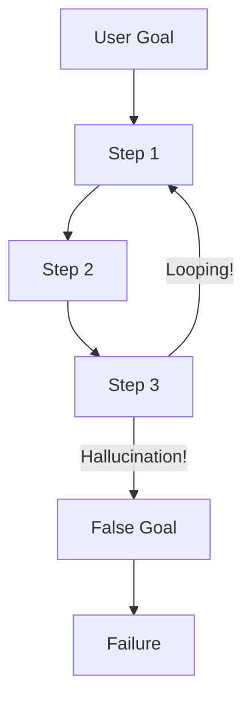

# ❌ Reasoning Failure Cases — Why Agents Fail
> **Level:** Core Engineering | **Language:** Hinglish | **Goal:** Master the identification and mitigation of common reasoning pitfalls in autonomous agents.

---

## 🧭 1. Beginner-Friendly Hinglish Explanation
Reasoning Failure ka matlab hai **"AI ka dimaag chalna band ho jana"**. 

Jaise kabhi-kabhi hum koi kaam karte waqt "Kho jate hain" ya loop mein phas jate hain, AI ke saath bhi wahi hota hai. 
- **Infinite Loops:** Agent ek hi kaam baar-baar karta rehta hai.
- **Hallucinations:** Agent jhoot bolne lagta hai par itne confidence se ki wo sach lagta hai.
- **Goal Drift:** Kaam shuru kiya tha "Flight book karne" ke liye, par 10 steps baad agent "Dubai ki history" padhne laga.

In failures ko samajhna zaruri hai taaki hum unhe **Guardrails** se rok sakein.

---

## 🧠 2. Deep Technical Explanation
Reasoning failures typically fall into four categories:
1. **Logic Loops:** The agent's thought process enters a cycle where `Observation N` leads back to `Action 1`.
2. **Context Saturation:** The "Lost-in-the-middle" effect where critical reasoning steps are buried in a large context window, leading to forgotten goals.
3. **Knowledge Conflicts:** The agent's internal weights (pre-trained knowledge) conflict with the provided tool observations (e.g., Tool says price is $10, LLM "thinks" it should be $20).
4. **Instruction Fatigue:** In long-running agents, the model gradually ignores the original "System Prompt" constraints.

---

## 🏗️ 3. Architecture Diagrams



---

## 💻 4. Production-Ready Code Example (Loop Detection Guardrail)

```python
class AgentMonitor:
    def __init__(self, max_repeats=3):
        self.action_history = []
        self.max_repeats = max_repeats

    def check_for_loop(self, current_action):
        # Hinglish Logic: Dekho kya agent wahi kaam baar-baar kar raha hai
        self.action_history.append(current_action)
        if self.action_history.count(current_action) > self.max_repeats:
            return True
        return False

# monitor = AgentMonitor()
# if monitor.check_for_loop("search_weather"):
#    print("🚨 ALERT: Infinite Loop detected. Breaking execution.")
```

---

## 🌍 5. Real-World Use Cases
- **Customer Service:** Preventing the bot from repeatedly asking the user for the same "Account Number".
- **Coding Agents:** Stopping the agent from trying the same buggy code fix over and over without changing strategy.

---

## ❌ 6. Failure Cases (Detailed)
- **The "Yes-Man" Loop:** Agent user se "Confirm" mangta hai, user deta hai, agent phir se confirm mangta hai.
- **Confidence Gap:** Tool fail hota hai par agent confident hota hai ki wo sahi hai, isliye wo retry nahi karta (False Success).

---

## 🛠️ 7. Debugging Guide
- **Trace the 'Thought' vs 'Observation':** Agar thought logic ke against hai, toh problem System Prompt mein hai.
- **Log Logits:** Check tokens probability to see if the model was "uncertain" during the failure step.

---

## ⚖️ 8. Tradeoffs
- **Strict Monitoring:** Breaks loops but might stop valid complex multi-step processes.
- **Relaxed Monitoring:** Allows complex tasks but wastes tokens on failures.

---

## ✅ 9. Best Practices
- **Max Iterations:** Humesha `max_steps=10` set karein.
- **Self-Correction Checkpoints:** Har 5 steps ke baad agent se pucho: "Kya tum goal ke paas ja rahe ho?"

---

## 🛡️ 10. Security Concerns
- **Intent Hijacking:** Hacker agent ko aisi reasoning trajectory mein bhej sakta hai jo user ke liye "Invisible" ho (Background data theft).

---

## 📈 11. Scaling Challenges
- **Monitoring Overhead:** 1000 agents ke loops real-time mein monitor karna requires high-speed streaming analytics.

---

## 💰 12. Cost Considerations
- **Failure Refund:** If an agent fails after 20 steps, you've already paid for 20 rounds of tokens. Prevention is 10x cheaper than recovery.

---

## 📝 13. Interview Questions
1. **"Reasoning drift ko kaise minimize karenge?"**
2. **"Infinite loops in agents: Detection and Mitigation strategies?"**
3. **"Hallucination vs Reasoning error mein kya difference hai?"**

---

## ⚠️ 14. Common Mistakes
- **Assuming 100% Reliability:** AI hamesha sahi sochega, ye sochna sabse badi galti hai.
- **No Progress Tracking:** Agent ko ye na batana ki wo kitne percent kaam khatam kar chuka hai.

---

## 🚀 15. Latest 2026 Industry Patterns
- **Multi-Agent Sanity Check:** One agent works, another "Watchdog" agent monitors its reasoning steps and "Kills" the process if it detects a drift.
- **Rule-based Reasoning Overrides:** Hard-coding "If/Else" logic for critical paths that agents are not allowed to deviate from.

---

> **Expert Tip:** Don't just look at the **Final Answer**. Look at the **Steps**. The most dangerous failure is the one that gives the right answer with the wrong reasoning.
