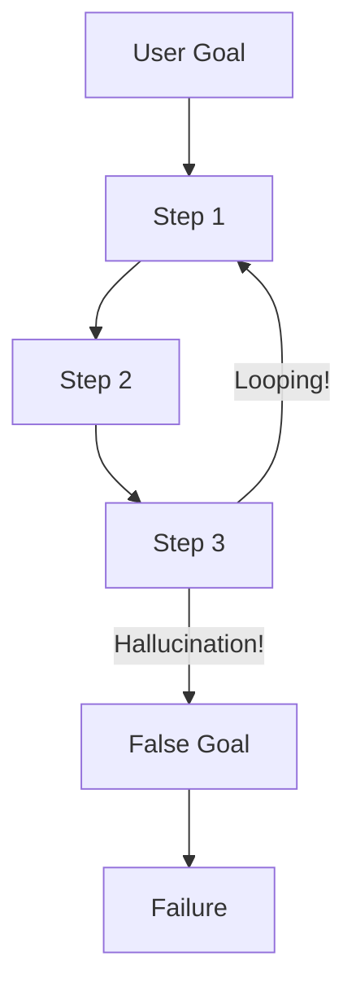

# ❌ Reasoning Failure Cases — Why Agents Fail
> **Level:** Core Engineering | **Language:** Hinglish | **Goal:** Autonomous agents mein hone wale common reasoning pitfalls ko identify aur mitigate karne mein master banein.

---

## 🧭 1. Beginner-Friendly Hinglish Explanation
Reasoning Failure ka matlab hai **"AI ka dimaag chalna band ho jana"**. 

Jaise kabhi-kabhi hum koi kaam karte waqt "Kho jate hain" ya loop mein phas jate hain, AI ke saath bhi wahi hota hai. 
- **Infinite Loops:** Agent ek hi kaam baar-baar karta rehta hai.
- **Hallucinations:** Agent jhoot bolne lagta hai par itne confidence se ki wo sach lagta hai.
- **Goal Drift:** Kaam shuru kiya tha "Flight book karne" ke liye, par 10 steps baad agent "Dubai ki history" padhne laga.

In failures ko samajhna zaruri hai taaki hum unhe **Guardrails** se rok sakein.

---

## 🧠 2. Deep Technical Explanation
Reasoning failures typically chaar categories mein aate hain:
1. **Logic Loops:** Agent ka thought process ek cycle mein chala jata hai jahan `Observation N` wapas `Action 1` ki taraf le jata hai.
2. **Context Saturation:** "Lost-in-the-middle" effect jahan critical reasoning steps ek bade context window mein dab jate hain, jisse goals bhool jate hain.
3. **Knowledge Conflicts:** Agent ke internal weights (pre-trained knowledge) aur provided tool observations ke beech conflict hona (e.g., Tool kehta hai price $10 hai, par LLM ko "lagta" hai ki $20 hona chahiye).
4. **Instruction Fatigue:** Long-running agents mein, model gradually original "System Prompt" constraints ko ignore karne lagta hai.

---

## 🏗️ 3. Architecture Diagrams


```mermaid
graph TD
    U[User Goal] --> S[Step 1]
    S --> S2[Step 2]
    S2 --> S3[Step 3]
    S3 -- "Hallucination!" --> H[False Goal]
    H --> F[Failure]
    
    S3 -- "Looping!" --> S
```

---

## 💻 4. Production-Ready Code Example (Loop Detection Guardrail)

```python
class AgentMonitor:
    def __init__(self, max_repeats=3):
        self.action_history = []
        self.max_repeats = max_repeats

    def check_for_loop(self, current_action):
        # Hinglish Logic: Dekho kya agent wahi kaam baar-baar kar raha hai
        self.action_history.append(current_action)
        if self.action_history.count(current_action) > self.max_repeats:
            return True
        return False

# monitor = AgentMonitor()
# if monitor.check_for_loop("search_weather"):
#    print("🚨 ALERT: Infinite Loop detected. Breaking execution.")
```

---

## 🌍 5. Real-World Use Cases
- **Customer Service:** Bot ko user se baar-baar same "Account Number" poochne se rokna.
- **Coding Agents:** Agent ko bina strategy change kiye baar-baar same buggy code fix try karne se rokna.

---

## ❌ 6. Failure Cases (Detailed)
- **The "Yes-Man" Loop:** Agent user se "Confirm" mangta hai, user deta hai, agent phir se confirm mangta hai.
- **Confidence Gap:** Tool fail hota hai par agent confident hota hai ki wo sahi hai, isliye wo retry nahi karta (False Success).

---

## 🛠️ 7. Debugging Guide
- **Trace the 'Thought' vs 'Observation':** Agar thought logic ke against hai, toh problem System Prompt mein hai.
- **Log Logits:** Tokens probability check karein taaki dekh sakein ki kya model failure step ke dauran "uncertain" tha.

---

## ⚖️ 8. Tradeoffs
- **Strict Monitoring:** Loops ko toh break karta hai par valid complex multi-step processes ko bhi rok sakta hai.
- **Relaxed Monitoring:** Complex tasks allow karta hai par failures par tokens waste hote hain.

---

## ✅ 9. Best Practices
- **Max Iterations:** Hamesha `max_steps=10` set karein.
- **Self-Correction Checkpoints:** Har 5 steps ke baad agent se pucho: "Kya tum goal ke paas ja rahe ho?"

---

## 🛡️ 10. Security Concerns
- **Intent Hijacking:** Hacker agent ko aisi reasoning trajectory mein bhej sakta hai jo user ke liye "Invisible" ho (Background data theft).

---

## 📈 11. Scaling Challenges
- **Monitoring Overhead:** 1000 agents ke loops real-time mein monitor karna requires high-speed streaming analytics.

---

## 💰 12. Cost Considerations
- **Failure Refund:** Agar ek agent 20 steps ke baad fail hota hai, toh aap pehle hi 20 rounds of tokens ke liye pay kar chuke hain. Prevention recovery se 10x sasta hai.

---

## 📝 13. Interview Questions
1. **"Reasoning drift ko kaise minimize karenge?"**
2. **"Agents mein infinite loops: Detection aur Mitigation strategies kya hain?"**
3. **"Hallucination vs Reasoning error mein kya difference hai?"**

---

## ⚠️ 14. Common Mistakes
- **Assuming 100% Reliability:** AI hamesha sahi sochega, ye sochna sabse badi galti hai.
- **No Progress Tracking:** Agent ko ye na batana ki wo kitne percent kaam khatam kar chuka hai.

---

## 🚀 15. Latest 2026 Industry Patterns
- **Multi-Agent Sanity Check:** Ek agent kaam karta hai, doosra "Watchdog" agent uske reasoning steps ko monitor karta hai aur drift detect hone par process ko "Kill" kar deta hai.
- **Rule-based Reasoning Overrides:** Critical paths ke liye "If/Else" logic ko hard-code karna jisse agents deviate na ho sakein.

---

> **Expert Tip:** Don't just look at the **Final Answer**. Look at the **Steps**. The most dangerous failure is the one that gives the right answer with the wrong reasoning.
