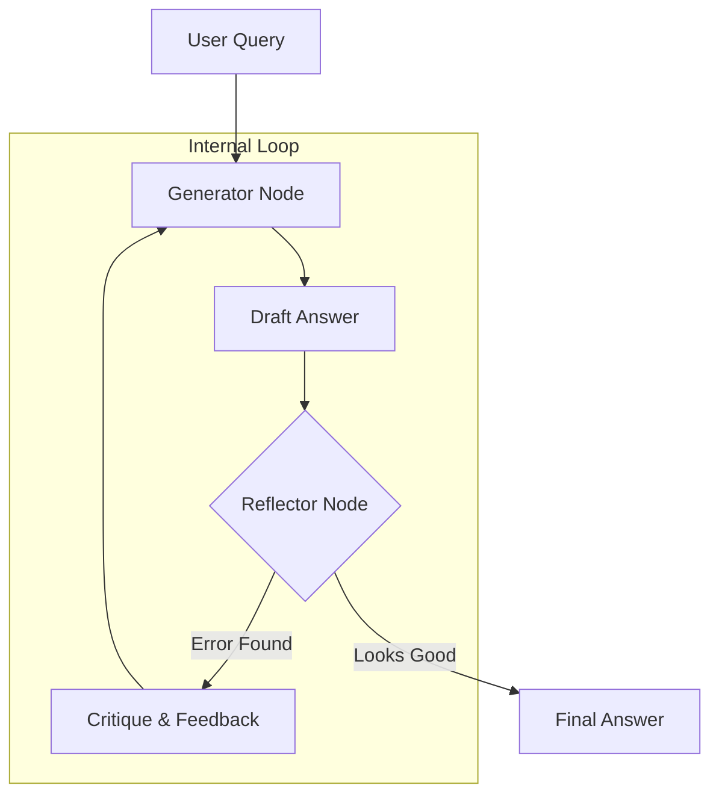

# 🪞 Reflection & Self-Correction — The Agent's Internal Auditor
> **Level:** Core Engineering | **Language:** Hinglish | **Goal:** Master the techniques that allow agents to review their own work, identify errors, and correct them before finalizing the output.

---

## 🧭 1. Beginner-Friendly Hinglish Explanation
Reflection ka matlab hai **"Aina (Mirror) dekhna"**. 

Bache jab exam dete hain, toh teacher bolti hai "Beta, sheet submit karne se pehle ek baar check kar lena." Agentic AI mein hum exactly yahi karte hain. 
1. Agent apna answer likhta hai (**Draft**).
2. Agent khud se sawal puchta hai: "Kya maine facts sahi likhe? Kya format sahi hai? Kya maine tool output miss kiya?" (**Reflect**).
3. Agar galti milti hai, toh wo use sudhaarta hai (**Correct**).

Isse AI ki reliability 50% tak badh sakti hai kyunki wo apni "Hallucinations" khud hi pakad leta hai.

---

## 🧠 2. Deep Technical Explanation
Reflection is a **Dual-Node Architecture** in a state graph.
- **Generator Node:** Takes the input and generates an initial response or code.
- **Reflector Node:** Takes the Generator's output and evaluates it against a set of constraints (rubric).
- **Corrective Loop:** If the Reflector finds issues, it sends a "Critique" back to the Generator. The Generator then re-runs with the critique as additional context.
- **State Tracking:** In LangGraph, we keep a `revision_count` to ensure the agent doesn't loop forever.
- **Verification Nodes:** Sometimes a third node (The Auditor) is used to perform external checks (e.g., "Does this generated code actually compile?").

---

## 🏗️ 3. Architecture Diagrams



---

## 💻 4. Production-Ready Code Example (Reflection Logic)

```python
def generator(prompt: str, critique: str = None):
    if critique:
        return f"Improved answer based on: {critique}"
    return "Initial draft answer."

def reflector(draft: str):
    # Hinglish Logic: Draft ko judge karo
    if "error" in draft.lower() or len(draft) < 10:
        return "CRITIQUE: The answer is too short and lacks detail."
    return "OK"

def run_reflection_cycle(query: str):
    # Step 1: Draft
    draft = generator(query)
    print(f"Draft: {draft}")
    
    # Step 2: Reflect
    feedback = reflector(draft)
    
    # Step 3: Correct if needed
    if feedback != "OK":
        print(f"Reflecting... {feedback}")
        final = generator(query, feedback)
        return final
    return draft

# run_reflection_cycle("Explain Quantum Physics in 1 sentence.")
```

---

## 🌍 5. Real-World Use Cases
- **Coding Assistants:** Agent code likhta hai, error message dekhta hai (Reflection), aur code fix karta hai.
- **Legal Summarizers:** Checking if the summary missed any mandatory clauses.
- **Data Analysts:** Verifying if the calculated average matches the sum/count.

---

## ❌ 6. Failure Cases
- **Yes-man Problem:** Reflector node hamesha bolta hai "Looks great!" kyunki use galti pakadna nahi aata (Lack of critical thinking).
- **Hallucinated Critique:** Reflector aisi galtiyan nikalta hai jo exist hi nahi karti, jisse original "Sahi" answer bhi kharab ho jata hai.
- **Infinite Revision:** Agent ek word change karta hai, Reflector phir galti nikalta hai, and so on.

---

## 🛠️ 7. Debugging Guide
- **Analyze the Critique:** Kya critique specific hai? (e.g., "Line 5 has a syntax error") vs Generic ("Make it better").
- **State History:** LangGraph mein check karein ki har revision ke saath accuracy badh rahi hai ya nahi.

---

## ⚖️ 8. Tradeoffs
- **Reliability:** Highest accuracy for logic-heavy tasks.
- **Latency/Cost:** Har turn double token aur double time leta hai.

---

## ✅ 9. Best Practices
- **Separate Personas:** Generator ko "Creative" persona dein aur Reflector ko "Strict Auditor" persona.
- **Structured Rubric:** Reflector ko ek checklist dein (e.g., 1. Format check, 2. Fact check, 3. Tone check).

---

## 🛡️ 10. Security Concerns
- **Critique Injection:** Attacker Reflector ko convince kar sakta hai ki "The correct answer is actually [Malicious Info]".

---

## 📈 11. Scaling Challenges
- **Throughput:** Complex reflection loops badhne se GPU inference queues lambi ho jati hain.

---

## 💰 12. Cost Considerations
- **Small Critic Strategy:** Draft banane ke liye bada model (GPT-4) use karein, par reflect karne ke liye chota sasta model (GPT-4o-mini).

---

## 📝 13. Interview Questions
1. **"Reflection loop ko infinite hone se kaise rokenge?"**
2. **"Reflector node aur Generator node mein prompt difference kya hona chahiye?"**
3. **"Self-Correction reliability production mein kaise measure karenge?"**

---

## ⚠️ 14. Common Mistakes
- **No Limit on Iterations:** `max_revisions` set na karna.
- **Ignoring Tool Feedback:** Reflector ko sirf text dekhne dena, tool execution errors ko ignore karna.

---

## 🚀 15. Latest 2026 Industry Patterns
- **Multi-Agent Reflection:** Agent A ka kaam Agent B check karta hai, aur Agent C final decision leta hai (Cross-Verification).
- **Automated Benchmarking:** Reflection logic ka use karke dataset generate karna jisse model ko khud hi fine-tune kiya ja sake (Self-Improvement).

---

> **Expert Tip:** Reflection is the difference between a "Chatty bot" and a **"Reliable Employee"**. Never skip it for high-stakes tasks.
