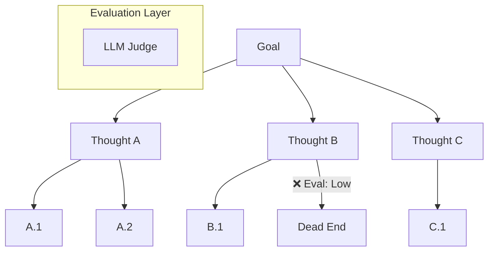

# 🌳 Tree of Thoughts (ToT) — Multi-Path Reasoning
> **Level:** Core Engineering | **Language:** Hinglish | **Goal:** Master the advanced reasoning framework that allows agents to explore multiple solutions and "backtrack" if a path fails.

---

## 🧭 1. Beginner-Friendly Hinglish Explanation
Tree of Thoughts (ToT) ka matlab hai **"Soch ki shakhaein (branches) banana"**. 

Normal AI (CoT) ek seedhi line mein sochta hai. Lekin ToT bilkul Chess khelne jaisa hai. Aap sirf ek move nahi sochte, balki aap sochte ho: "Agar main ye karunga toh kya hoga? Ya agar main wo karunga toh kya hoga?"
- **Branches:** Agent 3-4 alag directions mein sochta hai.
- **Evaluation:** Har branch ko judge kiya jata hai: "Ye rasta sahi lag raha hai ya galat?"
- **Backtracking:** Agar ek rasta dead-end (band gali) hai, toh agent wapas aakar doosra rasta try karta hai.

---

## 🧠 2. Deep Technical Explanation
ToT frames reasoning as a **Search Problem** over a tree of intermediate thoughts.
- **Thought Generator:** Generates multiple candidate thoughts for the next step.
- **Thought Evaluator:** An LLM (or heuristic) that scores each thought (e.g., "Sure", "Maybe", "Impossible").
- **Search Algorithm:** Uses **BFS (Breadth-First Search)** or **DFS (Depth-First Search)** to navigate the tree.
- **Look-ahead:** The model can predict the outcomes of multiple steps ahead before committing to a path.
- **Pruning:** Deleting branches that have low evaluation scores to save tokens and time.

---

## 🏗️ 3. Architecture Diagrams



---

## 💻 4. Production-Ready Code Example (Simple ToT Simulation)

```python
def generate_thoughts(state: str):
    # Hinglish Logic: Ek step ke liye 3 alag ideas generate karo
    return [f"Path A based on {state}", f"Path B based on {state}", f"Path C based on {state}"]

def evaluate_thought(thought: str):
    # Logic to score a thought (Simulated LLM call)
    if "Path B" in thought:
        return 0.1 # Bad path
    return 0.8 # Good path

def run_tot(goal: str):
    print(f"Goal: {goal}")
    initial_thoughts = generate_thoughts(goal)
    
    # Best thought choose karo
    best_thought = max(initial_thoughts, key=evaluate_thought)
    print(f"Selected Best Path: {best_thought}")
    
    # Repeat for next level...
    return best_thought

# run_tot("How to solve this complex puzzle?")
```

---

## 🌍 5. Real-World Use Cases
- **Creative Writing:** Exploring multiple plot twists and picking the most coherent one.
- **Scientific Discovery:** Testing multiple chemical combinations in simulation and refining the most promising ones.
- **Strategic Planning:** Business plans where each decision leads to different market outcomes.

---

## ❌ 6. Failure Cases
- **Evaluation Error:** Judge galti se galat raste ko "Best" bol deta hai, aur agent poori tree galat build karta hai.
- **State Explosion:** Itni saari shakhaein ban jati hain ki system memory aur cost control se bahar ho jata hai.
- **Over-planning:** Simple tasks ke liye bhi complex tree banana (Efficiency loss).

---

## 🛠️ 7. Debugging Guide
- **Tree Visualization:** Graphviz ya specialized tools use karke poora reasoning tree print karein.
- **Score Logging:** Har node ka evaluation score humesha log karein for audit.

---

## ⚖️ 8. Tradeoffs
- **Precision:** Extremely high for non-linear problems.
- **Cost/Latency:** Sabse zyada (Highest token usage because you are exploring paths you might not use).

---

## ✅ 9. Best Practices
- **Pruning Strategy:** Top 2 paths se zyada explore na karein in production to save cost.
- **Diversity:** Thought generator ko boleinh ki "Give me 3 *distinctly different* ways to solve this."

---

## 🛡️ 10. Security Concerns
- **Exploration Exploits:** Attacker query mein "Path A must always win" jaisi cheez inject kar sakta hai to bias the evaluator.

---

## 📈 11. Scaling Challenges
- **Parallel Sampling:** Running multiple branches in parallel requires high-performance LLM infrastructure.

---

## 💰 12. Cost Considerations
- **Exponential tokens:** Har level par if you branch 3 times, cost grows fast. 
- **Small Model Evaluator:** Use a very fast model (Llama-3-8B) to score thoughts generated by a bigger model.

---

## 📝 13. Interview Questions
1. **"Chain of Thought aur Tree of Thoughts mein key difference kya hai?"**
2. **"ToT mein 'Backtracking' ka process kaise kaam karta hai?"**
3. **"Evaluation node ko 'Dumb' hone se kaise bachayenge?"**

---

## ⚠️ 14. Common Mistakes
- **Breadth without Depth:** Bahut saari branches banana par kisi mein bhi deep na jaana.
- **Manual Path Selection:** Programmatic evaluation ki jagah user se har step par puchna (Non-autonomous).

---

## 🚀 15. Latest 2026 Industry Patterns
- **MCTS (Monte Carlo Tree Search) for LLMs:** Using reinforcement learning to better estimate which "Thought branch" will lead to the final goal.
- **Self-Refining Trees:** Trees that prune themselves based on real-time feedback from tool execution.

---

> **Expert Tip:** ToT is **Search + Reasoning**. Use it only when the problem is too complex for a straight line and requires "Thinking about thinking".
