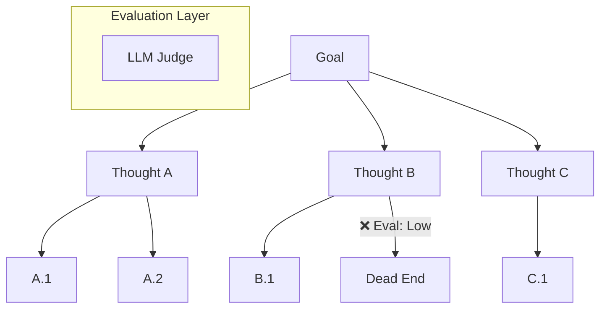

# 🌳 Tree of Thoughts (ToT) — Multi-Path Reasoning
> **Level:** Core Engineering | **Language:** Hinglish | **Goal:** Bade scale par agents ke explore-evaluate aur dynamic search structures ko master karein jo path fail hone par "backtrack" karna enable karte hain.

---

## 🧭 1. Beginner-Friendly Hinglish Explanation
Tree of Thoughts (ToT) ka matlab hai **"Soch ki shakhaein (branches) banana"**. 

Normal AI (CoT) ek seedhi line mein sochta hai. Lekin ToT bilkul Chess khelne jaisa hai. Aap sirf ek move nahi sochte, balki aap sochte ho: "Agar main ye karunga toh kya hoga? Ya agar main wo karunga toh kya hoga?"
- **Branches:** Agent 3-4 alag directions mein sochta hai.
- **Evaluation:** Har branch ko judge kiya jata hai: "Ye rasta sahi lag raha hai ya galat?"
- **Backtracking:** Agar ek rasta dead-end (band gali) hai, toh agent wapas aakar doosra rasta try karta hai.

---

## 🧠 2. Deep Technical Explanation
ToT reasoning ko intermediate thoughts ke tree par ek **Search Problem** ki tarah frame karta hai.
- **Thought Generator:** Agle step ke liye multiple candidate thoughts generate karta hai.
- **Thought Evaluator:** Ek LLM (ya heuristic) jo har thought ko score karta hai (e.g., "Sure", "Maybe", "Impossible").
- **Search Algorithm:** Tree ko navigate karne ke liye **BFS (Breadth-First Search)** ya **DFS (Depth-First Search)** ka use karta hai.
- **Look-ahead:** Model kisi path par commit karne se pehle aage ke multiple steps ke outcomes ko predict kar sakta hai.
- **Pruning:** Tokens aur time bachane ke liye low evaluation scores wali branches ko delete (prune) karna.

---

## 🏗️ 3. Architecture Diagrams


```mermaid
graph TD
    Root[Goal] --> T1[Thought A]
    Root --> T2[Thought B]
    Root --> T3[Thought C]
    T1 --> T1_1[A.1]
    T1 --> T1_2[A.2]
    T2 --> T2_1[B.1]
    T2 -- "❌ Eval: Low" --> Dead[Dead End]
    T3 --> T3_1[C.1]
    
    subgraph "Evaluation Layer"
    E[LLM Judge]
    end
```

---

## 💻 4. Production-Ready Code Example (Simple ToT Simulation)

```python
def generate_thoughts(state: str):
    # Hinglish Logic: Ek step ke liye 3 alag ideas generate karo
    return [f"Path A based on {state}", f"Path B based on {state}", f"Path C based on {state}"]

def evaluate_thought(thought: str):
    # Logic to score a thought (Simulated LLM call)
    if "Path B" in thought:
        return 0.1 # Bad path
    return 0.8 # Good path

def run_tot(goal: str):
    print(f"Goal: {goal}")
    initial_thoughts = generate_thoughts(goal)
    
    # Best thought choose karo
    best_thought = max(initial_thoughts, key=evaluate_thought)
    print(f"Selected Best Path: {best_thought}")
    
    # Repeat for next level...
    return best_thought

# run_tot("How to solve this complex puzzle?")
```

---

## 🌍 5. Real-World Use Cases
- **Creative Writing:** Multiple plot twists ko explore karna aur sabse coherent twists ko pick karna.
- **Scientific Discovery:** Simulation mein multiple chemical combinations ko test karna aur sabse promising ones ko refine karna.
- **Strategic Planning:** Aise business plans jahan har decision alag market outcomes ki taraf le jata hai.

---

## ❌ 6. Failure Cases
- **Evaluation Error:** Judge galti se galat raste ko "Best" bol deta hai, aur agent poori tree galat build karta hai.
- **State Explosion:** Itni saari shakhaein ban jati hain ki system memory aur cost control se bahar ho jata hai.
- **Over-planning:** Simple tasks ke liye bhi complex tree banana (Efficiency loss).

---

## 🛠️ 7. Debugging Guide
- **Tree Visualization:** Graphviz ya specialized tools use karke poora reasoning tree print karein.
- **Score Logging:** Har node ka evaluation score humesha log karein for audit.

---

## ⚖️ 8. Tradeoffs
- **Precision:** Non-linear problems ke liye extremely high.
- **Cost/Latency:** Sabse zyada (Highest token usage kyunki aap un paths ko explore kar rahe hain jo shayad aap use na karein).

---

## ✅ 9. Best Practices
- **Pruning Strategy:** Top 2 paths se zyada explore na karein in production to save cost.
- **Diversity:** Thought generator ko boleinh ki "Give me 3 *distinctly different* ways to solve this."

---

## 🛡️ 10. Security Concerns
- **Exploration Exploits:** Attacker query mein "Path A must always win" jaisi cheez inject kar sakta hai to bias the evaluator.

---

## 📈 11. Scaling Challenges
- **Parallel Sampling:** Parallel mein multiple branches run karne ke liye high-performance LLM infrastructure ki zaroorat hoti hai.

---

## 💰 12. Cost Considerations
- **Exponential tokens:** Har level par if you branch 3 times, cost grows fast. 
- **Small Model Evaluator:** Ek bade model dwara generated thoughts ko score karne ke liye ek bahut fast model (Llama-3-8B) ka use karein.

---

## 📝 13. Interview Questions
1. **"Chain of Thought aur Tree of Thoughts mein key difference kya hai?"**
2. **"ToT mein 'Backtracking' ka process kaise kaam karta hai?"**
3. **"Evaluation node ko 'Dumb' hone se kaise bachayenge?"**

---

## ⚠️ 14. Common Mistakes
- **Breadth without Depth:** Bahut saari branches banana par kisi mein bhi deep na jaana.
- **Manual Path Selection:** Programmatic evaluation ki jagah user se har step par puchna (Non-autonomous).

---

## 🚀 15. Latest 2026 Industry Patterns
- **MCTS (Monte Carlo Tree Search) for LLMs:** Reinforcement learning ka use karke behtar estimate karna ki kaunsi "Thought branch" final goal tak le jayegi.
- **Self-Refining Trees:** Aise trees jo tool execution ke real-time feedback ke basis par khud ko prune karte hain.

---

> **Expert Tip:** ToT is **Search + Reasoning**. Use it only when the problem is too complex for a straight line and requires "Thinking about thinking".
