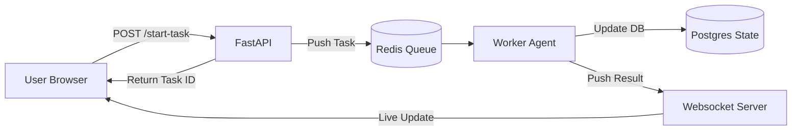

# ⏳ Async Agent Workflows — Non-blocking Intelligence
> **Level:** Core Engineering | **Language:** Hinglish | **Goal:** Master the techniques to build agentic systems that run in the background, handle long-running tasks, and communicate asynchronously.

---

## 🧭 1. Beginner-Friendly Hinglish Explanation
Async (Asynchronous) ka matlab hai **"Bina wait kiye aage badhna"**. 

Imagine aapne agent ko bola: "Puraani 1000 files analyze karo." Isme 10 minute lagenge. 
- **Sync Workflow:** Aapka computer 10 minute tak "hang" ho jayega. Aap kuch aur nahi kar paoge. 
- **Async Workflow:** Agent background mein kaam shuru kar deta hai. Aapko "Task ID" mil jata hai. Aap doosre kaam kar sakte ho, aur jab agent free hoga, wo aapko notification bhej dega.

Modern web apps (Production) mein hum hamesha Async use karte hain taaki user experience "Fast" aur "Smooth" rahe.

---

## 🧠 2. Deep Technical Explanation
Async workflows decouple the **User Request** from the **Agent Execution**.
- **Event Loop:** Using Python's `asyncio` to manage thousands of concurrent I/O operations (like LLM calls or DB queries) without spawning a new thread for each.
- **Message Queues:** Offloading heavy tasks to a worker process using **Redis Streams**, **RabbitMQ**, or **Celery**.
- **Websockets / Server-Sent Events (SSE):** Since the response isn't immediate, the backend needs a way to "Push" the results to the frontend once they are ready.
- **Task Status Tracking:** Storing the current state of a long-running agent in a database (`PENDING`, `RUNNING`, `COMPLETED`, `FAILED`) so the user can poll for updates.

---

## 🏗️ 3. Architecture Diagrams



---

## 💻 4. Production-Ready Code Example (FastAPI + BackgroundTasks)

```python
from fastapi import FastAPI, BackgroundTasks
import asyncio

app = FastAPI()

async def long_running_agent_task(task_id: str, query: str):
    # Hinglish Logic: Background mein agent ka logic chalao
    print(f"Starting Task {task_id} for query: {query}")
    await asyncio.sleep(10) # Simulate 10 sec reasoning
    print(f"Task {task_id} Completed!")
    # Update DB with result here

@app.post("/run-agent")
async def trigger_agent(query: str, background_tasks: BackgroundTasks):
    task_id = "task_abc_123"
    # User ko turant response do, agent ko background mein bhejo
    background_tasks.add_task(long_running_agent_task, task_id, query)
    return {"message": "Agent started in background", "task_id": task_id}

# run: uvicorn main:app
```

---

## 🌍 5. Real-World Use Cases
- **Autonomous Research:** An agent that researches a topic for 30 minutes and sends a PDF report via email.
- **Data Migration:** Moving millions of records from one DB to another with AI-driven schema mapping.
- **Voice Agents:** Processing audio streams in real-time requires async handling to minimize lag.

---

## ❌ 6. Failure Cases
- **Orphan Tasks:** Backend restart ho gaya aur background task "Lost" ho gaya (Use persistent queues like Celery).
- **Zombi Processes:** Agent loop mein phas gaya aur server ke saare resources consume kar raha hai background mein.
- **Race Conditions:** Async state updates mein data overwrite ho jana.

---

## 🛠️ 7. Debugging Guide
- **Task Monitors:** Use tools like **Flower** (for Celery) to see real-time task status.
- **Logging with Context:** Ensure every background log has the `task_id` attached.

---

## ⚖️ 8. Tradeoffs
- **Async:** Scalable, responsive UI, handles long tasks.
- **Sync:** Simple to write, immediate feedback for small tasks, but doesn't scale for complex agents.

---

## ✅ 9. Best Practices
- **Webhook Callbacks:** Insaan se wait karwane ki jagah, kaam khatam hone par uska `callback_url` call karein.
- **Graceful Shutdown:** Server band karte waqt ensure karein ki running tasks safely save ho jayein.

---

## 🛡️ 10. Security Concerns
- **Task Injection:** Attacker multiple heavy tasks bhej kar aapka server resources (RAM/CPU) exhaust kar sakta hai.
- **Access Control:** Task status sirf wahi user dekh sake jisne task start kiya hai.

---

## 📈 11. Scaling Challenges
- **Worker Scaling:** Traffic badhne par dynamically naye workers (containers) add karna.
- **Shared Context:** Distributed workers ke beech state sync karna.

---

## 💰 12. Cost Considerations
- **Concurrency Costs:** Many background tasks running at once = Many simultaneous LLM tokens. Manage your concurrency limits.

---

## 📝 13. Interview Questions
1. **"Sync vs Async agent workflows mein kab kya choose karoge?"**
2. **"Websockets ka use case agents mein kya hai?"**
3. **"Long-running tasks ke liye queue management kyu zaruri hai?"**

---

## ⚠️ 14. Common Mistakes
- **Blocking the Event Loop:** Async code ke beech mein `time.sleep()` (Sync) use karna.
- **No Persistence:** Tasks ko sirf memory mein rakhna.

---

## 🚀 15. Latest 2026 Industry Patterns
- **Serverless Background Agents:** Using AWS Lambda or Vercel Functions to run agents only when an event arrives (zero idle cost).
- **Streaming State Updates:** Users can see the agent's "Thought stream" live via SSE even while the final answer is still being computed.

---

> **Expert Tip:** In 2026, **Blocking is Buggy**. If a task takes more than 500ms, it belongs in an async workflow.
