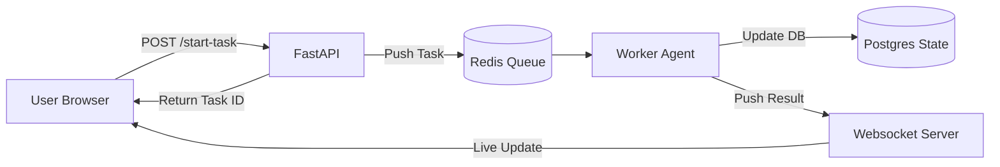

# ⏳ Async Agent Workflows — Non-blocking Intelligence
> **Level:** Core Engineering | **Language:** Hinglish | **Goal:** Aise agentic systems build karne ki techniques ko master karein jo background mein run ho sakein, long-running tasks handle karein, aur asynchronously communicate karein.

---

## 🧭 1. Beginner-Friendly Hinglish Explanation
Async (Asynchronous) ka matlab hai **"Bina wait kiye aage badhna"**. 

Imagine aapne agent ko bola: "Puraani 1000 files analyze karo." Isme 10 minute lagenge. 
- **Sync Workflow:** Aapka computer 10 minute tak "hang" ho jayega. Aap kuch aur nahi kar paoge. 
- **Async Workflow:** Agent background mein kaam shuru kar deta hai. Aapko "Task ID" mil jata hai. Aap doosre kaam kar sakte ho, aur jab agent free hoga, wo aapko notification bhej dega.

Modern web apps (Production) mein hum hamesha Async use karte hain taaki user experience "Fast" aur "Smooth" rahe.

---

## 🧠 2. Deep Technical Explanation
Async workflows **User Request** ko **Agent Execution** se decouple karte hain.
- **Event Loop:** Bina har ek ke liye naya thread spawn kiye, hazaron concurrent I/O operations (jaise LLM calls ya DB queries) ko manage karne ke liye Python ke `asyncio` ka use karna.
- **Message Queues:** **Redis Streams**, **RabbitMQ**, ya **Celery** ka use karke heavy tasks ko worker process par offload karna.
- **Websockets / Server-Sent Events (SSE):** Kyunki response immediate nahi hota, isliye backend ko frontend par results "Push" karne ke liye ek tareeqe ki zaroorat hoti hai jab wo ready ho jayein.
- **Task Status Tracking:** Long-running agent ki current state ko database (`PENDING`, `RUNNING`, `COMPLETED`, `FAILED`) mein store karna taaki user updates ke liye poll kar sake.

---

## 🏗️ 3. Architecture Diagrams


```mermaid
graph LR
    U[User Browser] -->|POST /start-task| B[FastAPI]
    B -->|Push Task| Q[(Redis Queue)]
    B -- "Return Task ID" --> U
    Q --> W[Worker Agent]
    W -->|Update DB| DB[(Postgres State)]
    W -->|Push Result| WS[Websocket Server]
    WS -->|Live Update| U
```

---

## 💻 4. Production-Ready Code Example (FastAPI + BackgroundTasks)

```python
from fastapi import FastAPI, BackgroundTasks
import asyncio

app = FastAPI()

async def long_running_agent_task(task_id: str, query: str):
    # Hinglish Logic: Background mein agent ka logic chalao
    print(f"Starting Task {task_id} for query: {query}")
    await asyncio.sleep(10) # Simulate 10 sec reasoning
    print(f"Task {task_id} Completed!")
    # Update DB with result here

@app.post("/run-agent")
async def trigger_agent(query: str, background_tasks: BackgroundTasks):
    task_id = "task_abc_123"
    # User ko turant response do, agent ko background mein bhejo
    background_tasks.add_task(long_running_agent_task, task_id, query)
    return {"message": "Agent started in background", "task_id": task_id}

# run: uvicorn main:app
```

---

## 🌍 5. Real-World Use Cases
- **Autonomous Research:** Ek aisa agent jo 30 minutes tak kisi topic par research karta hai aur email ke through PDF report bhejta hai.
- **Data Migration:** AI-driven schema mapping ke sath millions of records ko ek DB se doosre DB mein move karna.
- **Voice Agents:** Lag ko minimize karne ke liye real-time mein audio streams ko process karne ke liye async handling zaroori hai.

---

## ❌ 6. Failure Cases
- **Orphan Tasks:** Backend restart ho gaya aur background task "Lost" ho gaya (Use persistent queues like Celery).
- **Zombi Processes:** Agent loop mein phas gaya aur server ke saare resources consume kar raha hai background mein.
- **Race Conditions:** Async state updates mein data overwrite ho jana.

---

## 🛠️ 7. Debugging Guide
- **Task Monitors:** Real-time task status dekhne ke liye **Flower** (Celery ke liye) jaise tools ka use karein.
- **Logging with Context:** Ensure karein ki har background log ke sath `task_id` attached ho.

---

## ⚖️ 8. Tradeoffs
- **Async:** Scalable, responsive UI, long tasks ko handle karta hai.
- **Sync:** Likha jana simple hai, small tasks ke liye immediate feedback deta hai, par complex agents ke liye scale nahi hota.

---

## ✅ 9. Best Practices
- **Webhook Callbacks:** Insaan se wait karwane ki jagah, kaam khatam hone par uska `callback_url` call karein.
- **Graceful Shutdown:** Server band karte waqt ensure karein ki running tasks safely save ho jayein.

---

## 🛡️ 10. Security Concerns
- **Task Injection:** Attacker multiple heavy tasks bhej kar aapka server resources (RAM/CPU) exhaust kar sakta hai.
- **Access Control:** Task status sirf wahi user dekh sake jisne task start kiya hai.

---

## 📈 11. Scaling Challenges
- **Worker Scaling:** Traffic badhne par dynamically naye workers (containers) add karna.
- **Shared Context:** Distributed workers ke beech state sync karna.

---

## 💰 12. Cost Considerations
- **Concurrency Costs:** Ek sath chalne wale kai background tasks = Kai simultaneous LLM tokens. Apne concurrency limits ko manage karein.

---

## 📝 13. Interview Questions
1. **"Sync vs Async agent workflows mein kab kya choose karoge?"**
2. **"Websockets ka use case agents mein kya hai?"**
3. **"Long-running tasks ke liye queue management kyu zaruri hai?"**

---

## ⚠️ 14. Common Mistakes
- **Blocking the Event Loop:** Async code ke beech mein `time.sleep()` (Sync) use karna.
- **No Persistence:** Tasks ko sirf memory mein rakhna.

---

## 🚀 15. Latest 2026 Industry Patterns
- **Serverless Background Agents:** Sirf tabhi agents run karne ke liye jab koi event aaye, AWS Lambda ya Vercel Functions ka use karna (zero idle cost).
- **Streaming State Updates:** Users agent ke "Thought stream" ko live SSE ke through dekh sakte hain, jabki final answer abhi compute ho hi raha ho.

---

> **Expert Tip:** In 2026, **Blocking is Buggy**. If a task takes more than 500ms, it belongs in an async workflow.
