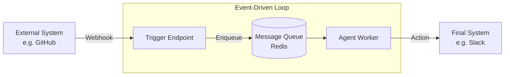

# 📡 Event-Driven Agents — Reactive & Proactive Systems
> **Level:** Core Engineering | **Language:** Hinglish | **Goal:** Master the architecture where agents respond to external events (webhooks, sensor data, database changes) rather than just user prompts.

---

## 🧭 1. Beginner-Friendly Hinglish Explanation
Event-Driven Agents ka matlab hai **"Mauka dekh kar chauka marna"**. 

Normal AI tab chalta hai jab aap use prompt dete ho. Lekin Event-Driven Agent tab chalta hai jab duniya mein kuch **Event** hota hai:
- Naya email aaya? Agent ne summarize kar diya.
- Stock price giri? Agent ne alert bhej diya.
- Kisi ne GitHub par issue dala? Agent ne code review kar diya.

Ye agents "Active" rehte hain bina aapke instruction ke. Wo backgroud mein kaam karte hain aur sahi waqt par react karte hain.

---

## 🧠 2. Deep Technical Explanation
Event-driven architecture (EDA) for agents relies on **Pub/Sub (Publisher-Subscriber)** models or **Webhooks**.
- **The Event Producer:** A system (GitHub, Stripe, IoT sensor) that sends a signal when something happens.
- **The Trigger:** A listener (FastAPI endpoint, AWS Lambda) that receives the signal and wakes up the agent.
- **The Payload:** The metadata about the event (e.g., the content of the new email).
- **Asynchronous Processing:** Since events can happen anytime, the agent usually processes them in a **Background Queue** (like Celery, RabbitMQ, or Redis Streams).
- **Filtering Logic:** Not every event needs an LLM call. A rule-based filter should decide if the event is "Interesting" enough for the agent.

---

## 🏗️ 3. Architecture Diagrams



---

## 💻 4. Production-Ready Code Example (Webhook Trigger)

```python
from fastapi import FastAPI, Request

app = FastAPI()

@app.post("/github-webhook")
async def github_event_handler(request: Request):
    # 1. Receive the event payload
    payload = await request.json()
    event_type = request.headers.get("X-GitHub-Event")
    
    # 2. Check if it's an 'Interesting' event (Hinglish: Faltu events ignore karo)
    if event_type == "issues":
        issue_title = payload['issue']['title']
        print(f"Triggering Agent for Issue: {issue_title}")
        # wake_up_agent(issue_title)
    
    return {"status": "received"}

# run with: uvicorn main:app --reload
```

---

## 🌍 5. Real-World Use Cases
- **Smart Homes:** Light on hui -> Agent ne AC optimize kar diya.
- **DevOps:** Code commit hua -> Agent ne tests run kiye aur documentation update ki.
- **Cybersecurity:** Suspicious login detected -> Agent ne account lock kiya aur user ko call kiya.

---

## ❌ 6. Failure Cases
- **Event Storm:** Ek saath 10,000 events aa gaye aur agent ka server crash ho gaya.
- **Stale Context:** Event tab aaya jab agent so raha tha, aur jab wo jaga toh info purani ho gayi thi.
- **Looping Events:** Agent ne email bheja -> Wo email doosre agent ko trigger kar gaya -> Doosre ne fir wapas pehle ko bhej diya (Infinite loop).

---

## 🛠️ 7. Debugging Guide
- **Idempotency Check:** Kya agent ek hi event ko do baar process kar raha hai? (Use unique Event IDs).
- **Replay Events:** Tool use karke purane events ko "Re-fire" karke dekhein for debugging.

---

## ⚖️ 8. Tradeoffs
- **Reactive:** Very fast response to changes but complex to manage (Concurrency).
- **Polling (Old way):** Simple but slow and wastes resources checking for updates when none exist.

---

## ✅ 9. Best Practices
- **Queueing Mandatory:** Kabhi bhi long-running agent logic ko direct API request mein mat chalayein. Humesha Queue use karein.
- **Filtering:** LLM call mehngi hai, isliye rule-based filtering se 90% "Boring" events block karein.

---

## 🛡️ 10. Security Concerns
- **Webhook Spoofing:** Attacker fake events bhej kar aapka agent trigger kar sakta hai. Always verify **HMAC signatures**.
- **Data Flooding:** Rate limit your events to prevent DDoS attacks on your LLM budget.

---

## 📈 11. Scaling Challenges
- **Concurrency Control:** How many agents can run in parallel without hitting LLM rate limits?
- **Ordering:** Ensuring Event A is processed before Event B if they are related.

---

## 💰 12. Cost Considerations
- **Idle Costs:** Trigger endpoints low cost hote hain, par LLM calls are the main expense. Filter events strictly.

---

## 📝 13. Interview Questions
1. **"Polling vs Webhook triggers in agents mein kya difference hai?"**
2. **"Event-driven systems mein idempotency kyu zaruri hai?"**
3. **"Background task processing agents ke liye kaise setup karenge?"**

---

## ⚠️ 14. Common Mistakes
- **No Retries:** Webhook fail ho gaya toh event lost (Use a persistent queue).
- **Processing Everything:** Har choti cheez ke liye GPT-4 call karna (Bankrupt hone ka rasta).

---

## 🚀 15. Latest 2026 Industry Patterns
- **Edge-Triggered Agents:** Running small agents on the device (Mobile/IoT) to process events locally before sending to the cloud.
- **Cross-Platform Event Buses:** Systems like **Inngest** or **Temporal** that manage long-running stateful agent workflows triggered by external events.

---

> **Final Note:** The future is **Proactive**. The best agent is the one that solves a problem before the user even realizes it exists.
