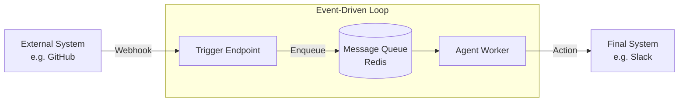

# 📡 Event-Driven Agents — Reactive & Proactive Systems
> **Level:** Core Engineering | **Language:** Hinglish | **Goal:** Uss architecture ko master karein jahan agents user prompts ke bajaye external events (webhooks, sensor data, DB changes) par respond karte hain.

---

## 🧭 1. Beginner-Friendly Hinglish Explanation
Event-Driven Agents ka matlab hai **"Mauka dekh kar chauka marna"**. 

Normal AI tab chalta hai jab aap use prompt dete ho. Lekin Event-Driven Agent tab chalta hai jab duniya mein kuch **Event** hota hai:
- Naya email aaya? Agent ne summarize kar diya.
- Stock price giri? Agent ne alert bhej diya.
- Kisi ne GitHub par issue dala? Agent ne code review kar diya.

Ye agents "Active" rehte hain bina aapke instruction ke. Wo backgroud mein kaam karte hain aur sahi waqt par react karte hain.

---

## 🧠 2. Deep Technical Explanation
Agents ke liye event-driven architecture (EDA) **Pub/Sub (Publisher-Subscriber)** models ya **Webhooks** par rely karti hai.
- **The Event Producer:** Ek system (GitHub, Stripe, IoT sensor) jo tab signal send karta hai jab kuch hota hai.
- **The Trigger:** Ek listener (FastAPI endpoint, AWS Lambda) jo signal receive karta hai aur agent ko wake up karta hai.
- **The Payload:** Event ke baare mein metadata (e.g., new email ka content).
- **Asynchronous Processing:** Kyunki events kabhi bhi ho sakte hain, isliye agent unhe aamtaur par ek **Background Queue** (jaise Celery, RabbitMQ, ya Redis Streams) mein process karta hai.
- **Filtering Logic:** Har event ko LLM call ki zaroorat nahi hoti. Ek rule-based filter decide karega ki kya event agent ke liye kaafi "Interesting" hai.

---

## 🏗️ 3. Architecture Diagrams


```mermaid
graph LR
    E[External System\ne.g. GitHub] -->|Webhook| T[Trigger Endpoint]
    T -->|Enqueue| Q[(Message Queue\nRedis)]
    Q --> W[Agent Worker]
    W -->|Action| S[Final System\ne.g. Slack]
    
    subgraph "Event-Driven Loop"
    T
    Q
    W
    end
```

---

## 💻 4. Production-Ready Code Example (Webhook Trigger)

```python
from fastapi import FastAPI, Request

app = FastAPI()

@app.post("/github-webhook")
async def github_event_handler(request: Request):
    # 1. Receive the event payload
    payload = await request.json()
    event_type = request.headers.get("X-GitHub-Event")
    
    # 2. Check if it's an 'Interesting' event (Hinglish: Faltu events ignore karo)
    if event_type == "issues":
        issue_title = payload['issue']['title']
        print(f"Triggering Agent for Issue: {issue_title}")
        # wake_up_agent(issue_title)
    
    return {"status": "received"}

# run with: uvicorn main:app --reload
```

---

## 🌍 5. Real-World Use Cases
- **Smart Homes:** Light on hui -> Agent ne AC optimize kar diya.
- **DevOps:** Code commit hua -> Agent ne tests run kiye aur documentation update ki.
- **Cybersecurity:** Suspicious login detected -> Agent ne account lock kiya aur user ko call kiya.

---

## ❌ 6. Failure Cases
- **Event Storm:** Ek saath 10,000 events aa gaye aur agent ka server crash ho gaya.
- **Stale Context:** Event tab aaya jab agent so raha tha, aur jab wo jaga toh info purani ho gayi thi.
- **Looping Events:** Agent ne email bheja -> Wo email doosre agent ko trigger kar gaya -> Doosre ne fir wapas pehle ko bhej diya (Infinite loop).

---

## 🛠️ 7. Debugging Guide
- **Idempotency Check:** Kya agent ek hi event ko do baar process kar raha hai? (Use unique Event IDs).
- **Replay Events:** Tool use karke purane events ko "Re-fire" karke dekhein for debugging.

---

## ⚖️ 8. Tradeoffs
- **Reactive:** Changes par bahut fast response par ise manage karna complex hai (Concurrency).
- **Polling (Old way):** Simple hai par slow hai aur jab koi updates na hon tab bhi updates check karne mein resources waste karta hai.

---

## ✅ 9. Best Practices
- **Queueing Mandatory:** Kabhi bhi long-running agent logic ko direct API request mein mat chalayein. Humesha Queue use karein.
- **Filtering:** LLM call mehngi hai, isliye rule-based filtering se 90% "Boring" events block karein.

---

## 🛡️ 10. Security Concerns
- **Webhook Spoofing:** Attacker fake events bhej kar aapka agent trigger kar sakta hai. Always verify **HMAC signatures**.
- **Data Flooding:** Apne LLM budget par DDoS attacks ko rokne ke liye apne events ko rate limit karein.

---

## 📈 11. Scaling Challenges
- **Concurrency Control:** Bina LLM rate limits hit kiye kitne agents parallel mein run ho sakte hain?
- **Ordering:** Agar Event A aur Event B related hain, toh ensure karna ki Event A Event B se pehle process ho.

---

## 💰 12. Cost Considerations
- **Idle Costs:** Trigger endpoints low cost hote hain, par LLM calls are the main expense. Filter events strictly.

---

## 📝 13. Interview Questions
1. **"Polling vs Webhook triggers in agents mein kya difference hai?"**
2. **"Event-driven systems mein idempotency kyu zaruri hai?"**
3. **"Background task processing agents ke liye kaise setup karenge?"**

---

## ⚠️ 14. Common Mistakes
- **No Retries:** Webhook fail ho gaya toh event lost (Ek persistent queue ka use karein).
- **Processing Everything:** Har choti cheez ke liye GPT-4 call karna (Bankrupt hone ka rasta).

---

## 🚀 15. Latest 2026 Industry Patterns
- **Edge-Triggered Agents:** Cloud par bhejne se pehle events ko locally process karne ke liye device (Mobile/IoT) par small agents run karna.
- **Cross-Platform Event Buses:** **Inngest** ya **Temporal** jaise systems jo external events dwara triggered long-running stateful agent workflows ko manage karte hain.

---

> **Final Note:** The future is **Proactive**. The best agent is the one that solves a problem before the user even realizes it exists.
