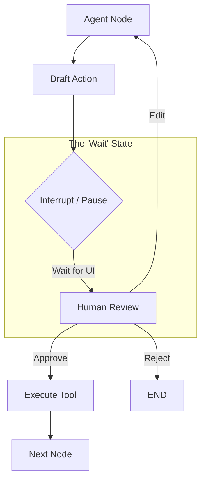

# 🧑‍💻 Human-in-the-Loop (HITL) — Collaborative Agency
> **Level:** Core Engineering | **Language:** Hinglish | **Goal:** Master the patterns that allow humans to review, edit, and approve agentic actions in production-grade systems.

---

## 🧭 1. Beginner-Friendly Hinglish Explanation
Human-in-the-loop (HITL) ka matlab hai **"Insaan ki raza-mandi"**. 

Agent kitna bhi smart ho, wo galti kar sakta hai. Isliye critical kaamo ke liye hum agent ke beech mein ek **"Pause"** button laga dete hain. 
Example:
- Agent ne email likha, par bhejega tabhi jab aap "Send" click karoge.
- Agent ne flight dhoondhi, par payment tabhi hogi jab aap approve karoge.
- Agent ne code likha, par commit tabhi hoga jab aap use review karoge.

Isse agent autonomous bhi rehta hai aur safe bhi.

---

## 🧠 2. Deep Technical Explanation
HITL in 2026 is implemented using **State Interrupts**.
- **The Interrupt:** A workflow node that triggers a state save and "pauses" the execution thread. It waits for an external signal (Human Input).
- **Review & Edit:** The human can not only "Approve/Reject" but also **Modify** the agent's state (e.g., editing the drafted email) before it proceeds.
- **Time-Travel:** Users can look at the agent's history, go back to a previous turn, change the outcome, and restart from there.
- **Wait Condition:** The backend exposes an API endpoint (`/approve`) that updates the state and signals the graph to continue.

---

## 🏗️ 3. Architecture Diagrams



---

## 💻 4. Production-Ready Code Example (LangGraph HITL Pattern)

```python
# Pseudo-code for LangGraph Interrupt
# 1. Add 'interrupt_before' or 'interrupt_after' to a node
# app = workflow.compile(checkpointer=memory, interrupt_before=["execute_payment"])

# 2. When the node is reached, the graph stops.
# The user sees the state in the UI.

def approve_action(thread_id: str, action_data: dict):
    # Hinglish Logic: Insaan ne 'Yes' bola, toh state update karke continue karo
    # app.update_state(config, {"approval": True})
    # app.invoke(None, config) # Continue from where it left off
    pass

# User Interface side:
# Button [Approve Trade: Buy 10 BTC] -> Calls approve_action()
```

---

## 🌍 5. Real-World Use Cases
- **Medical AI:** Agent suggests a diagnosis, but the doctor must sign off before it's saved in the records.
- **Enterprise Spend:** Agents can buy stationery < $50, but need manager approval for anything higher.
- **Content Publishing:** Automating social media posts with a final "Quality Check" by a human editor.

---

## ❌ 6. Failure Cases
- **Bottlenecking:** Human itna busy hai ki agent 2 din tak "Paused" rehta hai (Slow performance).
- **Approval Fatigue:** Insaan bina dekhe "Yes" dabata hai, jisse HITL ka poora point khatam ho jata hai.
- **Lost State:** Approval aane tak session timeout ho jana ya state database se delete ho jana.

---

## 🛠️ 7. Debugging Guide
- **State Snapshots:** Har interrupt point par poora state object log karein.
- **UI Mocking:** Test karein ki "Edit" karne par agent naye state ko sahi se interpret kar raha hai ya nahi.

---

## ⚖️ 8. Tradeoffs
- **Full Autonomy:** Fast and efficient but risky.
- **HITL:** Very safe and high quality but adds significant latency and requires human time.

---

## ✅ 9. Best Practices
- **Conditional HITL:** Sirf "Dangerous" ya "Expensive" tasks ke liye interrupt karein, har cheez ke liye nahi.
- **Contextual UI:** Human ko sirf "Approve" button mat dikhao, use ye bhi batao ki Agent ne wo decision kyu liya (**Reasoning visibility**).

---

## 🛡️ 10. Security Concerns
- **Impersonation:** Attacker agar user ka account hack kar le, toh wo agent ki dangerous actions approve kar sakta hai.
- **Phishing:** Fake approval requests dikhana.

---

## 📈 11. Scaling Challenges
- **Massive Concurrency:** 10,000 agents approvals ka wait kar rahe hain toh server par active connections/threads badh jate hain.

---

## 💰 12. Cost Considerations
- **Human Labor Cost:** HITL sasta nahi hai. Insaan ka waqt tokens se mehnga hota hai. Optimize tasks to minimize human intervention.

---

## 📝 13. Interview Questions
1. **"LangGraph mein 'Interrupt' mechanism kaise kaam karta hai?"**
2. **"HITL workflows mein state persistence kyu mandatory hai?"**
3. **"In-the-loop vs On-the-loop (Monitoring) mein kya fark hai?"**

---

## ⚠️ 14. Common Mistakes
- **No Edit Capability:** Insaan ko sirf Yes/No ka option dena (Instead, let them fix the agent's mistake).
- **Vague Notifications:** User ko ye na batana ki unki approval kyu chahiye.

---

## 🚀 15. Latest 2026 Industry Patterns
- **Active Learning via HITL:** Har human correction se agent ke system prompt ya fine-tuning dataset ko automatically update karna.
- **Multi-Level Approvals:** Ek task ke liye junior aur senior dono agents/insaanon ki approval mangna (Hierarchy).

---

> **Expert Tip:** HITL is about **Trust Transfer**. You let the human handle the risk so the agent can handle the scale.
