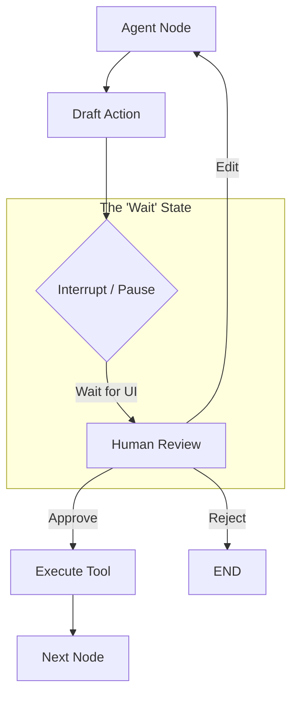

# 🧑‍💻 Human-in-the-Loop (HITL) — Collaborative Agency
> **Level:** Core Engineering | **Language:** Hinglish | **Goal:** Production-grade systems mein humans ke review, edit, aur agentic actions approve karne ke patterns ko master karein.

---

## 🧭 1. Beginner-Friendly Hinglish Explanation
Human-in-the-loop (HITL) ka matlab hai **"Insaan ki raza-mandi"**. 

Agent kitna bhi smart ho, wo galti kar sakta hai. Isliye critical kaamo ke liye hum agent ke beech mein ek **"Pause"** button laga dete hain. 
Example:
- Agent ne email likha, par bhejega tabhi jab aap "Send" click karoge.
- Agent ne flight dhoondhi, par payment tabhi hogi jab aap approve karoge.
- Agent ne code likha, par commit tabhi hoga jab aap use review karoge.

Isse agent autonomous bhi rehta hai aur safe bhi.

---

## 🧠 2. Deep Technical Explanation
2026 mein HITL **State Interrupts** ka use karke implement kiya jata hai.
- **The Interrupt:** Ek workflow node jo state save trigger karta hai aur execution thread ko "pause" karta hai. Ye ek external signal (Human Input) ka wait karta hai.
- **Review & Edit:** Human na sirf "Approve/Reject" kar sakta hai balki agent ki state ko **Modify** bhi kar sakta hai (e.g., draft kiye gaye email ko edit karna) isse pehle ki wo aage badhe.
- **Time-Travel:** Users agent ki history dekh sakte hain, pichle turn par wapas ja sakte hain, outcome change kar sakte hain, aur wahan se restart kar sakte hain.
- **Wait Condition:** Backend ek API endpoint (`/approve`) expose karta hai jo state update karta hai aur graph ko continue karne ka signal deta hai.

---

## 🏗️ 3. Architecture Diagrams


```mermaid
graph TD
    A[Agent Node] --> D[Draft Action]
    D --> I{Interrupt / Pause}
    I -->|Wait for UI| H[Human Review]
    H -->|Approve| S[Execute Tool]
    H -->|Edit| A
    H -->|Reject| END
    S --> Next[Next Node]
    
    subgraph "The 'Wait' State"
    I
    H
    end
```

---

## 💻 4. Production-Ready Code Example (LangGraph HITL Pattern)

```python
# Pseudo-code for LangGraph Interrupt
# 1. Add 'interrupt_before' or 'interrupt_after' to a node
# app = workflow.compile(checkpointer=memory, interrupt_before=["execute_payment"])

# 2. When the node is reached, the graph stops.
# The user sees the state in the UI.

def approve_action(thread_id: str, action_data: dict):
    # Hinglish Logic: Insaan ne 'Yes' bola, toh state update karke continue karo
    # app.update_state(config, {"approval": True})
    # app.invoke(None, config) # Continue from where it left off
    pass

# User Interface side:
# Button [Approve Trade: Buy 10 BTC] -> Calls approve_action()
```

---

## 🌍 5. Real-World Use Cases
- **Medical AI:** Agent diagnosis suggest karta hai, par records mein save hone se pehle doctor ka sign off zaroori hai.
- **Enterprise Spend:** Agents $50 se kam ka stationery buy kar sakte hain, par usse higher kisi bhi cheez ke liye manager approval ki zaroorat hoti hai.
- **Content Publishing:** Ek human editor dwara final "Quality Check" ke sath social media posts ko automate karna.

---

## ❌ 6. Failure Cases
- **Bottlenecking:** Human itna busy hai ki agent 2 din tak "Paused" rehta hai (Slow performance).
- **Approval Fatigue:** Insaan bina dekhe "Yes" dabata hai, jisse HITL ka poora point khatam ho jata hai.
- **Lost State:** Approval aane tak session timeout ho jana ya state database se delete ho jana.

---

## 🛠️ 7. Debugging Guide
- **State Snapshots:** Har interrupt point par poora state object log karein.
- **UI Mocking:** Test karein ki "Edit" karne par agent naye state ko sahi se interpret kar raha hai ya nahi.

---

## ⚖️ 8. Tradeoffs
- **Full Autonomy:** Fast aur efficient hai par risky hai.
- **HITL:** Bahut safe aur high quality hai par significant latency add karta hai aur human time ki zaroorat hoti hai.

---

## ✅ 9. Best Practices
- **Conditional HITL:** Sirf "Dangerous" ya "Expensive" tasks ke liye interrupt karein, har cheez ke liye nahi.
- **Contextual UI:** Human ko sirf "Approve" button mat dikhao, use ye bhi batao ki Agent ne wo decision kyu liya (**Reasoning visibility**).

---

## 🛡️ 10. Security Concerns
- **Impersonation:** Attacker agar user ka account hack kar le, toh wo agent ki dangerous actions approve kar sakta hai.
- **Phishing:** Fake approval requests dikhana.

---

## 📈 11. Scaling Challenges
- **Massive Concurrency:** 10,000 agents approvals ka wait kar rahe hain toh server par active connections/threads badh jate hain.

---

## 💰 12. Cost Considerations
- **Human Labor Cost:** HITL sasta nahi hai. Insaan ka waqt tokens se mehnga hota hai. Optimize tasks to minimize human intervention.

---

## 📝 13. Interview Questions
1. **"LangGraph mein 'Interrupt' mechanism kaise kaam karta hai?"**
2. **"HITL workflows mein state persistence kyu mandatory hai?"**
3. **"In-the-loop vs On-the-loop (Monitoring) mein kya fark hai?"**

---

## ⚠️ 14. Common Mistakes
- **No Edit Capability:** Insaan ko sirf Yes/No ka option dena (Instead, let them fix the agent's mistake).
- **Vague Notifications:** User ko ye na batana ki unki approval kyu chahiye.

---

## 🚀 15. Latest 2026 Industry Patterns
- **Active Learning via HITL:** Har human correction se agent ke system prompt ya fine-tuning dataset ko automatically update karna.
- **Multi-Level Approvals:** Ek task ke liye junior aur senior dono agents/insaanon ki approval mangna (Hierarchy).

---

> **Expert Tip:** HITL is about **Trust Transfer**. You let the human handle the risk so the agent can handle the scale.
