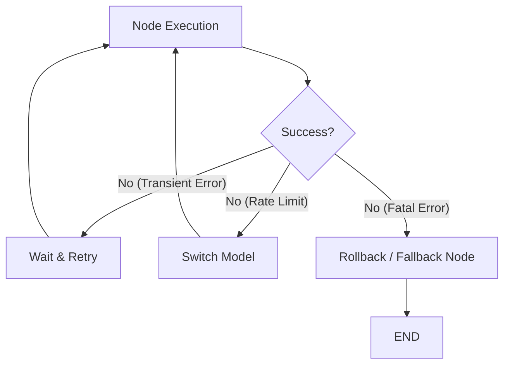

# 🔄 Retry & Recovery Strategies — Building Fault-Tolerant Agents
> **Level:** Core Engineering | **Language:** Hinglish | **Goal:** Master the patterns to handle API failures, rate limits, and reasoning errors through automated retries and fallback paths.

---

## 🧭 1. Beginner-Friendly Hinglish Explanation
Retry & Recovery ka matlab hai **"Galti sudhaarna aur haar na maanna"**. 

Imagine aapka agent ek tool use kar raha hai aur internet disconnect ho gaya. Ya phir AI provider (OpenAI/Claude) ne kaha "Bahut zyada requests ho gayi hain, thodi der ruko."
- **Retry:** Wahi kaam dobara koshish karna.
- **Recovery:** Agar ek rasta band hai, toh doosre raste se goal tak pahuchna.

Professional agents "Fragile" nahi hote. Wo mushkilon ke bawajood kaam pura karte hain.

---

## 🧠 2. Deep Technical Explanation
Resilience in agentic workflows is achieved through **Fault-Tolerant Loops**.
- **Exponential Backoff:** If an API fails, don't retry immediately. Wait 1s, then 2s, then 4s... This prevents overwhelming the server.
- **Fallback Models:** If GPT-4 is down or rate-limited, automatically switch the request to Claude 3.5 or Llama-3.
- **Self-Healing State:** If a node in the graph crashes, use the checkpointer to resume from the last successful state instead of starting over.
- **Circuit Breakers:** If a tool fails 5 times in a row, "Trip" the circuit and stop calling that tool to save costs and prevent further errors.

---

## 🏗️ 3. Architecture Diagrams



---

## 💻 4. Production-Ready Code Example (Retry with Tenacity)

```python
from tenacity import retry, wait_exponential, stop_after_attempt

@retry(wait=wait_exponential(multiplier=1, min=2, max=10), stop=stop_after_attempt(5))
def call_llm_api(prompt):
    # Hinglish Logic: Agar API fail ho, toh exponential gap ke saath 5 baar try karo
    print("Attempting API call...")
    # response = client.chat.completions.create(...)
    # return response
    raise Exception("API Timeout!") # Simulated error

# try:
#    call_llm_api("Hello")
# except Exception:
#    print("All retries failed. Triggering fallback.")
```

---

## 🌍 5. Real-World Use Cases
- **Data Scraping Agents:** Retrying if a website block is detected or using a different proxy.
- **Payment Agents:** If a bank's API is slow, the agent waits and verifies the status before retrying to avoid double payments.
- **Autonomous Coding:** If the generated code fails a test, the agent "Recovers" by rewriting the logic based on the error message.

---

## ❌ 6. Failure Cases
- **Poison Retry:** Agent galti se ek aisi instruction retry karta rehta hai jo kabhi sahi nahi hogi (e.g., trying to delete a non-existent file).
- **Resource Drain:** Bahut zyada retries token budget khatam kar deti hain.
- **Inconsistent State:** Retry ke waqt agar state update ho gaya par original task complete nahi hua.

---

## 🛠️ 7. Debugging Guide
- **Track Attempt Counts:** Humesha log karein ki ye kaunsa attempt hai (`Attempt 3 of 5`).
- **Error Specificity:** Sirf `try/except` mat karein. Pata lagayein ki error `429` (Rate limit) hai ya `500` (Server error).

---

## ⚖️ 8. Tradeoffs
- **High Retry Count:** More robust but increases latency and cost.
- **Low Retry Count:** Faster failure but less reliable in unstable environments.

---

## ✅ 9. Best Practices
- **Idempotency is Key:** Ensure karein ki tool ko 2 baar chalane se koi side-effect na ho.
- **User Notification:** Agar agent 3-4 baar fail hota hai, toh user ko batayein ki "Trying alternative approach..."

---

## 🛡️ 10. Security Concerns
- **Retry Exhaustion Attack:** Attacker galti se aisi requests bhejta hai jo system ko infinite retries mein phasa deti hain, jisse server resources khatam ho jate hain.

---

## 📈 11. Scaling Challenges
- **Global Rate Limits:** Multiple server instances ka collective rate limit manage karna.

---

## 💰 12. Cost Considerations
- **Fallback Models:** Use cheaper models for retries if the task is simple.

---

## 📝 13. Interview Questions
1. **"Exponential backoff kyu zaruri hai agentic systems mein?"**
2. **"Circuit breaker pattern agents ke liye kaise implement karenge?"**
3. **"State rollback aur recovery mein kya fark hai?"**

---

## ⚠️ 14. Common Mistakes
- **Infinite Retries:** `max_attempts` set na karna.
- **Ignoring the Error Message:** Tool error message ko ignore karke wahi parameters baar-baar bhejte rehna.

---

## 🚀 15. Latest 2026 Industry Patterns
- **Multi-Cloud Failover:** Agents that automatically switch between OpenAI (Azure), Anthropic (AWS), and Google Cloud based on real-time availability.
- **Reasoning Recovery:** Using a "Debug Agent" whose only job is to fix the state of another agent that has failed.

---

> **Expert Tip:** Production agents are built for the **Worst Case**, not the Best Case. Recovery is your safety net.
