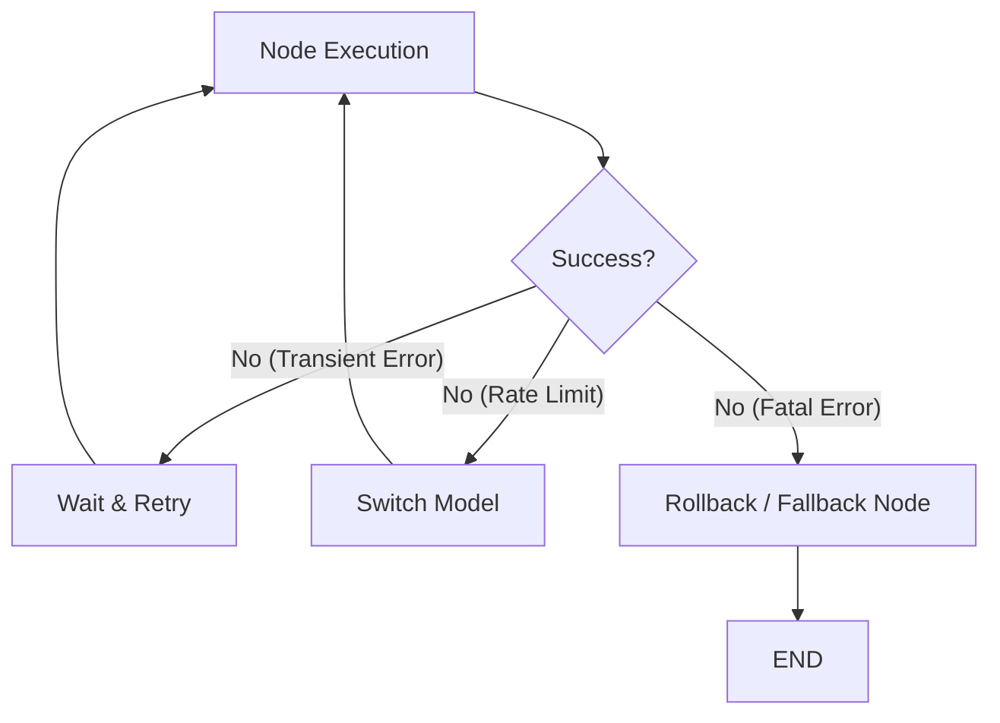

# 🔄 Retry & Recovery Strategies — Building Fault-Tolerant Agents
> **Level:** Core Engineering | **Language:** Hinglish | **Goal:** Automated retries aur fallback paths ke through API failures, rate limits, aur reasoning errors handle karne ke patterns ko master karein.

---

## 🧭 1. Beginner-Friendly Hinglish Explanation
Retry & Recovery ka matlab hai **"Galti sudhaarna aur haar na maanna"**. 

Imagine aapka agent ek tool use kar raha hai aur internet disconnect ho gaya. Ya phir AI provider (OpenAI/Claude) ne kaha "Bahut zyada requests ho gayi hain, thodi der ruko."
- **Retry:** Wahi kaam dobara koshish karna.
- **Recovery:** Agar ek rasta band hai, toh doosre raste se goal tak pahuchna.

Professional agents "Fragile" nahi hote. Wo mushkilon ke bawajood kaam pura karte hain.

---

## 🧠 2. Deep Technical Explanation
Agentic workflows mein resilience **Fault-Tolerant Loops** ke through achieve ki jati hai.
- **Exponential Backoff:** Agar koi API fail hoti hai, toh immediate retry na karein. 1s wait karein, fir 2s, fir 4s... Ye server ko overwhelm hone se rokta hai.
- **Fallback Models:** Agar GPT-4 down ya rate-limited hai, toh request ko automatically Claude 3.5 ya Llama-3 par switch karein.
- **Self-Healing State:** Agar graph mein koi node crash hota hai, toh starting se shuru karne ke bajaye last successful state se resume karne ke liye checkpointer ka use karein.
- **Circuit Breakers:** Agar koi tool lagatar 5 baar fail hota hai, toh circuit ko "Trip" karein aur costs bachane aur further errors ko rokne ke liye us tool ko call karna band karein.

---

## 🏗️ 3. Architecture Diagrams


```mermaid
graph TD
    A[Node Execution] --> B{Success?}
    B -- No (Transient Error) --> C[Wait & Retry]
    C --> A
    B -- No (Rate Limit) --> D[Switch Model]
    D --> A
    B -- No (Fatal Error) --> E[Rollback / Fallback Node]
    E --> END
```

---

## 💻 4. Production-Ready Code Example (Retry with Tenacity)

```python
from tenacity import retry, wait_exponential, stop_after_attempt

@retry(wait=wait_exponential(multiplier=1, min=2, max=10), stop=stop_after_attempt(5))
def call_llm_api(prompt):
    # Hinglish Logic: Agar API fail ho, toh exponential gap ke saath 5 baar try karo
    print("Attempting API call...")
    # response = client.chat.completions.create(...)
    # return response
    raise Exception("API Timeout!") # Simulated error

# try:
#    call_llm_api("Hello")
# except Exception:
#    print("All retries failed. Triggering fallback.")
```

---

## 🌍 5. Real-World Use Cases
- **Data Scraping Agents:** Website block detect hone par retry karna ya different proxy ka use karna.
- **Payment Agents:** Agar bank ki API slow hai, toh double payments se bachane ke liye agent wait karta hai aur retrying se pehle status verify karta hai.
- **Autonomous Coding:** Agar generated code test mein fail ho jata hai, toh agent error message ke basis par logic ko rewrite karke "Recover" karta hai.

---

## ❌ 6. Failure Cases
- **Poison Retry:** Agent galti se ek aisi instruction retry karta rehta hai jo kabhi sahi nahi hogi (e.g., trying to delete a non-existent file).
- **Resource Drain:** Bahut zyada retries token budget khatam kar deti hain.
- **Inconsistent State:** Retry ke waqt agar state update ho gaya par original task complete nahi hua.

---

## 🛠️ 7. Debugging Guide
- **Track Attempt Counts:** Humesha log karein ki ye kaunsa attempt hai (`Attempt 3 of 5`).
- **Error Specificity:** Sirf `try/except` mat karein. Pata lagayein ki error `429` (Rate limit) hai ya `500` (Server error).

---

## ⚖️ 8. Tradeoffs
- **High Retry Count:** Zyada robust hai par latency aur cost ko badhata hai.
- **Low Retry Count:** Faster failure hai par unstable environments mein kam reliable hai.

---

## ✅ 9. Best Practices
- **Idempotency is Key:** Ensure karein ki tool ko 2 baar chalane se koi side-effect na ho.
- **User Notification:** Agar agent 3-4 baar fail hota hai, toh user ko batayein ki "Trying alternative approach..."

---

## 🛡️ 10. Security Concerns
- **Retry Exhaustion Attack:** Attacker galti se aisi requests bhejta hai jo system ko infinite retries mein phasa deti hain, jisse server resources khatam ho jate hain.

---

## 📈 11. Scaling Challenges
- **Global Rate Limits:** Multiple server instances ka collective rate limit manage karna.

---

## 💰 12. Cost Considerations
- **Fallback Models:** Agar task simple hai, toh retries ke liye saste models ka use karein.

---

## 📝 13. Interview Questions
1. **"Exponential backoff kyu zaruri hai agentic systems mein?"**
2. **"Circuit breaker pattern agents ke liye kaise implement karenge?"**
3. **"State rollback aur recovery mein kya fark hai?"**

---

## ⚠️ 14. Common Mistakes
- **Infinite Retries:** `max_attempts` set na karna.
- **Ignoring the Error Message:** Tool error message ko ignore karke wahi parameters baar-baar bhejte rehna.

---

## 🚀 15. Latest 2026 Industry Patterns
- **Multi-Cloud Failover:** Aise agents jo real-time availability ke basis par OpenAI (Azure), Anthropic (AWS), aur Google Cloud ke beech automatically switch karte hain.
- **Reasoning Recovery:** Ek "Debug Agent" ka use karna jiska kaam sirf kisi doosre agent ki state ko fix karna hai jo fail ho gaya hai.

---

> **Expert Tip:** Production agents are built for the **Worst Case**, not the Best Case. Recovery is your safety net.
