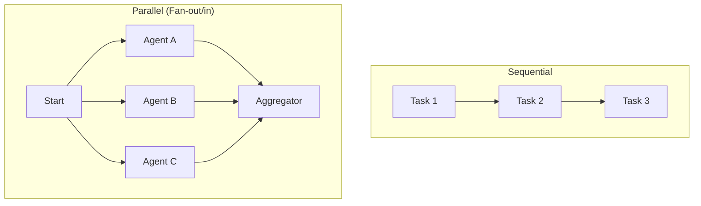

# ⚡ Sequential vs Parallel Workflows — Mastering Speed
> **Level:** Core Engineering | **Language:** Hinglish | **Goal:** Master the techniques to balance step-by-step logic with high-speed parallel execution in agentic systems.

---

## 🧭 1. Beginner-Friendly Hinglish Explanation
Sequential vs Parallel ka matlab hai **"Ek ke baad ek"** vs **"Sab ek saath"**. 

Socho aapko party organize karni hai. 
- **Sequential:** Pehle cake mangwao (1 hour) -> Cake aa gaya -> Ab decorations lagao (1 hour). Total 2 hours.
- **Parallel:** Aapne ek bande ko cake lene bheja aur doosre ko decoration ke liye. Dono kaam ek saath ho gaye. Total sirf 1 hour. 

AI Workflows mein bhi yahi hota hai. Agar Agent 1 ka output Agent 2 ko nahi chahiye, toh unhe Parallel chalana chahiye taaki user ko result fast mile.

---

## 🧠 2. Deep Technical Explanation
Optimizing workflows requires identifying **Data Dependencies**.
- **Sequential (Chains):** Data flows linearly. Node B requires the output of Node A as its input. This is safe and logical but slow.
- **Parallel (Fan-out/Fan-in):** Multiple independent nodes run at the same time. Their results are combined in a final "Aggregator" node.
- **Async Execution:** Using Python's `asyncio` or `ThreadedPoolExecutor` to handle parallel nodes without blocking the main event loop.
- **Aggregator Logic:** When branches merge, the state must handle "Conflict Resolution"—how to combine multiple tool outputs into a single cohesive state.

---

## 🏗️ 3. Architecture Diagrams



---

## 💻 4. Production-Ready Code Example (Parallel Fan-out)

```python
import asyncio

async def agent_task(name, duration):
    print(f"Agent {name} starting...")
    await asyncio.sleep(duration)
    return f"Result from {name}"

async def run_parallel_workflow():
    # Hinglish Logic: Dono agents ko ek saath chalao
    results = await asyncio.gather(
        agent_task("Researcher", 2),
        agent_task("Analyst", 2)
    )
    print(f"All done! Combined Results: {results}")

# asyncio.run(run_parallel_workflow())
```

---

## 🌍 5. Real-World Use Cases
- **Parallel Search:** Searching Google, Twitter, and LinkedIn simultaneously for a candidate.
- **A/B Testing Prompts:** Running the same query through 3 different models/prompts in parallel to see which one performs best.
- **Large Document Processing:** Splitting a 100-page PDF into 10 parts and summarizing each part in parallel.

---

## ❌ 6. Failure Cases
- **Aggregator Bottleneck:** Saare parallel agents apna kaam kar lete hain par aggregator node unhe merge karne mein galti kar deta hai.
- **Resource Starvation:** 100 parallel tasks chalane se API rate limits hit ho jati hain.
- **Zombi Tasks:** Ek parallel task fail ho jata hai par system doosre tasks ka wait karta rehta hai (No timeout).

---

## 🛠️ 7. Debugging Guide
- **Trace the Timeline:** Humesha dekho kaunsa task kitna time le raha hai (Gantt chart style logs).
- **Isolate Branches:** Agar parallel workflow fail ho raha hai, toh har branch ko individually test karein.

---

## ⚖️ 8. Tradeoffs
- **Sequential:** Easy to debug, low resource usage, but high latency.
- **Parallel:** Very fast but complex to implement, higher cost (simultaneous tokens), and harder to debug state conflicts.

---

## ✅ 9. Best Practices
- **Use for Independent Tasks:** Sirf tab parallel karein jab tasks ek doosre par depend na karte hon.
- **Implement Timeouts:** Har parallel branch ke liye ek max wait time set karein.

---

## 🛡️ 10. Security Concerns
- **Race Conditions:** Do parallel agents same state variable ko overwrite karne ki koshish karein (use locks or unique keys).

---

## 📈 11. Scaling Challenges
- **Concurrent Inference:** LLM providers (like OpenAI) often have lower rate limits for concurrent requests than total tokens.

---

## 💰 12. Cost Considerations
- **Peak Load:** Parallel workflows ek saath bahut saare tokens consume karte hain, jo billing thresholds ko jaldi hit kar sakte hain.

---

## 📝 13. Interview Questions
1. **"Fan-out / Fan-in architecture kya hoti hai?"**
2. **"Parallel workflows mein conflict resolution kaise handle karenge?"**
3. **"Sequential logic ko parallel mein convert karne ke fayde aur nuksaan?"**

---

## ⚠️ 14. Common Mistakes
- **Dead Waiting:** Ek parallel task ke liye infiniti tak wait karna.
- **No Aggregator:** Sab results mangwa lena par unhe dhang se use na karna.

---

## 🚀 15. Latest 2026 Industry Patterns
- **Speculative Parallelism:** Agent predict karta hai ki usse next 3 tools ki zarurat padegi aur unhe pehle se hi parallel mein start kar deta hai.
- **Dynamic Branching:** Flow runtime par decide karta hai ki kitni parallel branches banani hain based on query complexity.

---

> **Expert Tip:** In the world of AI Agents, **Time is the new Currency**. Parallelism is how you save it.
