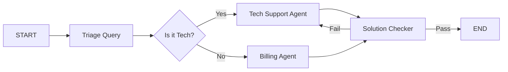

# 🏗️ Workflow Architecture — Building Complex Agent Systems
> **Level:** Core Engineering | **Language:** Hinglish | **Goal:** Master the structural design of agentic workflows, moving from linear chains to stateful graphs.

---

## 🧭 1. Beginner-Friendly Hinglish Explanation
Workflow Architecture ka matlab hai **"Kaam karne ka poora nakshe (Map)"**. 

Ek simple AI sirf sawal ka jawab deta hai, lekin ek **Agentic Workflow** mein hum bohot saare steps ko ek saath jode hain. 
Example:
Step 1: User ki query samjho.
Step 2: Database mein dhoondho.
Step 3: Result ko summarize karo.
Step 4: Email bhejo.

Workflow architecture humein batata hai ki ye steps kab, kaise aur kis order mein chalenge.

---

## 🧠 2. Deep Technical Explanation
Workflow architecture in 2026 is dominated by **Stateful Graphs** (e.g., LangGraph).
- **Nodes:** Individual units of work (LLM calls, Python functions, Tool executions).
- **Edges:** The connections between nodes. They can be **Directed** (fixed path) or **Conditional** (based on LLM logic).
- **State:** A shared object that travels through the graph, storing all observations and reasoning.
- **Cycles:** Allowing the workflow to loop back (e.g., if validation fails, go back to the generation node). This is what makes a workflow "Agentic" rather than just a "Chain".
- **Checkpointers:** Automatically saving the state at each edge so the workflow can be resumed or audited.

---

## 🏗️ 3. Architecture Diagrams



---

## 💻 4. Production-Ready Code Example (Basic LangGraph Structure)

```python
from typing import TypedDict
from langgraph.graph import StateGraph, START, END

# 1. Define State
class GraphState(TypedDict):
    input: str
    output: str
    is_valid: bool

# 2. Define Nodes
def processing_node(state: GraphState):
    print("---Processing---")
    return {"output": "Processed " + state["input"]}

def validation_node(state: GraphState):
    print("---Validating---")
    return {"is_valid": True}

# 3. Build Graph
workflow = StateGraph(GraphState)
workflow.add_node("processor", processing_node)
workflow.add_node("validator", validation_node)

workflow.add_edge(START, "processor")
workflow.add_edge("processor", "validator")
workflow.add_edge("validator", END)

# app = workflow.compile()
```

---

## 🌍 5. Real-World Use Cases
- **Insurance Claims:** A workflow that extracts data from images, checks policy documents, and approves/rejects the claim.
- **Content Moderation:** A system that filters text, checks against safety rules, and flags for human review if uncertain.

---

## ❌ 6. Failure Cases
- **Deadlock:** Node A Node B ka wait kar raha hai, aur Node B Node A ka (Graph stuck).
- **State Bloat:** Har node state mein itna data add kar deta hai ki context window exceed ho jaye.
- **Incorrect Conditional Edge:** LLM decide nahi kar pata ki "Yes" edge lena hai ya "No", jisse flow galat direction mein chala jata hai.

---

## 🛠️ 7. Debugging Guide
- **Visual Tracing:** Use LangGraph's `draw_mermaid()` to visualize your graph.
- **Breakpoints:** Stop the workflow at a specific node to inspect the state variables.

---

## ⚖️ 8. Tradeoffs
- **Graph-based Workflows:** Very flexible and powerful but complex to design and debug.
- **Linear Chains:** Simple and fast but can't handle loops or complex logic.

---

## ✅ 9. Best Practices
- **Small Nodes:** Ek node mein sirf ek kaam karein (Single Responsibility Principle).
- **Clear State Schema:** State mein kya data hai, use Pydantic se strictly define karein.

---

## 🛡️ 10. Security Concerns
- **State Manipulation:** Ensure that nodes from untrusted tools cannot overwrite critical state variables (like `is_admin`).

---

## 📈 11. Scaling Challenges
- **Memory Persistence:** Saving states for millions of concurrent graphs in a high-speed database like Redis.

---

## 💰 12. Cost Considerations
- **Node Overhead:** Har node transition LLM call nahi hoti, lekin agar conditional edges mein LLM use ho raha hai, toh cost badh sakti hai.

---

## 📝 13. Interview Questions
1. **"Chain vs Graph based workflows mein key difference kya hai?"**
2. **"LangGraph mein 'State' management kaise kaam karti hai?"**
3. **"Conditional edges reliability production mein kaise ensure karenge?"**

---

## ⚠️ 14. Common Mistakes
- **Designing a black box:** Pura logic ek hi node mein dalkar use "Workflow" bolna.
- **No Stop Condition:** Graph ko infinite loop mein phasa dena.

---

## 🚀 15. Latest 2026 Industry Patterns
- **Agentic Microservices:** Breaking down a large workflow graph into multiple microservices that communicate via events.
- **Dynamic Graph Construction:** An LLM that builds the workflow graph *on the fly* based on the user's specific request.

---

> **Expert Tip:** Workflows are the **SOPs (Standard Operating Procedures)** of AI. If you can't map it on a whiteboard, you can't build it in code.
