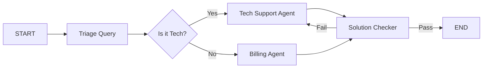

# 🏗️ Workflow Architecture — Building Complex Agent Systems
> **Level:** Core Engineering | **Language:** Hinglish | **Goal:** Linear chains se stateful graphs ki taraf agentic workflows ke structural design ko master karein.

---

## 🧭 1. Beginner-Friendly Hinglish Explanation
Workflow Architecture ka matlab hai **"Kaam karne ka poora nakshe (Map)"**. 

Ek simple AI sirf sawal ka jawab deta hai, lekin ek **Agentic Workflow** mein hum bohot saare steps ko ek saath jode hain. 
Example:
Step 1: User ki query samjho.
Step 2: Database mein dhoondho.
Step 3: Result ko summarize karo.
Step 4: Email bhejo.

Workflow architecture humein batata hai ki ye steps kab, kaise aur kis order mein chalenge.

---

## 🧠 2. Deep Technical Explanation
2026 mein workflow architecture par **Stateful Graphs** (e.g., LangGraph) ka dabdaba hai.
- **Nodes:** Work ki individual units (LLM calls, Python functions, Tool executions).
- **Edges:** Nodes ke beech ke connections. Ye **Directed** (fixed path) ya **Conditional** (LLM logic ke basis par) ho sakte hain.
- **State:** Ek shared object jo graph ke through travel karta hai, saare observations aur reasoning ko store karta hai.
- **Cycles:** Workflow ko loop back allow karna (e.g., agar validation fail ho jaye, toh generation node par wapas jana). Ye wahi cheez hai jo workflow ko sirf ek "Chain" ke bajaye "Agentic" banati hai.
- **Checkpointers:** Har edge par state ko automatically save karna taaki workflow ko resume ya audit kiya ja sake.

---

## 🏗️ 3. Architecture Diagrams


```mermaid
graph LR
    START --> Node1[Triage Query]
    Node1 --> Condition{Is it Tech?}
    Condition -- Yes --> Node2[Tech Support Agent]
    Condition -- No --> Node3[Billing Agent]
    Node2 --> Node4[Solution Checker]
    Node3 --> Node4
    Node4 -- "Fail" --> Node2
    Node4 -- "Pass" --> END
```

---

## 💻 4. Production-Ready Code Example (Basic LangGraph Structure)

```python
from typing import TypedDict
from langgraph.graph import StateGraph, START, END

# 1. Define State
class GraphState(TypedDict):
    input: str
    output: str
    is_valid: bool

# 2. Define Nodes
def processing_node(state: GraphState):
    print("---Processing---")
    return {"output": "Processed " + state["input"]}

def validation_node(state: GraphState):
    print("---Validating---")
    return {"is_valid": True}

# 3. Build Graph
workflow = StateGraph(GraphState)
workflow.add_node("processor", processing_node)
workflow.add_node("validator", validation_node)

workflow.add_edge(START, "processor")
workflow.add_edge("processor", "validator")
workflow.add_edge("validator", END)

# app = workflow.compile()
```

---

## 🌍 5. Real-World Use Cases
- **Insurance Claims:** Ek aisa workflow jo images se data extract karta hai, policy documents check karta hai, aur claim ko approve/reject karta hai.
- **Content Moderation:** Ek aisa system jo text filter karta hai, safety rules ke against check karta hai, aur uncertain hone par human review ke liye flag karta hai.

---

## ❌ 6. Failure Cases
- **Deadlock:** Node A Node B ka wait kar raha hai, aur Node B Node A ka (Graph stuck).
- **State Bloat:** Har node state mein itna data add kar deta hai ki context window exceed ho jaye.
- **Incorrect Conditional Edge:** LLM decide nahi kar pata ki "Yes" edge lena hai ya "No", jisse flow galat direction mein chala jata hai.

---

## 🛠️ 7. Debugging Guide
- **Visual Tracing:** Apne graph ko visualize karne ke liye LangGraph ke `draw_mermaid()` ka use karein.
- **Breakpoints:** State variables ko inspect karne ke liye workflow ko ek specific node par stop karein.

---

## ⚖️ 8. Tradeoffs
- **Graph-based Workflows:** Bahut flexible aur powerful hain par design aur debug karne mein complex hain.
- **Linear Chains:** Simple aur fast hain par loops ya complex logic handle nahi kar sakte.

---

## ✅ 9. Best Practices
- **Small Nodes:** Ek node mein sirf ek kaam karein (Single Responsibility Principle).
- **Clear State Schema:** State mein kya data hai, use Pydantic se strictly define karein.

---

## 🛡️ 10. Security Concerns
- **State Manipulation:** Ensure karein ki untrusted tools ke nodes critical state variables (jaise `is_admin`) ko overwrite na kar sakein.

---

## 📈 11. Scaling Challenges
- **Memory Persistence:** Ek high-speed database jaise Redis mein millions of concurrent graphs ke liye states ko save karna.

---

## 💰 12. Cost Considerations
- **Node Overhead:** Har node transition LLM call nahi hoti, lekin agar conditional edges mein LLM use ho raha hai, toh cost badh sakti hai.

---

## 📝 13. Interview Questions
1. **"Chain vs Graph based workflows mein key difference kya hai?"**
2. **"LangGraph mein 'State' management kaise kaam karti hai?"**
3. **"Conditional edges reliability production mein kaise ensure karenge?"**

---

## ⚠️ 14. Common Mistakes
- **Designing a black box:** Pura logic ek hi node mein dalkar use "Workflow" bolna.
- **No Stop Condition:** Graph ko infinite loop mein phasa dena.

---

## 🚀 15. Latest 2026 Industry Patterns
- **Agentic Microservices:** Ek bade workflow graph ko multiple microservices mein break karna jo events ke through communicate karte hain.
- **Dynamic Graph Construction:** Ek LLM jo user ki specific request ke basis par *on the fly* workflow graph build karta hai.

---

> **Expert Tip:** Workflows are the **SOPs (Standard Operating Procedures)** of AI. If you can't map it on a whiteboard, you can't build it in code.
