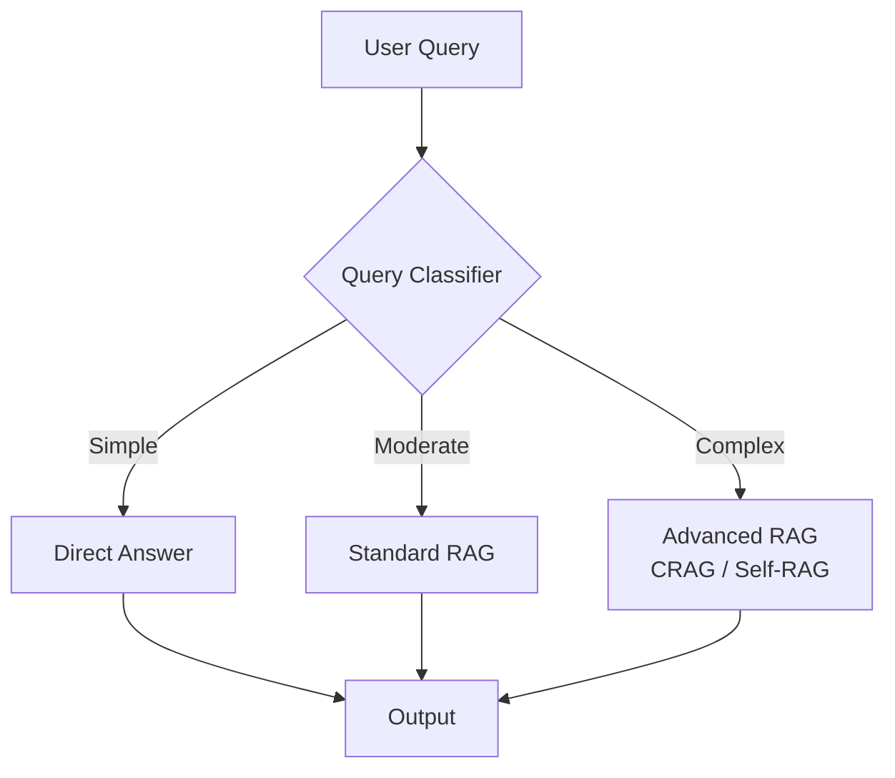

# 🧠 Adaptive RAG — Query-Driven Retrieval Logic
> **Level:** Advanced | **Language:** Hinglish | **Goal:** Master the technique of dynamically choosing between different RAG strategies (Direct, CRAG, Self-RAG) based on query complexity.

---

## 🧭 1. Beginner-Friendly Hinglish Explanation
Adaptive RAG ka matlab hai **"Sawal ke hisaab se raasta chunna"**. 

Imagine aap ek helpline operator ho. 
- Agar koi puchta hai "Aapka naam kya hai?" (Simple), toh aap direct jawab de dete ho. 
- Agar koi puchta hai "Mera order kahan hai?" (Medium), toh aap database mein check karte ho (Simple RAG). 
- Agar koi puchta hai "Agle 10 saal mein AI market kaisa hoga?" (Complex), toh aap dher saari research karte ho aur verify karte ho (CRAG/Self-RAG).

Adaptive RAG mein AI pehle **Query ko analyze** karta hai aur phir decide karta hai ki kitna "Zor" (Computation) lagana hai.

---

## 🧠 2. Deep Technical Explanation
Adaptive RAG is a **Routing Strategy** for RAG pipelines.
- **Query Classifier:** A small, fast LLM or a set of rules that classifies the incoming query into categories like `SIMPLE`, `MODERATE`, or `COMPLEX`.
- **Strategy Routing:**
    - `SIMPLE`: Direct LLM generation (No retrieval).
    - `MODERATE`: Standard RAG (Single retrieval).
    - `COMPLEX`: Corrective RAG or Multi-hop RAG (Iterative retrieval + Web search).
- **Optimization:** This prevents over-using resources (tokens/time) for simple questions while ensuring high quality for hard ones.
- **Implementation:** Often built as the "Entry Node" in a LangGraph workflow.

---

## 🏗️ 3. Architecture Diagrams



---

## 💻 4. Production-Ready Code Example (Adaptive Router)

```python
from typing import Literal
from pydantic import BaseModel

class RouteQuery(BaseModel):
    # Hinglish Logic: Router decide karega kaunsa raasta lena hai
    path: Literal["direct", "rag", "advanced"]

def query_router(query: str) -> str:
    # Simulated Router LLM call
    if len(query.split()) < 5:
        return "direct"
    elif "compare" in query or "research" in query:
        return "advanced"
    return "rag"

def run_adaptive_rag(query: str):
    path = query_router(query)
    print(f"Routing to: {path}")
    
    if path == "direct":
        return "Direct Answer"
    elif path == "rag":
        return "Standard RAG result"
    else:
        return "Advanced CRAG/Self-RAG result"

# run_adaptive_rag("Hi there!")
# run_adaptive_rag("Compare the revenue of Apple and Microsoft in 2024.")
```

---

## 🌍 5. Real-World Use Cases
- **Enterprise Chatbots:** Handling "Hi" and "Bye" instantly while doing deep searches for "Policy details".
- **Search Engines:** Identifying when a query needs a "Featured Snippet" vs a "Deep Research" report.
- **Academic Assistants:** Answering basic definitions vs providing citations for a thesis.

---

## ❌ 6. Failure Cases
- **Misclassification:** Complex query ko "Simple" mark kar dena, jisse galat ya hallucinated answer milta hai.
- **Router Overhead:** Router khud itna time leta hai ki total latency badh jati hai.
- **State Mismatch:** Har path ke liye alag data schema hone ki wajah se integration errors.

---

## 🛠️ 7. Debugging Guide
- **Classifier Audit:** Regularly check the logs: "Did the router pick the right path?"
- **Confusion Matrix:** Map the Query vs Path to see where the router is failing.

---

## ⚖️ 8. Tradeoffs
- **Efficiency:** Best balance between cost, speed, and accuracy.
- **Maintenance:** Designing and maintaining 3 different RAG paths is 3x more work.

---

## ✅ 9. Best Practices
- **Fast Router:** Router ke liye hamesha fast model (like Llama-3-8B or GPT-4o-mini) use karein.
- **Fail-safe:** If in doubt, route to "Moderate RAG" instead of "Direct".

---

## 🛡️ 10. Security Concerns
- **Routing Manipulation:** Attacker query ko aisi banata hai jo advanced path bypass karke direct simple path par jaye jahan security checks kam hon.

---

## 📈 11. Scaling Challenges
- **Consistent Quality:** Ensuring that all 3 paths give the same "Tone" and "Style" of response.

---

## 💰 12. Cost Considerations
- **Router tokens:** Since every query goes through the router, you pay for those extra tokens every time. Keep the router prompt small.

---

## 📝 13. Interview Questions
1. **"Adaptive RAG vs Standard RAG: Kyu aur kab?"**
2. **"Query classifier training data kaise generate karoge?"**
3. **"Latency vs Accuracy tradeoff adaptive RAG mein kaise manage karenge?"**

---

## ⚠️ 14. Common Mistakes
- **Complex Routing Logic:** Itne saare paths banana ki system maintainable na rahe.
- **No Feedback Loop:** Router ko kabhi na batana ki usne galat path choose kiya tha.

---

## 🚀 15. Latest 2026 Industry Patterns
- **Reinforcement Learning Router:** Routers that learn from user "Thumbs Up/Down" to improve their classification over time.
- **Prompt-less Routing:** Using semantic similarity (Embeddings) to route instead of a full LLM call (Faster & Cheaper).

---

> **Expert Tip:** Adaptive RAG is the **"Traffic Controller"** of your AI system. It makes sure no token is wasted on a simple "Hello".
