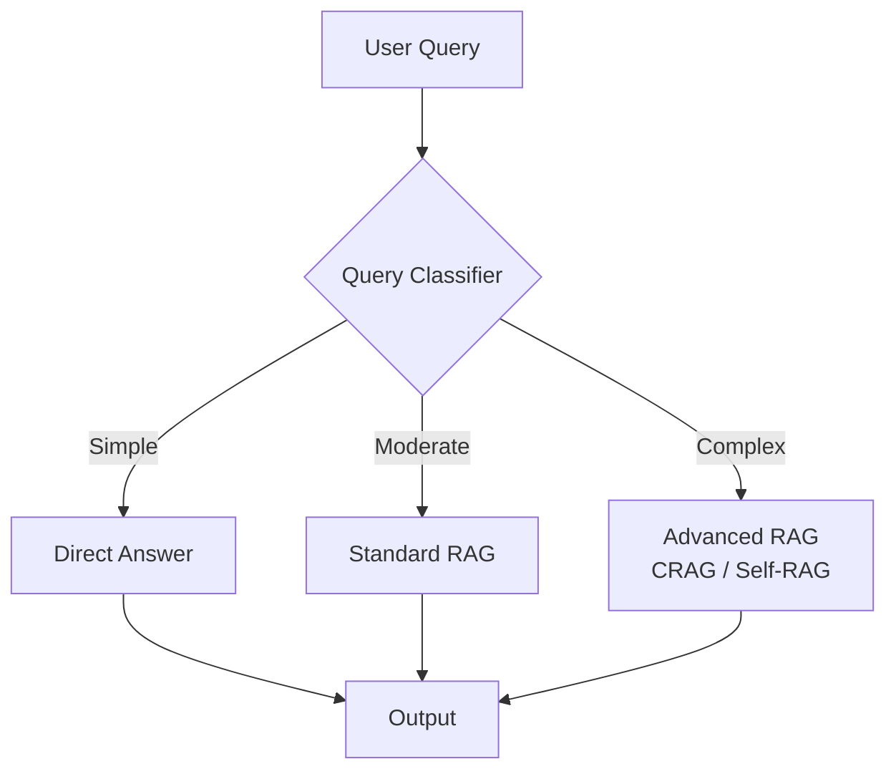

# 🧠 Adaptive RAG — Query-Driven Retrieval Logic
> **Level:** Advanced | **Language:** Hinglish | **Goal:** Query complexity ke basis par alag-alag RAG strategies (Direct, CRAG, Self-RAG) ke beech dynamically choose karne ki technique ko master karein.

---

## 🧭 1. Beginner-Friendly Hinglish Explanation
Adaptive RAG ka matlab hai **"Sawal ke hisaab se raasta chunna"**. 

Imagine aap ek helpline operator ho. 
- Agar koi puchta hai "Aapka naam kya hai?" (Simple), toh aap direct jawab de dete ho. 
- Agar koi puchta hai "Mera order kahan hai?" (Medium), toh aap database mein check karte ho (Simple RAG). 
- Agar koi puchta hai "Agle 10 saal mein AI market kaisa hoga?" (Complex), toh aap dher saari research karte ho aur verify karte ho (CRAG/Self-RAG).

Adaptive RAG mein AI pehle **Query ko analyze** karta hai aur phir decide karta hai ki kitna "Zor" (Computation) lagana hai.

---

## 🧠 2. Deep Technical Explanation
Adaptive RAG, RAG pipelines ke liye ek **Routing Strategy** hai.
- **Query Classifier:** Ek chota, fast LLM ya rules ka set jo incoming query ko `SIMPLE`, `MODERATE`, ya `COMPLEX` jaise categories mein classify karta hai.
- **Strategy Routing:**
    - `SIMPLE`: Direct LLM generation (Koi retrieval nahi).
    - `MODERATE`: Standard RAG (Single retrieval).
    - `COMPLEX`: Corrective RAG ya Multi-hop RAG (Iterative retrieval + Web search).
- **Optimization:** Ye simple questions ke liye resources (tokens/time) ko over-use karne se rokta hai aur hard questions ke liye high quality ensure karta hai.
- **Implementation:** Aksar LangGraph workflow mein "Entry Node" ki tarah build kiya jata hai.

---

## 🏗️ 3. Architecture Diagrams


```mermaid
graph TD
    U[User Query] --> C{Query Classifier}
    C -->|Simple| D[Direct Answer]
    C -->|Moderate| R[Standard RAG]
    C -->|Complex| A[Advanced RAG\nCRAG / Self-RAG]
    D --> Final[Output]
    R --> Final
    A --> Final
```

---

## 💻 4. Production-Ready Code Example (Adaptive Router)

```python
from typing import Literal
from pydantic import BaseModel

class RouteQuery(BaseModel):
    # Hinglish Logic: Router decide karega kaunsa raasta lena hai
    path: Literal["direct", "rag", "advanced"]

def query_router(query: str) -> str:
    # Simulated Router LLM call
    if len(query.split()) < 5:
        return "direct"
    elif "compare" in query or "research" in query:
        return "advanced"
    return "rag"

def run_adaptive_rag(query: str):
    path = query_router(query)
    print(f"Routing to: {path}")
    
    if path == "direct":
        return "Direct Answer"
    elif path == "rag":
        return "Standard RAG result"
    else:
        return "Advanced CRAG/Self-RAG result"

# run_adaptive_rag("Hi there!")
# run_adaptive_rag("Compare the revenue of Apple and Microsoft in 2024.")
```

---

## 🌍 5. Real-World Use Cases
- **Enterprise Chatbots:** "Policy details" ke liye deep search karte waqt "Hi" aur "Bye" ko instantly handle karna.
- **Search Engines:** Identify karna ki kab query ko "Featured Snippet" ki zaroorat hai vs "Deep Research" report ki.
- **Academic Assistants:** Basic definitions ka answer dena vs thesis ke liye citations provide karna.

---

## ❌ 6. Failure Cases
- **Misclassification:** Complex query ko "Simple" mark kar dena, jisse galat ya hallucinated answer milta hai.
- **Router Overhead:** Router khud itna time leta hai ki total latency badh jati hai.
- **State Mismatch:** Har path ke liye alag data schema hone ki wajah se integration errors.

---

## 🛠️ 7. Debugging Guide
- **Classifier Audit:** Regularly logs check karein: "Kya router ne sahi path pick kiya?"
- **Confusion Matrix:** Query vs Path ko map karein taaki dekh sakein ki router kahan fail ho raha hai.

---

## ⚖️ 8. Tradeoffs
- **Efficiency:** Cost, speed, aur accuracy ke beech best balance.
- **Maintenance:** 3 different RAG paths ko design aur maintain karna 3x zyada kaam hai.

---

## ✅ 9. Best Practices
- **Fast Router:** Router ke liye hamesha fast model (like Llama-3-8B or GPT-4o-mini) use karein.
- **Fail-safe:** Agar doubt ho, toh "Direct" ke bajaye "Moderate RAG" par route karein.

---

## 🛡️ 10. Security Concerns
- **Routing Manipulation:** Attacker query ko aisi banata hai jo advanced path bypass karke direct simple path par jaye jahan security checks kam hon.

---

## 📈 11. Scaling Challenges
- **Consistent Quality:** Ensure karna ki teeno paths response ka same "Tone" aur "Style" dein.

---

## 💰 12. Cost Considerations
- **Router tokens:** Kyunki har query router ke through jati hai, aap har baar un extra tokens ke liye pay karte hain. Router prompt ko chota rakhein.

---

## 📝 13. Interview Questions
1. **"Adaptive RAG vs Standard RAG: Kyu aur kab?"**
2. **"Query classifier training data kaise generate karoge?"**
3. **"Latency vs Accuracy tradeoff adaptive RAG mein kaise manage karenge?"**

---

## ⚠️ 14. Common Mistakes
- **Complex Routing Logic:** Itne saare paths banana ki system maintainable na rahe.
- **No Feedback Loop:** Router ko kabhi na batana ki usne galat path choose kiya tha.

---

## 🚀 15. Latest 2026 Industry Patterns
- **Reinforcement Learning Router:** Aise routers jo time ke sath apni classification improve karne ke liye user "Thumbs Up/Down" se seekhte hain.
- **Prompt-less Routing:** Full LLM call ke bajaye route karne ke liye semantic similarity (Embeddings) ka use karna (Faster & Cheaper).

---

> **Expert Tip:** Adaptive RAG is the **"Traffic Controller"** of your AI system. It makes sure no token is wasted on a simple "Hello".
