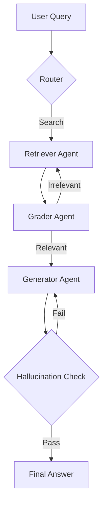

# 🏗️ Agentic RAG Architectures — The Synthesis of Search & Logic
> **Level:** Advanced | **Language:** Hinglish | **Goal:** Master the end-to-end architectural designs that transform simple retrieval into autonomous, reasoning-driven knowledge discovery.

---

## 🧭 1. Beginner-Friendly Hinglish Explanation
Agentic RAG Architecture ka matlab hai **"RAG ko dimaag dena"**. 

Simple RAG ek machine ki tarah hai: "Button dabao -> Info lo". 
Lekin Agentic RAG ek **Expert Librarian** ki tarah hai:
- Wo aapka sawal dhang se samajhta hai.
- Agar info nahi milti, toh wo doosri book dhoondhta hai.
- Agar info mil jati hai, toh wo use double-check karta hai.
- Wo khud decide karta hai kab chup rehna hai aur kab Google Search karna hai.

Is architecture mein Retrieval sirf ek "Step" nahi, balki ek **"Skill"** hai jo Agent use karta hai.

---

## 🧠 2. Deep Technical Explanation
Agentic RAG moves from a **Pipeline** (linear) to a **Graph** (cyclic).
- **The Router:** Classifies if the query needs RAG, Web Search, or direct answer.
- **The Retriever Agent:** Can refine its own search queries if the first result is poor.
- **The Grader Agent:** Critiques the retrieved documents for relevance and support.
- **The Hallucination Checker:** Verifies if the generation is grounded in the retrieval.
- **Iterative Loop:** If any of the checks fail, the system loops back to re-retrieve or re-generate.
- **Tool Integration:** RAG is treated as a "Tool" in the agent's toolbox, rather than a fixed wrapper.

---

## 🏗️ 3. Architecture Diagrams



---

## 💻 4. Production-Ready Code Example (High-level Agentic RAG Graph)

```python
from langgraph.graph import StateGraph, START, END

# Define nodes for the Agentic RAG
def retrieve_node(state):
    print("---RETRIEVE---")
    # call vector search tool
    return {"docs": ["some docs"]}

def grade_docs_node(state):
    print("---GRADE---")
    # LLM grades docs. If irrelevant, set status to 'retry'
    return {"status": "success"}

def generate_node(state):
    print("---GENERATE---")
    # final answer generation
    return {"answer": "The answer is..."}

# Build the Agentic Graph
builder = StateGraph(dict)
builder.add_node("retrieve", retrieve_node)
builder.add_node("grade", grade_docs_node)
builder.add_node("generate", generate_node)

builder.add_edge(START, "retrieve")
builder.add_edge("retrieve", "grade")
builder.add_conditional_edges("grade", lambda x: x["status"], {"success": "generate", "retry": "retrieve"})
builder.add_edge("generate", END)

# app = builder.compile()
```

---

## 🌍 5. Real-World Use Cases
- **Autonomous Research Papers:** An agent that researches multiple sources, grades them, and writes a cited thesis.
- **Dynamic Customer Support:** An agent that can look at your order history, shipping status, and company policy to solve a refund issue autonomously.
- **Market Intelligence:** Searching news, financial reports, and social media to provide a real-time risk assessment.

---

## ❌ 6. Failure Cases
- **Loop Death:** Agent retrieval aur grading ke beech mein phas gaya aur kabhi answer nahi de raha (Infinite loop).
- **Over-Correction:** Hallucination checker itna strict hai ki wo sahi answers ko bhi reject kar raha hai.
- **Complexity Bloat:** Itne saare agents/nodes banana ki system debug karna impossible ho jaye.

---

## 🛠️ 7. Debugging Guide
- **Trace Visualization:** Humesha LangGraph cloud ya LangSmith use karke graph ka rasta dekhein.
- **Node-level Logging:** Har node ka input/output aur "Reasoning" humesha save karein.

---

## ⚖️ 8. Tradeoffs
- **Quality:** Best-in-class grounding and factual accuracy.
- **Latency:** Kafi zyada (Multiple LLM calls for grading and checks).
- **Cost:** Expensive due to iterative nature.

---

## ✅ 9. Best Practices
- **Small Grader Models:** Grading ke liye saste aur fast models (GPT-4o-mini/Haiku) use karein.
- **Max Iterations:** Looping agents mein humesha `max_loops=3` set karein.

---

## 🛡️ 10. Security Concerns
- **Tool Chaining Exploits:** Attacker query se retrieval ko manipulate karke galti se malicious data ko "Correct" mark karwa sakta hai.

---

## 📈 11. Scaling Challenges
- **State Management:** Large graphs ke liye state persistence aur recovery in high traffic.

---

## 💰 12. Cost Considerations
- **Incremental Cost:** Simple RAG vs Agentic RAG cost difference 3x-5x ho sakta hai. Optimize your loops.

---

## 📝 13. Interview Questions
1. **"Standard RAG pipeline aur Agentic RAG graph mein kya fark hai?"**
2. **"Grader agent RAG system ki reliability kaise badhata hai?"**
3. **"Hallucination check node kaise implement karoge?"**

---

## ⚠️ 14. Common Mistakes
- **No Stop Condition:** Agent ko bolna ki "Tab tak dhoondho jab tak perfect na mil jaye" (It will never stop).
- **Manual Pathing:** Everything hard-coding (Instead, let the router decide the path).

---

## 🚀 15. Latest 2026 Industry Patterns
- **Multi-Agent RAG Teams:** One researcher agent, one fact-checker agent, and one writer agent working in a parallel-serial hybrid graph.
- **RAG as a Planning Algorithm:** Using the retrieved documents to *build* the reasoning plan, rather than just using them as context.

---

> **Expert Tip:** Agentic RAG is **Self-Aware Search**. It knows what it knows, and more importantly, it knows when it's confused.
