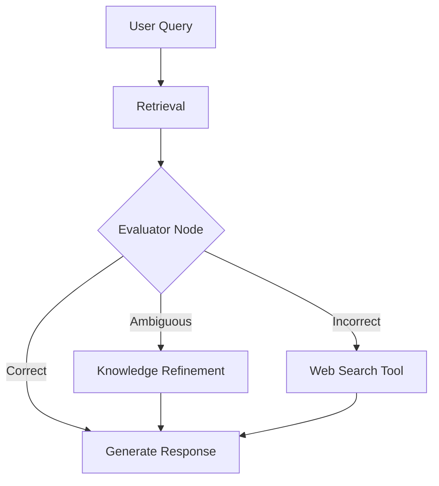

# 🛡️ CRAG (Corrective RAG) — Self-Healing Retrieval
> **Level:** Advanced | **Language:** Hinglish | **Goal:** Master the Corrective RAG pattern that uses a "Retrieval Evaluator" to decide when to trust search results, when to refine them, and when to search the web.

---

## 🧭 1. Beginner-Friendly Hinglish Explanation
CRAG (Corrective RAG) ka matlab hai **"Galati sudhaarne wala RAG"**. 

Normal RAG mein agar aapne search kiya aur Vector DB ne galat info di, toh AI galat jawab de dega. 
Lekin CRAG pehle ek **"Quality Check"** karta hai:
- **Correct:** Info sahi hai? Toh aage badho.
- **Ambiguous:** Info thodi-thodi sahi hai? Toh use "Clean" (Refine) karo.
- **Incorrect:** Info bilkul galat hai? Toh use discard karo aur **Google Search (Web)** se fresh info nikalo.

CRAG ka kaam hai ensure karna ki AI kabhi purani ya galat info par bharosa na kare.

---

## 🧠 2. Deep Technical Explanation
CRAG introduces a **Retrieval Evaluator** node between the retrieval and generation phases.
- **Evaluation Node:** A lightweight LLM call that scores the retrieved documents as `CORRECT`, `AMBIGUOUS`, or `INCORRECT`.
- **Knowledge Refinement:** For ambiguous docs, it performs "Knowledge Partitioning"—splitting the chunk further and extracting only the relevant sub-sentences.
- **Web Search Fallback:** If all retrieved documents are `INCORRECT`, it triggers a search tool (like Tavily or DuckDuckGo) to find external up-to-date data.
- **Safety Layer:** It prevents "Garbage In, Garbage Out" by ensuring only validated context reaches the generator LLM.

---

## 🏗️ 3. Architecture Diagrams



---

## 💻 4. Production-Ready Code Example (CRAG Logic)

```python
def crag_evaluator(query, retrieved_docs):
    # Hinglish Logic: retrieved data ko verify karo
    score = 0.5 # Simulated evaluation score
    
    if score > 0.8:
        return "CORRECT"
    elif score > 0.4:
        return "AMBIGUOUS"
    else:
        return "INCORRECT"

def run_crag_flow(query):
    docs = ["Simulated Doc from Vector DB"]
    verdict = crag_evaluator(query, docs)
    
    if verdict == "CORRECT":
        return f"Using docs: {docs}"
    elif verdict == "AMBIGUOUS":
        refined_docs = ["Cleaned version of docs"]
        return f"Refined docs: {refined_docs}"
    else:
        # Web Search logic here
        return "Triggering Web Search for fresh info..."

# print(run_crag_flow("Who won the match today?"))
```

---

## 🌍 5. Real-World Use Cases
- **News Chatbots:** If local DB doesn't have today's news, search the web (CRAG pattern).
- **Technical Support:** If the local manual is outdated for a new version, finding the latest patch notes online.
- **Fact-Checking Agents:** Verifying internal claims against public data sources.

---

## ❌ 6. Failure Cases
- **False Negative:** Evaluator ne sahi document ko "Incorrect" bol diya aur faltu mein web search trigger kar di (Costly error).
- **Web Search Noise:** Web se itni zyada info aa gayi ki model aur zyada confuse ho gaya.
- **Latency:** Evaluation + Refining + Web Search milkar response time 20 second badha sakte hain.

---

## 🛠️ 7. Debugging Guide
- **Trace the Evaluator:** Evaluator ki reasoning log karein: "Why did you mark this as Ambiguous?"
- **Cost Audit:** Monitor karein ki kitne percent queries web search par ja rahi hain.

---

## ⚖️ 8. Tradeoffs
- **Reliability:** Highest accuracy and up-to-date info.
- **Complexity:** Complex graph structure (LangGraph) and higher latency.

---

## ✅ 9. Best Practices
- **Threshold Tuning:** `CORRECT` aur `INCORRECT` ke scores ko dhang se tune karein.
- **Streaming:** Web search results ko stream karein taaki user ko "Loading..." feel na ho.

---

## 🛡️ 10. Security Concerns
- **Information Leakage:** Agent galti se private query (e.g. "CEO salary") web search par bhej sakta hai to find info. **PII Masking** zaruri hai.

---

## 📈 11. Scaling Challenges
- **API Quotas:** Web search APIs (Tavily/Perplexity) ke apne rate limits hote hain jo high traffic mein hit ho sakte hain.

---

## 💰 12. Cost Considerations
- **Web Search Pricing:** Every web search is expensive (~$0.01 to $0.05 per call). Use it sparingly.

---

## 📝 13. Interview Questions
1. **"Corrective RAG (CRAG) normal RAG se better kyu hai?"**
2. **"Ambiguous documents ke liye knowledge refinement kaise kaam karta hai?"**
3. **"Web search fallback kab trigger karna chahiye?"**

---

## ⚠️ 14. Common Mistakes
- **No Evaluation:** Retrieval ke baad direct trust karna.
- **Infinite Web Loops:** Web search se bhi answer nahi mila toh bar-bar search karna.

---

## 🚀 15. Latest 2026 Industry Patterns
- **Multi-Modal CRAG:** Checking if text retrieved matches an image or chart (Multi-modal verification).
- **Self-Improving Evaluator:** Evaluator uses human feedback to learn which documents it was wrong about in the past.

---

> **Expert Tip:** CRAG is the **"Trust but Verify"** model for AI. Never trust your own database blindly.
