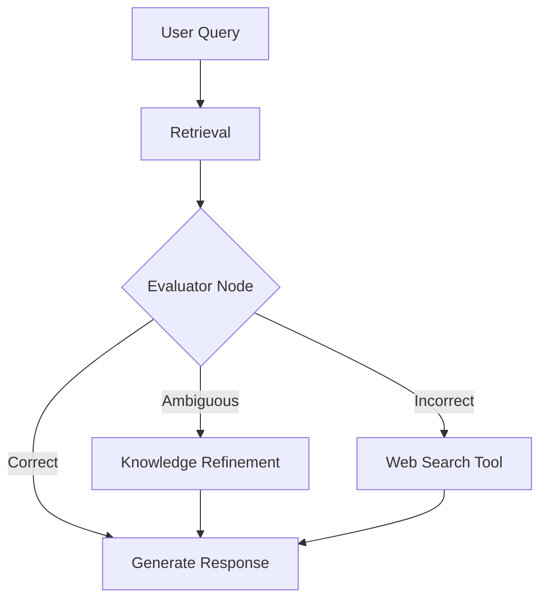

# 🛡️ CRAG (Corrective RAG) — Self-Healing Retrieval
> **Level:** Advanced | **Language:** Hinglish | **Goal:** Corrective RAG pattern ko master karein jo "Retrieval Evaluator" ka use karke decide karta hai ki kab search results par trust karna hai, kab refine karna hai, aur kab web search karni hai.

---

## 🧭 1. Beginner-Friendly Hinglish Explanation
CRAG (Corrective RAG) ka matlab hai **"Galati sudhaarne wala RAG"**. 

Normal RAG mein agar aapne search kiya aur Vector DB ne galat info di, toh AI galat jawab de dega. 
Lekin CRAG pehle ek **"Quality Check"** karta hai:
- **Correct:** Info sahi hai? Toh aage badho.
- **Ambiguous:** Info thodi-thodi sahi hai? Toh use "Clean" (Refine) karo.
- **Incorrect:** Info bilkul galat hai? Toh use discard karo aur **Google Search (Web)** se fresh info nikalo.

CRAG ka kaam hai ensure karna ki AI kabhi purani ya galat info par bharosa na kare.

---

## 🧠 2. Deep Technical Explanation
CRAG retrieval aur generation phases ke bech ek **Retrieval Evaluator** node introduce karta hai.
- **Evaluation Node:** Ek lightweight LLM call jo retrieved documents ko `CORRECT`, `AMBIGUOUS`, ya `INCORRECT` ke roop mein score karti hai.
- **Knowledge Refinement:** Ambiguous docs ke liye, ye "Knowledge Partitioning" perform karta hai—yaani chunk ko aur split karna aur sirf relevant sub-sentences ko extract karna.
- **Web Search Fallback:** Agar saare retrieved documents `INCORRECT` hote hain, toh ye external up-to-date data dhoondhne ke liye ek search tool (jaise Tavily ya DuckDuckGo) trigger karta hai.
- **Safety Layer:** Ye sirf validated context ko generator LLM tak pahunchana ensure karke "Garbage In, Garbage Out" ko rokta hai.

---

## 🏗️ 3. Architecture Diagrams


```mermaid
graph TD
    U[User Query] --> R[Retrieval]
    R --> E{Evaluator Node}
    E -->|Correct| G[Generate Response]
    E -->|Ambiguous| Ref[Knowledge Refinement]
    E -->|Incorrect| W[Web Search Tool]
    Ref --> G
    W --> G
```

---

## 💻 4. Production-Ready Code Example (CRAG Logic)

```python
def crag_evaluator(query, retrieved_docs):
    # Hinglish Logic: retrieved data ko verify karo
    score = 0.5 # Simulated evaluation score
    
    if score > 0.8:
        return "CORRECT"
    elif score > 0.4:
        return "AMBIGUOUS"
    else:
        return "INCORRECT"

def run_crag_flow(query):
    docs = ["Simulated Doc from Vector DB"]
    verdict = crag_evaluator(query, docs)
    
    if verdict == "CORRECT":
        return f"Using docs: {docs}"
    elif verdict == "AMBIGUOUS":
        refined_docs = ["Cleaned version of docs"]
        return f"Refined docs: {refined_docs}"
    else:
        # Web Search logic here
        return "Triggering Web Search for fresh info..."

# print(run_crag_flow("Who won the match today?"))
```

---

## 🌍 5. Real-World Use Cases
- **News Chatbots:** Agar local DB mein aaj ki news nahi hai, toh web search karein (CRAG pattern).
- **Technical Support:** Agar naye version ke liye local manual outdated hai, toh online latest patch notes dhoondhna.
- **Fact-Checking Agents:** Public data sources ke against internal claims ko verify karna.

---

## ❌ 6. Failure Cases
- **False Negative:** Evaluator ne sahi document ko "Incorrect" bol diya aur faltu mein web search trigger kar di (Costly error).
- **Web Search Noise:** Web se itni zyada info aa gayi ki model aur zyada confuse ho gaya.
- **Latency:** Evaluation + Refining + Web Search milkar response time 20 seconds tak badha sakte hain.

---

## 🛠️ 7. Debugging Guide
- **Trace the Evaluator:** Evaluator ki reasoning log karein: "Why did you mark this as Ambiguous?"
- **Cost Audit:** Monitor karein ki kitne percent queries web search par ja rahi hain.

---

## ⚖️ 8. Tradeoffs
- **Reliability:** Highest accuracy aur up-to-date info.
- **Complexity:** Complex graph structure (LangGraph) aur higher latency.

---

## ✅ 9. Best Practices
- **Threshold Tuning:** `CORRECT` aur `INCORRECT` ke scores ko dhang se tune karein.
- **Streaming:** Web search results ko stream karein taaki user ko "Loading..." feel na ho.

---

## 🛡️ 10. Security Concerns
- **Information Leakage:** Agent galti se private query (e.g. "CEO salary") web search par bhej sakta hai to find info. **PII Masking** zaruri hai.

---

## 📈 11. Scaling Challenges
- **API Quotas:** Web search APIs (Tavily/Perplexity) ke apne rate limits hote hain jo high traffic mein hit ho sakte hain.

---

## 💰 12. Cost Considerations
- **Web Search Pricing:** Har web search expensive hoti hai (~$0.01 to $0.05 per call). Ise dhyan se use karein.

---

## 📝 13. Interview Questions
1. **"Corrective RAG (CRAG) normal RAG se better kyu hai?"**
2. **"Ambiguous documents ke liye knowledge refinement kaise kaam karta hai?"**
3. **"Web search fallback kab trigger karna chahiye?"**

---

## ⚠️ 14. Common Mistakes
- **No Evaluation:** Retrieval ke baad direct trust karna.
- **Infinite Web Loops:** Web search se bhi answer nahi mila toh bar-bar search karna.

---

## 🚀 15. Latest 2026 Industry Patterns
- **Multi-Modal CRAG:** Check karna ki kya retrieved text kisi image ya chart se match karta hai (Multi-modal verification).
- **Self-Improving Evaluator:** Evaluator human feedback ka use karke seekhta hai ki pichle samay mein wo kaunse documents ke baare mein galat tha.

---

> **Expert Tip:** CRAG is the **"Trust but Verify"** model for AI. Never trust your own database blindly.
