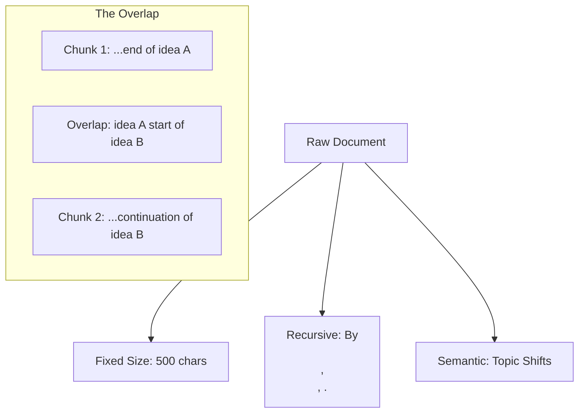

# ✂️ Chunking Strategies — Splitting Knowledge for Precision
> **Level:** Core Engineering | **Language:** Hinglish | **Goal:** Master the art of breaking down large documents into optimal pieces for high-performance RAG retrieval.

---

## 🧭 1. Beginner-Friendly Hinglish Explanation
Chunking ka matlab hai **"Tukde-tukde karna"**. 

Imagine aapko ek poori kitaab (book) di gayi aur pucha gaya "Dumbledore ne Harry se kya kaha?" 
- Agar aap poori kitaab ka ek hi photo khinchoge (Large Chunk), toh details dhundhli ho jayengi. 
- Agar aap har word ka photo khinchoge (Tiny Chunk), toh context (asli matlab) kho jayega.

Chunking humein batata hai ki kaise hum documents ko sahi size mein kaatein taaki AI ko "Point to point" information mile bina matlab khooye.

---

## 🧠 2. Deep Technical Explanation
Chunking is the most underrated part of RAG. It determines the **Semantic Density** of your vectors.
- **Fixed-size Chunking:** Splitting by character count (e.g., 500 chars). Simple but breaks sentences mid-way.
- **Recursive Character Splitting:** Splitting by hierarchy (Paragraphs → Sentences → Words). This keeps related text together.
- **Semantic Chunking:** Using an LLM or Embedding model to find "Natural breaks" in meaning. If the topic changes, start a new chunk.
- **Overlap:** Keeping 10-20% of the previous chunk at the start of the next one. This ensures that the context at the "Edges" isn't lost.
- **Token-based Chunking:** Splitting based on LLM tokens to ensure chunks fit perfectly into the model's budget.

---

## 🏗️ 3. Architecture Diagrams



---

## 💻 4. Production-Ready Code Example (Recursive Splitting)

```python
from langchain.text_splitter import RecursiveCharacterTextSplitter

text = "This is a long document... [10,000 words here]"

# Hinglish Logic: Pehle double newline (\n\n) par todna, phir newline (\n), phir full stop (.)
splitter = RecursiveCharacterTextSplitter(
    chunk_size=500,
    chunk_overlap=50,
    separators=["\n\n", "\n", ".", " ", ""]
)

chunks = splitter.split_text(text)
print(f"Total Chunks: {len(chunks)}")
print(f"First Chunk: {chunks[0]}")
```

---

## 🌍 5. Real-World Use Cases
- **Markdown Docs:** Chunking by headers (`#`, `##`) to keep sections intact.
- **Code Repositories:** Chunking by functions or classes so the logic isn't split across chunks.
- **Financial Reports:** Chunking by tables or quarters.

---

## ❌ 6. Failure Cases
- **Context Fragmentation:** Info do chunks mein split ho gayi, aur retrieval sirf ek hi la paya (Answer incomplete).
- **Too Large Chunks:** Model irrelevant data mein "Kho" gaya (Noise).
- **No Overlap:** Sentences adhe reh gaye chunks ke ends par.

---

## 🛠️ 7. Debugging Guide
- **Visual Inspection:** Chunk ke start aur end ko padh kar dekhein: "Kya ye readable hai?"
- **Retrieval Test:** Aisa sawal puchen jiska answer "Chunk Boundary" par ho. Agar fail hota hai, toh overlap badhayein.

---

## ⚖️ 8. Tradeoffs
- **Small Chunks:** High precision but might lose the "Big Picture".
- **Large Chunks:** Better context but high token cost and more noise.

---

## ✅ 9. Best Practices
- **Document Metadata:** Chunk mein document ka title aur summary humesha add karein (`Parent Document Retrieval`).
- **Semantic Headers:** Har chunk ke top par ek line add karein: "This chunk is about [Topic]."

---

## 🛡️ 10. Security Concerns
- **Sensitive Split:** Galti se user ID aur uska password do alag chunks mein ho jayein aur ek leak ho jaye.

---

## 📈 11. Scaling Challenges
- **Processing Time:** Millions of documents ko chunk karna and index karna is a heavy ETL task.

---

## 💰 12. Cost Considerations
- **Vector DB Storage:** Zyaada chunks = Zyaada storage cost. Overlap badhane se chunks ki sankhya badh jati hai.

---

## 📝 13. Interview Questions
1. **"Recursive character splitter better kyu hai fixed size se?"**
2. **"Chunk overlap ka role RAG accuracy mein kya hai?"**
3. **"Semantic chunking latency ko kaise affect karti hai?"**

---

## ⚠️ 14. Common Mistakes
- **Ignoring Document Structure:** JSON ya code ko normal text ki tarah chunk karna.
- **Constant Chunk Size:** Sab documents (email vs book) ke liye same chunk size use karna.

---

## 🚀 15. Latest 2026 Industry Patterns
- **Late Interaction Chunking:** Models that generate multiple embeddings per chunk to capture different "Meanings".
- **Contextual Chunking:** Pre-pending every chunk with a 1-sentence global summary of the parent document.

---

> **Expert Tip:** Chunking is the **Foundation** of retrieval. If your chunks are bad, no amount of GPT-4 "Smartness" can save your RAG.
