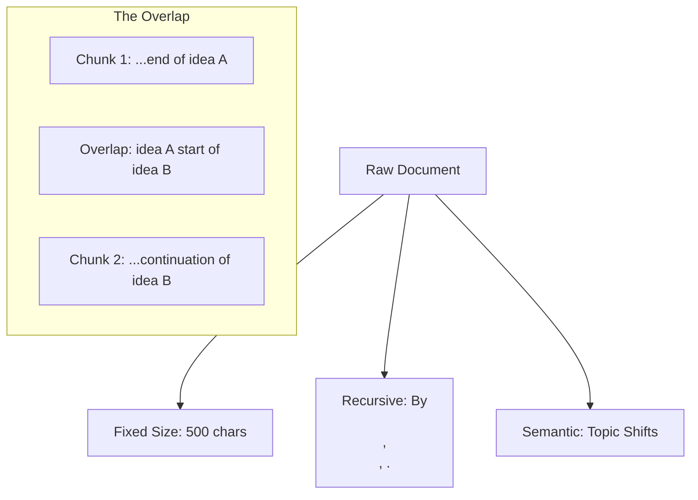

# ✂️ Chunking Strategies — Splitting Knowledge for Precision
> **Level:** Core Engineering | **Language:** Hinglish | **Goal:** High-performance RAG retrieval ke liye bade documents ko optimal pieces mein break karne ki art ko master karein.

---

## 🧭 1. Beginner-Friendly Hinglish Explanation
Chunking ka matlab hai **"Tukde-tukde karna"**. 

Imagine aapko ek poori kitaab (book) di gayi aur pucha gaya "Dumbledore ne Harry se kya kaha?" 
- Agar aap poori kitaab ka ek hi photo khinchoge (Large Chunk), toh details dhundhli ho jayengi. 
- Agar aap har word ka photo khinchoge (Tiny Chunk), toh context (asli matlab) kho jayega.

Chunking humein batata hai ki kaise hum documents ko sahi size mein kaatein taaki AI ko "Point to point" information mile bina matlab khooye.

---

## 🧠 2. Deep Technical Explanation
Chunking RAG ka sabse underrated part hai. Ye aapke vectors ki **Semantic Density** ko determine karta hai.
- **Fixed-size Chunking:** Character count (e.g., 500 chars) ke basis par split karna. Simple hai par sentences ko beech mein break kar deta hai.
- **Recursive Character Splitting:** Hierarchy (Paragraphs → Sentences → Words) ke basis par split karna. Ye related text ko ek sath rakhta hai.
- **Semantic Chunking:** Meaning mein "Natural breaks" dhoondhne ke liye LLM ya Embedding model ka use karna. Agar topic change hota hai, toh naya chunk start karein.
- **Overlap:** Agle chunk ke start mein pichle chunk ka 10-20% rakhna. Ye ensure karta hai ki "Edges" par context loss na ho.
- **Token-based Chunking:** Chunks ko model ke budget mein perfectly fit karne ke liye LLM tokens ke basis par split karna.

---

## 🏗️ 3. Architecture Diagrams


```mermaid
graph TD
    DOC[Raw Document] --> C1[Fixed Size: 500 chars]
    DOC --> C2[Recursive: By \n\n, \n, .]
    DOC --> C3[Semantic: Topic Shifts]
    
    subgraph "The Overlap"
    ChunkA[Chunk 1: ...end of idea A]
    ChunkB[Overlap: idea A start of idea B]
    ChunkC[Chunk 2: ...continuation of idea B]
    end
```

---

## 💻 4. Production-Ready Code Example (Recursive Splitting)

```python
from langchain.text_splitter import RecursiveCharacterTextSplitter

text = "This is a long document... [10,000 words here]"

# Hinglish Logic: Pehle double newline (\n\n) par todna, phir newline (\n), phir full stop (.)
splitter = RecursiveCharacterTextSplitter(
    chunk_size=500,
    chunk_overlap=50,
    separators=["\n\n", "\n", ".", " ", ""]
)

chunks = splitter.split_text(text)
print(f"Total Chunks: {len(chunks)}")
print(f"First Chunk: {chunks[0]}")
```

---

## 🌍 5. Real-World Use Cases
- **Markdown Docs:** Sections ko intact rakhne ke liye headers (`#`, `##`) ke basis par chunking karna.
- **Code Repositories:** Functions ya classes ke basis par chunking karna taaki logic chunks mein split na ho.
- **Financial Reports:** Tables ya quarters ke basis par chunking karna.

---

## ❌ 6. Failure Cases
- **Context Fragmentation:** Info do chunks mein split ho gayi, aur retrieval sirf ek hi la paya (Answer incomplete).
- **Too Large Chunks:** Model irrelevant data mein "Kho" gaya (Noise).
- **No Overlap:** Sentences adhe reh gaye chunks ke ends par.

---

## 🛠️ 7. Debugging Guide
- **Visual Inspection:** Chunk ke start aur end ko padh kar dekhein: "Kya ye readable hai?"
- **Retrieval Test:** Aisa sawal puchen jiska answer "Chunk Boundary" par ho. Agar fail hota hai, toh overlap badhayein.

---

## ⚖️ 8. Tradeoffs
- **Small Chunks:** High precision par ho sakta hai ki "Big Picture" lose ho jaye.
- **Large Chunks:** Better context par high token cost aur zyada noise.

---

## ✅ 9. Best Practices
- **Document Metadata:** Chunk mein document ka title aur summary humesha add karein (`Parent Document Retrieval`).
- **Semantic Headers:** Har chunk ke top par ek line add karein: "This chunk is about [Topic]."

---

## 🛡️ 10. Security Concerns
- **Sensitive Split:** Galti se user ID aur uska password do alag chunks mein ho jayein aur ek leak ho jaye.

---

## 📈 11. Scaling Challenges
- **Processing Time:** Millions of documents ko chunk karna and index karna is a heavy ETL task.

---

## 💰 12. Cost Considerations
- **Vector DB Storage:** Zyaada chunks = Zyaada storage cost. Overlap badhane se chunks ki sankhya badh jati hai.

---

## 📝 13. Interview Questions
1. **"Recursive character splitter better kyu hai fixed size se?"**
2. **"Chunk overlap ka role RAG accuracy mein kya hai?"**
3. **"Semantic chunking latency ko kaise affect karti hai?"**

---

## ⚠️ 14. Common Mistakes
- **Ignoring Document Structure:** JSON ya code ko normal text ki tarah chunk karna.
- **Constant Chunk Size:** Sab documents (email vs book) ke liye same chunk size use karna.

---

## 🚀 15. Latest 2026 Industry Patterns
- **Late Interaction Chunking:** Aise models jo different "Meanings" ko capture karne ke liye per chunk multiple embeddings generate karte hain.
- **Contextual Chunking:** Har chunk ke aage parent document ki 1-sentence global summary lagana.

---

> **Expert Tip:** Chunking is the **Foundation** of retrieval. If your chunks are bad, no amount of GPT-4 "Smartness" can save your RAG.
