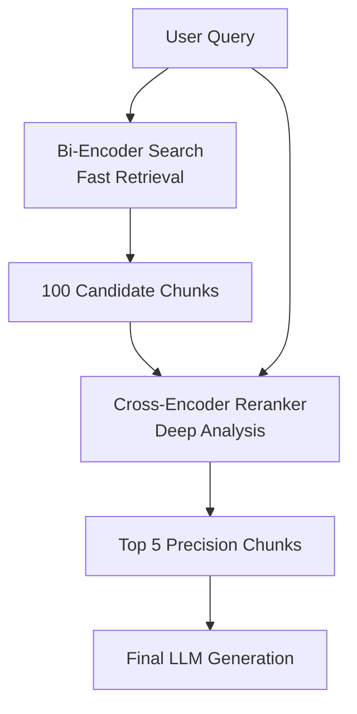

# 🎯 Cross-Encoder Reranking — The Quality Filter
> **Level:** Core Engineering | **Language:** Hinglish | **Goal:** Master the use of Rerankers to filter out irrelevant retrieval results and significantly improve RAG precision.

---

## 🧭 1. Beginner-Friendly Hinglish Explanation
Reranking ka matlab hai **"Final Selection"**. 

Imagine aapne search kiya "AI jobs". Pehle step (Retrieval) ne aapko 100 results diye. Lekin ye results sirf "Similarity" par based hain. 
Reranking bilkul waisa hi hai jaise aapka boss un 100 results ko dhang se padhta hai aur sirf top 5 select karta hai jo actually aapke kaam ke hain. 
- **Step 1 (Retrieval):** Fast but thoda "Raw" (Vector search).
- **Step 2 (Reranking):** Slow but bahut "Accurate" (Cross-Encoder).

Production RAG mein bina Reranker ke accuracy kabhi 90% cross nahi karti.

---

## 🧠 2. Deep Technical Explanation
Retrieval models (Bi-Encoders) are fast because they pre-compute embeddings. Rerankers (Cross-Encoders) are slow but accurate because they process the **Query** and the **Document** together.
- **Bi-Encoder (Retrieval):** `Query Embedding` vs `Doc Embedding`. Good for finding 100 candidates from 1 million.
- **Cross-Encoder (Reranker):** `LLM(Query + Doc)`. The model looks at the relationship between the two and gives a score (0 to 1). It captures nuances that Bi-Encoders miss.
- **Why use it?** Vector search can find documents with similar words but different meanings. Rerankers actually "Read" both and verify the relevance.
- **Model Examples:** Cohere Rerank, BGE-Reranker, or a small BERT-based model.

---

## 🏗️ 3. Architecture Diagrams



---

## 💻 4. Production-Ready Code Example (Simulated Reranking)

```python
# Simulated Cross-Encoder Scoring
def cross_encoder_score(query, doc):
    # Hinglish Logic: Query aur Doc ko saath mein judge karo
    if "exact_match" in doc and "match" in query:
        return 0.95
    return 0.4

def rerank_results(query, candidates):
    # Score every candidate
    scored_docs = []
    for doc in candidates:
        score = cross_encoder_score(query, doc)
        scored_docs.append((doc, score))
    
    # Sort by score descending
    sorted_docs = sorted(scored_docs, key=lambda x: x[1], reverse=True)
    return [doc for doc, score in sorted_docs[:5]]

# query = "Find exact match docs."
# candidates = ["doc with exact_match", "irrelevant doc", "doc with match"]
# print(f"Reranked Top 5: {rerank_results(query, candidates)}")
```

---

## 🌍 5. Real-World Use Cases
- **Enterprise Search:** Finding the exact policy clause among thousands of similar-sounding legal documents.
- **Medical Q&A:** Distinguishing between two symptoms that look similar in vector space but are medically different.
- **Financial Audit:** Finding the specific transaction that matches an audit query.

---

## ❌ 6. Failure Cases
- **High Latency:** Agar aap 1000 chunks ko rerank karoge, toh response 10 second slow ho jayega.
- **Cost:** Paid rerankers (like Cohere) par API call ki cost badh jati hai.
- **False Negatives:** Reranker galti se sahi doc ko "Irrelevant" mark karke remove kar deta hai.

---

## 🛠️ 7. Debugging Guide
- **Recall@K Monitoring:** Check karein ki reranking ke baad accuracy badhi ya kam hui.
- **Score Distribution:** Dekhein ki kya saare scores 0.9+ hain (Model is too confident) ya 0.1- (Model is too skeptical).

---

## ⚖️ 8. Tradeoffs
- **Precision:** Excellent accuracy boost.
- **Latency:** Adds 100ms to 2s depending on the number of chunks and model size.

---

## ✅ 9. Best Practices
- **Retrieve 50, Rerank 5:** Humesha retrieval se zyada data mangwayein aur reranking se use filter karein.
- **Thresholding:** Agar top result ka score 0.3 se kam hai, toh user ko batayein "No confident answer found."

---

## 🛡️ 10. Security Concerns
- **Model Hijacking:** Reranker ko manipulate karke galti se malicious documents ko top par lana.

---

## 📈 11. Scaling Challenges
- **CPU/GPU Usage:** Running Cross-Encoders on your own server requires significant compute power.

---

## 💰 12. Cost Considerations
- **Token Usage:** Reranking involves sending `Query + Doc` multiple times, which consumes tokens.

---

## 📝 13. Interview Questions
1. **"Bi-Encoder aur Cross-Encoder mein kya difference hai?"**
2. **"Reranking latency ko kaise optimize karenge?"**
3. **"RAG pipeline mein reranker kab use nahi karna chahiye?"**

---

## ⚠️ 14. Common Mistakes
- **Reranking too many docs:** 100+ docs ko rerank karna bottleneck ban sakta hai.
- **Ignoring Scores:** Reranker ke results ko blindly use karna bina scores check kiye.

---

## 🚀 15. Latest 2026 Industry Patterns
- **LLM-as-a-Reranker:** Using GPT-4o-mini directly to rerank by asking it: "Rank these 10 docs based on relevance."
- **Multi-Vector Reranking:** Rerankers that look at multiple semantic "aspects" (e.g., tone, factuality, recency) at once.

---

> **Expert Tip:** Reranking is the **Secret Sauce** of expert RAG. It turns "Similar" documents into **"Correct"** documents.
