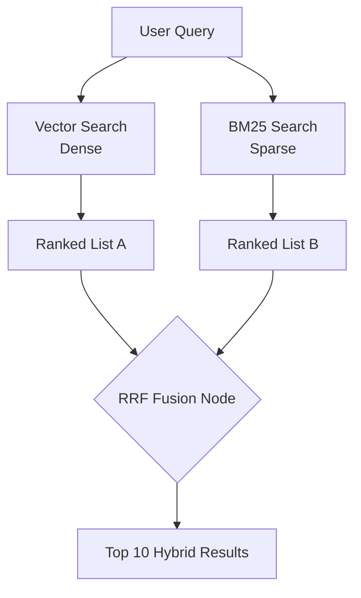

# 🔀 Hybrid Search — The Best of Both Worlds
> **Level:** Core Engineering | **Language:** Hinglish | **Goal:** Master the combination of Semantic Vector Search and Keyword-based Search to achieve maximum RAG precision.

---

## 🧭 1. Beginner-Friendly Hinglish Explanation
Hybrid Search ka matlab hai **"Dimaag + Aankhein"**. 

Imagine aapko ek library mein book dhoondhni hai. 
- **Semantic Search (Dimaag):** Aap sochte ho "Mujhe space ki koi book chahiye." Vector search "Space" se related sab kuch (Mars, Astronauts, NASA) dhoondh lega. 
- **Keyword Search (Aankhein):** Aap dhoondh rahe ho ek specific word: "B612-Asteroid". 

Semantic search kabhi-kabhi specific names ya numbers miss kar deta hai. Keyword search unhe pakad leta hai. **Hybrid Search** dono ko mix karke aapko "Best Result" deta hai.

---

## 🧠 2. Deep Technical Explanation
Hybrid search combines two different retrieval paradigms:
1. **Dense Retrieval (Vector Search):** Uses embeddings to capture the **Semantic Meaning** of the query. Good for "What are the benefits of X?"
2. **Sparse Retrieval (BM25 / Keyword Search):** Uses term frequency to find **Exact Matches**. Essential for names, product IDs, or technical acronyms.
- **Fusion (RRF):** We use **Reciprocal Rank Fusion (RRF)** to combine the ranked lists from both searches. It calculates a unified score based on the rank in each list.
- **Weighting:** You can adjust the balance (e.g., 70% Vector, 30% Keyword) based on your use case.

---

## 🏗️ 3. Architecture Diagrams



---

## 💻 4. Production-Ready Code Example (Simulated Fusion Logic)

```python
def reciprocal_rank_fusion(vector_results: list, keyword_results: list, k=60):
    # Hinglish Logic: Dono list ke results ko mix karke naya score do
    scores = {}
    
    # Process Vector Results
    for rank, doc in enumerate(vector_results):
        scores[doc] = scores.get(doc, 0) + 1 / (k + rank)
        
    # Process Keyword Results
    for rank, doc in enumerate(keyword_results):
        scores[doc] = scores.get(doc, 0) + 1 / (k + rank)
        
    # Sort by new fusion score
    sorted_docs = sorted(scores.items(), key=lambda x: x[1], reverse=True)
    return [doc for doc, score in sorted_docs]

# v_res = ["Doc1", "Doc2", "Doc3"]
# k_res = ["Doc3", "Doc1", "Doc5"]
# print(f"Final Hybrid List: {reciprocal_rank_fusion(v_res, k_res)}")
```

---

## 🌍 5. Real-World Use Cases
- **Product Search:** Searching for "Cheap running shoes" (Semantic) vs "Nike Air Max 270" (Keyword).
- **Code Search:** Searching for "How to sort a list" vs a specific function name like `sort_v2_fast`.
- **Medical Records:** Searching for "Heart issues" vs a specific drug code like "Lisinopril-20mg".

---

## ❌ 6. Failure Cases
- **Overpowering:** Agar weights sahi nahi hain, toh Keyword results Vector results ko "Daba" sakte hain, jisse semantic meaning lost ho jaye.
- **Index Out of Sync:** Vector DB update ho gaya par Keyword index (Elasticsearch) abhi bhi purana hai.

---

## 🛠️ 7. Debugging Guide
- **Analyze Search Paths:** Check karein ki top result kahan se aaya—Vector se ya Keyword se?
- **Tweak 'k' Parameter:** RRF mein `k` parameter ko badal kar dekhein (usually 60 is best).

---

## ⚖️ 8. Tradeoffs
- **Hybrid:** Highest accuracy but requires maintaining two indexes (Vector + Keyword) which increases complexity.
- **Vector-only:** Simple to maintain but poor at finding specific numbers/acronyms.

---

## ✅ 9. Best Practices
- **Use pgvector (Postgres):** 2026 mein Postgres dono dense aur sparse search ek hi database mein handle kar leta hai.
- **Normalize Queries:** Keyword search se pehle user query se "Stop words" (a, the, is) remove karein.

---

## 🛡️ 10. Security Concerns
- **Relevance Manipulation:** Attacker knowledge base mein keywords repeat karke hybrid search ko "Hijack" kar sakta hai.

---

## 📈 11. Scaling Challenges
- **Multi-Index Latency:** Do alag systems se data fetch karne mein total response time badh sakta hai.

---

## 💰 12. Cost Considerations
- **Extra Storage:** Keyword index storage ki cost add ho jati hai.

---

## 📝 13. Interview Questions
1. **"Hybrid search vector-only search se better kyu hai?"**
2. **"Reciprocal Rank Fusion (RRF) kaise kaam karta hai?"**
3. **"Sparse vs Dense embeddings mein kya fark hai?"**

---

## ⚠️ 14. Common Mistakes
- **No Weighting:** Dono ko 50/50 maanna bina use case dekhe.
- **Broken Tokenization:** Keyword search mein sahi tokenizer (like NLTK or Stemmer) use na karna.

---

## 🚀 15. Latest 2026 Industry Patterns
- **Learnable Fusion:** Using a small neural network to dynamically decide the weights of Vector vs Keyword search for *every* query.
- **Vector-based Sparse Retrieval:** Models like **SPLADE** that generate sparse vectors using LLM knowledge, replacing traditional BM25.

---

> **Expert Tip:** Hybrid Search is the **Insurance Policy** of RAG. It ensures that even if the semantic meaning is complex, the exact words will still be found.
