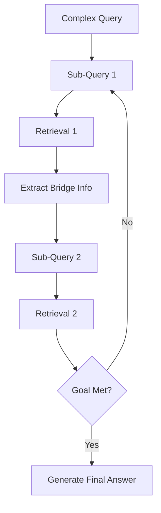

# ⛓️ Multi-Hop RAG — Connecting the Dots
> **Level:** Advanced | **Language:** Hinglish | **Goal:** Iterative retrieval ki technique ko master karein jahan agent ek search ke result ka use agla search query formulate karne ke liye karta hai.

---

## 🧭 1. Beginner-Friendly Hinglish Explanation
Multi-Hop RAG ka matlab hai **"Kadi se kadi jodna"**. 

Imagine aapne pucha: "Us director ki pehli movie kaunsi thi jisne 2024 ka Oscar jeeta?" 
Ise aap ek baar mein nahi dhoondh sakte. 
- **Hop 1:** Dhoondho 2024 ka Oscar kis director ne jeeta. (Answer: Christopher Nolan - Example).
- **Hop 2:** Ab dhoondho Christopher Nolan ki pehli movie kaunsi thi. (Answer: Following).

Multi-Hop RAG mein agent pehle ek step dhoondhta hai, uska result dekhta hai, aur phir doosre step ke liye naya sawal banata hai. Ye "Deep Research" ke liye zaruri hai.

---

## 🧠 2. Deep Technical Explanation
Multi-hop reasoning un questions ko address karta hai jinhe multiple documents ke across **Information Synthesis** ki zaroorat hoti hai.
- **Decomposition:** Query ko sub-queries mein break kiya jata hai.
- **Iterative Retrieval:** Agent ek chunk retrieve karta hai → Ek "Bridge Entity" (e.g., person ka name ya date) extract karta hai → Uss entity ka use aur chunks retrieve karne ke liye karta hai.
- **Context Accumulation:** Har "Hop" state mein nayi information add karta hai, jisse LLM eventually "Connect the dots" kar pata hai.
- **Termination Logic:** Agent ko decide karna hoga ki kab uske paas hops ko rokne aur final answer generate karne ke liye "Enough Information" hai.
- **Looping Graph:** Ye aamtaur par LangGraph mein ek cyclic graph ke roop mein implement kiya jata hai.

---

## 🏗️ 3. Architecture Diagrams


```mermaid
graph TD
    U[Complex Query] --> Q1[Sub-Query 1]
    Q1 --> R1[Retrieval 1]
    R1 --> E1[Extract Bridge Info]
    E1 --> Q2[Sub-Query 2]
    Q2 --> R2[Retrieval 2]
    R2 --> S{Goal Met?}
    S -- No --> Q1
    S -- Yes --> G[Generate Final Answer]
```

---

## 💻 4. Production-Ready Code Example (Multi-Hop Loop)

```python
def multi_hop_agent(query):
    state = {"found_info": [], "next_query": query}
    
    for i in range(3): # Max 3 hops
        # Hinglish Logic: Ek baar dhoondho, result dekho, phir naya sawal banao
        print(f"Hop {i+1}: Searching for {state['next_query']}")
        result = f"Result of {state['next_query']}"
        state["found_info"].append(result)
        
        # Logic to generate next query based on result
        state["next_query"] = f"Next step based on {result}"
        
        if "ready" in result: # Stop condition
            break
            
    return f"Final synthesis of {state['found_info']}"

# multi_hop_agent("Who is the CEO of the company that acquired X?")
```

---

## 🌍 5. Real-World Use Cases
- **Investment Research:** "Company A ke parent company ke CEO ki background kya hai?"
- **Scientific Literature Review:** Ek protein dhoondhna, fir uske inhibitors, fir un inhibitors ke side effects.
- **Legal Discovery:** Ek contract dhoondhna, fir use sign karne wala person, fir unke doosre business affiliations.

---

## ❌ 6. Failure Cases
- **Information Drift:** Har hop ke saath agent apne asli sawal se dur hota jata hai (Chinese Whispers).
- **Dead Ends:** Ek hop ka result aage ka rasta nahi dikhata, aur agent loop mein phas jata hai.
- **Latency Overload:** 3 hops matlab 3-6 LLM calls (Min 30-40 seconds).

---

## 🛠️ 7. Debugging Guide
- **Log the Hops:** Trace karein ki har hop par "Next Query" kya thi.
- **Bridge Verification:** Check karein ki "Bridge Entity" (e.g. Name/ID) sahi se extract hua ya nahi.

---

## ⚖️ 8. Tradeoffs
- **Depth:** Un questions ka answer de sakta hai jinhe simple RAG touch bhi nahi kar sakta.
- **Speed/Cost:** Single-hop RAG ke comparison mein extremely slow aur expensive.

---

## ✅ 9. Best Practices
- **Explicit Stop Sequences:** Agent ko bolrein ki "If the answer is found, stop immediately."
- **Summarization at each Hop:** Pura context bhejte rehne ki jagah har hop ka "Essence" save karein.

---

## 🛡️ 10. Security Concerns
- **Exploratory Injection:** Attacker query aisi banata hai jo agent ko private data ki "Crawl" karne par majboor karde across multiple hops.

---

## 📈 11. Scaling Challenges
- **Concurrency Queues:** Multi-hop tasks server threads ko bahut der tak "Hold" karke rakhte hain.

---

## 💰 12. Cost Considerations
- **High Multiplier:** Har hop essentially ek nayi RAG call hai. 3 hops = 3x cost.

---

## 📝 13. Interview Questions
1. **"Single-hop vs Multi-hop RAG mein difference kya hai?"**
2. **"Bridge entities multi-hop reasoning mein kyu zaruri hain?"**
3. **"Infinite hops ko kaise rokenge production mein?"**

---

## ⚠️ 14. Common Mistakes
- **No Limit on Hops:** Agent ko 10-20 baar search karne dena (Token drain).
- **Ignoring intermediate results:** Sirf final result dikhana bina hops ki transparency ke.

---

## 🚀 15. Latest 2026 Industry Patterns
- **GraphRAG Traversal:** Multiple semantic searches karne ke bajaye nodes ke beech "Jump" karne ke liye ek Knowledge Graph ka use karna.
- **Beam Search Hops:** Parallel mein 2-3 alag "Next Queries" explore karna aur best path pick karna.

---

> **Expert Tip:** Multi-Hop RAG is **Detective Work**. Your agent is a detective following a trail of breadcrumbs.
