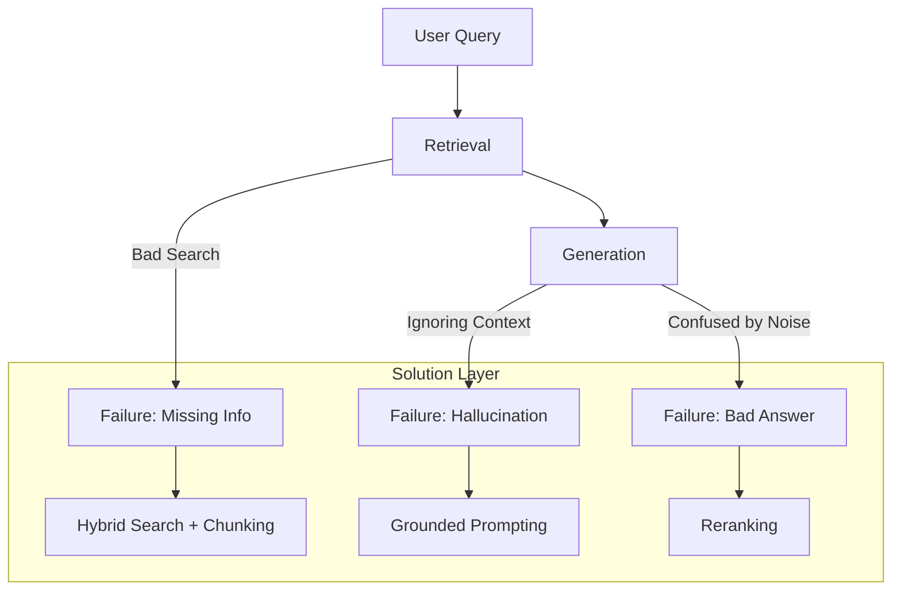

# 🚨 RAG Failure Handling — Debugging the Knowledge Loop
> **Level:** Core Engineering | **Language:** Hinglish | **Goal:** Master the identification and resolution of the most common points of failure in RAG pipelines.

---

## 🧭 1. Beginner-Friendly Hinglish Explanation
RAG Failure Handling ka matlab hai **"Jab library mein book na mile, toh kya karein?"** 

RAG system kai jagah fail ho sakta hai:
1. **Search Fail:** Sahi book hi nahi mili.
2. **Context Fail:** Book mil gayi par AI use samajh nahi paya.
3. **Generation Fail:** AI ne sab kuch sahi dekha par fir bhi gappe (Hallucination) maar diye.

In failures ko dhoondhna aur fix karna hi ek professional AI Engineer ka asli kaam hai. 

---

## 🧠 2. Deep Technical Explanation
RAG failures typically occur in the **Retrieval-Generation Gap**.
- **Low Recall:** The correct information was in the database, but the vector search didn't find it. (Fix: Better chunking or hybrid search).
- **Low Precision:** The search found the information, but also pulled in 10 irrelevant chunks that confused the LLM. (Fix: Reranking).
- **Hallucination (Faithfulness):** The LLM generates a claim that isn't in the provided context. (Fix: Self-RAG or grounded prompts).
- **Context Overload:** Too much data retrieved causes the model to ignore the "Needle" in the "Haystack". (Fix: Context compression).
- **Out-of-Sync Index:** The source data changed but the vector DB wasn't updated. (Fix: CDC or event-driven re-indexing).

---

## 🏗️ 3. Architecture Diagrams



---

## 💻 4. Production-Ready Code Example (Failure Detection Logic)

```python
def check_faithfulness(query, context, answer):
    # Hinglish Logic: Dekho kya answer context mein hai ya model ne feka hai
    prompt = f"Does the following answer follow the context? Context: {context}. Answer: {answer}. Answer Yes/No."
    # res = llm.call(prompt)
    res = "Yes" # Simulated
    return res == "Yes"

def run_rag_with_safety(query):
    context = "Employee can take 20 leaves."
    answer = "Employee can take 30 leaves."
    
    if not check_faithfulness(query, context, answer):
        print("🚨 ALERT: Hallucination detected! Regenerating...")
        # retry generation
    return answer
```

---

## 🌍 5. Real-World Use Cases
- **Medical Bots:** Ensuring no "Treatment" is suggested that isn't in the official medical guidelines.
- **Financial Compliance:** Verifying that a report correctly quotes the latest tax laws.
- **Customer Portals:** Preventing the bot from giving "Free Discounts" that don't exist in the company database.

---

## ❌ 6. Failure Cases (Common Pitfalls)
- **Top-K is not enough:** Sahi answer 11th rank par hai, par aap sirf top 10 dekh rahe ho.
- **Ambiguous Queries:** User ne pucha "Apple kya hai?" (Fruit or Tech?). Vector search dono ko mix kar dega.
- **Broken Tables:** PDF tables ko text mein convert karte waqt logic ka toot jana.

---

## 🛠️ 7. Debugging Guide
- **RAGAS (RAG Assessment):** Use the RAGAS framework to measure Faithfulness, Relevance, and Answer Correctness.
- **Visualization:** Plot your query vector and retrieved vectors to see if they are actually "Close".

---

## ⚖️ 8. Tradeoffs
- **Strict Verification:** Very safe but slow and can lead to many "I don't know" answers.
- **Relaxed Verification:** Fast and conversational but high risk of hallucinations.

---

## ✅ 9. Best Practices
- **Query Rewriting:** User ki query ko pehle "Clean" karein to improve retrieval.
- **Cite the Source:** Output mein hamesha batayein: "I found this in Document XYZ, Page 4."

---

## 🛡️ 10. Security Concerns
- **Indirect Prompt Injection:** Attacker knowledge base mein malicious instructions insert karta hai. Use an **Input Guardrail** for retrieved chunks.

---

## 📈 11. Scaling Challenges
- **Latency of Checks:** Evaluation nodes response time badhate hain. Use small models for checking.

---

## 💰 12. Cost Considerations
- **Verification Cost:** Hallucination check nodes token consume karte hain. Use simple rules (regex/keywords) where possible before LLM checks.

---

## 📝 13. Interview Questions
1. **"RAG pipeline mein hallucinations ko kaise rokenge?"**
2. **"RAGAS framework kya measure karta hai?"**
3. **"Retrieval precision vs recall mein kya tradeoff hai?"**

---

## ⚠️ 14. Common Mistakes
- **No Evaluation:** System ko "Vibes" par check karna.
- **Hard-coding Chunk Size:** Sab documents ke liye 500 characters use karna bina content dekhe.

---

## 🚀 15. Latest 2026 Industry Patterns
- **Automated Root Cause Analysis:** Agents that, when they fail, automatically run a debugger to tell you if the problem was in Retrieval, Context, or Generation.
- **Real-time Re-indexing:** Systems that detect outdated data and trigger an index update instantly.

---

> **Expert Tip:** RAG failure is **Data failure**. If your agent is lying, look at your database first, your prompt second.
