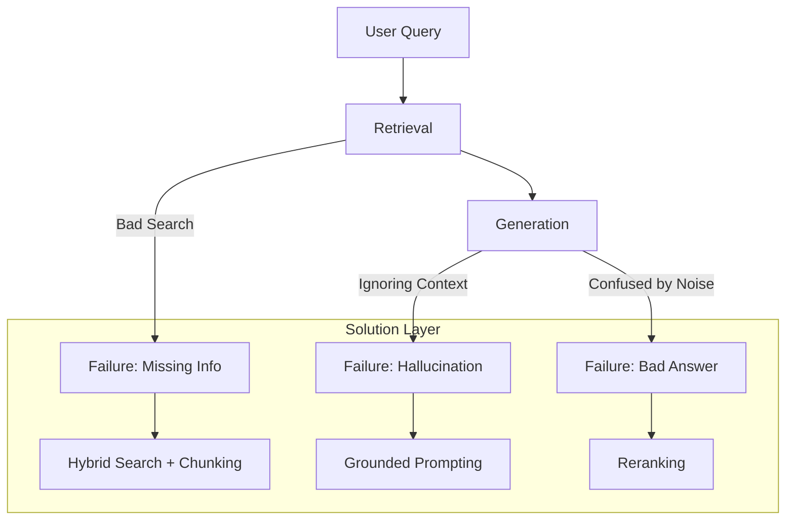

# 🚨 RAG Failure Handling — Debugging the Knowledge Loop
> **Level:** Core Engineering | **Language:** Hinglish | **Goal:** RAG pipelines mein failure ke sabse common points ki identification aur resolution ko master karein.

---

## 🧭 1. Beginner-Friendly Hinglish Explanation
RAG Failure Handling ka matlab hai **"Jab library mein book na mile, toh kya karein?"** 

RAG system kai jagah fail ho sakta hai:
1. **Search Fail:** Sahi book hi nahi mili.
2. **Context Fail:** Book mil gayi par AI use samajh nahi paya.
3. **Generation Fail:** AI ne sab kuch sahi dekha par fir bhi gappe (Hallucination) maar diye.

In failures ko dhoondhna aur fix karna hi ek professional AI Engineer ka asli kaam hai. 

---

## 🧠 2. Deep Technical Explanation
RAG failures aamtaur par **Retrieval-Generation Gap** mein hote hain.
- **Low Recall:** Correct information database mein thi, par vector search use dhoondh nahi payi. (Fix: Better chunking ya hybrid search).
- **Low Precision:** Search ne information toh dhoondh li, par sath hi 10 irrelevant chunks bhi pull kar liye jisne LLM ko confuse kar diya. (Fix: Reranking).
- **Hallucination (Faithfulness):** LLM ek aisa claim generate karta hai jo provided context mein nahi hai. (Fix: Self-RAG ya grounded prompts).
- **Context Overload:** Zyada data retrieve hone ke karan model "Haystack" mein "Needle" ko ignore kar deta hai. (Fix: Context compression).
- **Out-of-Sync Index:** Source data change ho gaya par vector DB update nahi hua. (Fix: CDC ya event-driven re-indexing).

---

## 🏗️ 3. Architecture Diagrams


```mermaid
graph TD
    U[User Query] --> R[Retrieval]
    R -- "Bad Search" --> F1[Failure: Missing Info]
    R --> G[Generation]
    G -- "Ignoring Context" --> F2[Failure: Hallucination]
    G -- "Confused by Noise" --> F3[Failure: Bad Answer]
    
    subgraph "Solution Layer"
    F1 --> S1[Hybrid Search + Chunking]
    F2 --> S2[Grounded Prompting]
    F3 --> S3[Reranking]
    end
```

---

## 💻 4. Production-Ready Code Example (Failure Detection Logic)

```python
def check_faithfulness(query, context, answer):
    # Hinglish Logic: Dekho kya answer context mein hai ya model ne feka hai
    prompt = f"Does the following answer follow the context? Context: {context}. Answer: {answer}. Answer Yes/No."
    # res = llm.call(prompt)
    res = "Yes" # Simulated
    return res == "Yes"

def run_rag_with_safety(query):
    context = "Employee can take 20 leaves."
    answer = "Employee can take 30 leaves."
    
    if not check_faithfulness(query, context, answer):
        print("🚨 ALERT: Hallucination detected! Regenerating...")
        # retry generation
    return answer
```

---

## 🌍 5. Real-World Use Cases
- **Medical Bots:** Ensure karna ki koi bhi "Treatment" suggest na ho jo official medical guidelines mein na ho.
- **Financial Compliance:** Verify karna ki report latest tax laws ko sahi se quote karti hai.
- **Customer Portals:** Bot ko "Free Discounts" dene se rokna jo company database mein exist nahi karte.

---

## ❌ 6. Failure Cases (Common Pitfalls)
- **Top-K is not enough:** Sahi answer 11th rank par hai, par aap sirf top 10 dekh rahe ho.
- **Ambiguous Queries:** User ne pucha "Apple kya hai?" (Fruit or Tech?). Vector search dono ko mix kar dega.
- **Broken Tables:** PDF tables ko text mein convert karte waqt logic ka toot jana.

---

## 🛠️ 7. Debugging Guide
- **RAGAS (RAG Assessment):** Faithfulness, Relevance, aur Answer Correctness ko measure karne ke liye RAGAS framework ka use karein.
- **Visualization:** Apne query vector aur retrieved vectors ko plot karein taaki dekh sakein ki kya wo actually "Close" hain.

---

## ⚖️ 8. Tradeoffs
- **Strict Verification:** Bahut safe par slow aur isse kai "I don't know" answers mil sakte hain.
- **Relaxed Verification:** Fast aur conversational par hallucinations ka high risk.

---

## ✅ 9. Best Practices
- **Query Rewriting:** User ki query ko pehle "Clean" karein to improve retrieval.
- **Cite the Source:** Output mein hamesha batayein: "I found this in Document XYZ, Page 4."

---

## 🛡️ 10. Security Concerns
- **Indirect Prompt Injection:** Attacker knowledge base mein malicious instructions insert karta hai. Use an **Input Guardrail** for retrieved chunks.

---

## 📈 11. Scaling Challenges
- **Latency of Checks:** Evaluation nodes response time badhate hain. Checking ke liye small models use karein.

---

## 💰 12. Cost Considerations
- **Verification Cost:** Hallucination check nodes tokens consume karte hain. LLM checks se pehle jahan ho sake simple rules (regex/keywords) use karein.

---

## 📝 13. Interview Questions
1. **"RAG pipeline mein hallucinations ko kaise rokenge?"**
2. **"RAGAS framework kya measure karta hai?"**
3. **"Retrieval precision vs recall mein kya tradeoff hai?"**

---

## ⚠️ 14. Common Mistakes
- **No Evaluation:** System ko "Vibes" par check karna.
- **Hard-coding Chunk Size:** Sab documents ke liye 500 characters use karna bina content dekhe.

---

## 🚀 15. Latest 2026 Industry Patterns
- **Automated Root Cause Analysis:** Aise agents jo fail hone par automatically debugger run karke batate hain ki problem Retrieval, Context, ya Generation mein thi.
- **Real-time Re-indexing:** Systems jo outdated data detect karte hain aur instantly index update trigger karte hain.

---

> **Expert Tip:** RAG failure is **Data failure**. If your agent is lying, look at your database first, your prompt second.
