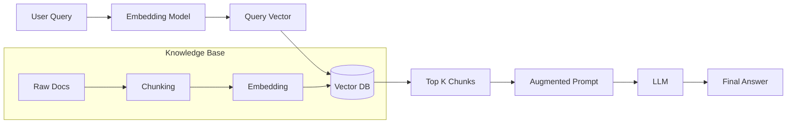

# 📚 RAG Fundamentals — Giving AI a Library
> **Level:** Core Engineering | **Language:** Hinglish | **Goal:** Master the basics of Retrieval-Augmented Generation (RAG) to connect LLMs with private, external data.

---

## 🧭 1. Beginner-Friendly Hinglish Explanation
RAG (Retrieval-Augmented Generation) ka matlab hai **"Dekh kar jawab dena"**. 

Imagine aapne ek exam diya. 
- **Normal LLM:** Aapne poori raat padhai ki aur ab paper likh rahe ho (Pre-trained knowledge). Agar koi aisi cheez puchi jo aapne nahi padhi, toh aap "Hallucinate" (Gappe) karoge.
- **RAG:** Aapke haath mein "Open Book" hai. Aap sawal dekhte ho, book mein sahi page dhoondhte ho (**Retrieve**), aur phir use padh kar jawab likhte ho (**Generate**).

RAG ki wajah se AI kabhi outdated nahi hota kyunki wo humesha latest data dhoondh sakta hai.

---

## 🧠 2. Deep Technical Explanation
RAG is the process of optimizing the output of an LLM by referencing a dynamic, external knowledge base.
- **Indexing:** Documents are split into **Chunks**, converted into **Embeddings** (Vectors), and stored in a **Vector Database**.
- **Retrieval:** When a user asks a question, the system converts the query into a vector and finds the most similar chunks using **Cosine Similarity**.
- **Augmentation:** The retrieved chunks are stuffed into the LLM's **Context Window** along with the user query.
- **Generation:** The LLM generates a response "Grounded" in the provided context, reducing hallucinations.

---

## 🏗️ 3. Architecture Diagrams



---

## 💻 4. Production-Ready Code Example (Simple RAG Pipeline)

```python
# Simulated RAG Pipeline
knowledge_base = {
    "chunk1": "The company policy for leaves is 20 days per year.",
    "chunk2": "Working hours are from 9 AM to 6 PM."
}

def retrieve(query):
    # Hinglish Logic: Query ke hisaab se sahi chunk dhoondho
    if "leave" in query.lower():
        return knowledge_base["chunk1"]
    return "No relevant info found."

def generate(query, context):
    prompt = f"Context: {context}\nQuestion: {query}\nAnswer based ONLY on context:"
    print(f"Final Prompt: {prompt}")
    # return llm.call(prompt)

# query = "How many leaves can I take?"
# context = retrieve(query)
# generate(query, context)
```

---

## 🌍 5. Real-World Use Cases
- **Customer Support:** Reading company wikis to answer user queries.
- **Legal/Compliance:** Searching thousands of pages of regulations.
- **Personal Knowledge Management:** Chatting with your own notes (Notion/Obsidian).

---

## ❌ 6. Failure Cases
- **Bad Retrieval:** Sahi chunk dhoondhne ki bajah irrelevant info bhej dena (Low precision).
- **Hallucination despite RAG:** Context mein info hai, par model use ignore karke apni puraani knowledge use karta hai.
- **Outdated Index:** Documents update ho gaye par Vector DB abhi bhi puraana data de raha hai.

---

## 🛠️ 7. Debugging Guide
- **Evaluate Retrieval:** Check karein ki "Top K" chunks mein actual answer hai ya nahi.
- **Inspect Context:** Prompt mein context kaise format ho raha hai, wo dekhein.

---

## ⚖️ 8. Tradeoffs
- **RAG:** Accurate and up-to-date but adds latency (Retrieval step) and cost (Embedding + extra tokens).
- **Fine-tuning:** Fast and specialized but expensive to train and can't handle new/dynamic data.

---

## ✅ 9. Best Practices
- **Citation:** Model ko boleinh ki "Source mention karo" (e.g., [Source 1]). Isse trust badhta hai.
- **Small Chunks:** 300-500 tokens ke chunks rakhein for better precision.

---

## 🛡️ 10. Security Concerns
- **Sensitive Context:** Galti se Private HR docs retrieve hokar public user ko dikh jana.
- **Adversarial Docs:** Knowledge base mein aisi files dalna jo model ko manipulate karein (Prompt injection via RAG).

---

## 📈 11. Scaling Challenges
- **Massive Data:** Billions of chunks index karna and maintain karna.
- **Real-time updates:** How fast can you index a new document?

---

## 💰 12. Cost Considerations
- **Embedding Costs:** Thousands of pages index karne ki cost.
- **Context Tokens:** RAG prompts hamesha bade hote hain, so input tokens ki cost badh jati hai.

---

## 📝 13. Interview Questions
1. **"RAG aur Fine-tuning mein kya difference hai?"**
2. **"Cosine similarity RAG mein kaise use hoti hai?"**
3. **"Hallucination reduction ke liye RAG kyu best hai?"**

---

## ⚠️ 14. Common Mistakes
- **No Chunking:** Poora PDF ek saath model ko bhej dena.
- **Bad Embeddings:** Saste/Purane embedding models use karna jo semantic meaning nahi samajhte.

---

## 🚀 15. Latest 2026 Industry Patterns
- **GraphRAG:** Using Knowledge Graphs + Vector DBs to understand relationships between entities, not just text similarity.
- **Long-Context RAG:** Skipping retrieval and putting 1M tokens directly into the LLM context (Only for very high-budget apps).

---

> **Expert Tip:** RAG is **90% Data Engineering** and **10% LLM Prompting**. Focus on your retrieval quality first.
