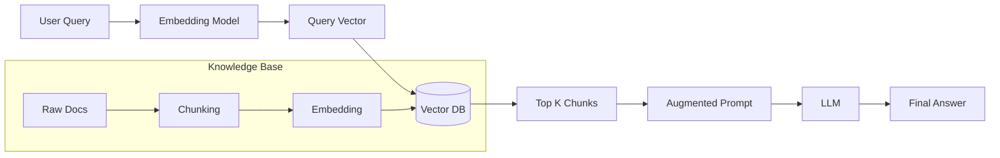

# 📚 RAG Fundamentals — Giving AI a Library
> **Level:** Core Engineering | **Language:** Hinglish | **Goal:** LLMs ko private aur external data se connect karne ke liye Retrieval-Augmented Generation (RAG) ke basics ko master karein.

---

## 🧭 1. Beginner-Friendly Hinglish Explanation
RAG (Retrieval-Augmented Generation) ka matlab hai **"Dekh kar jawab dena"**. 

Imagine aapne ek exam diya. 
- **Normal LLM:** Aapne poori raat padhai ki aur ab paper likh rahe ho (Pre-trained knowledge). Agar koi aisi cheez puchi jo aapne nahi padhi, toh aap "Hallucinate" (Gappe) karoge.
- **RAG:** Aapke haath mein "Open Book" hai. Aap sawal dekhte ho, book mein sahi page dhoondhte ho (**Retrieve**), aur phir use padh kar jawab likhte ho (**Generate**).

RAG ki wajah se AI kabhi outdated nahi hota kyunki wo humesha latest data dhoondh sakta hai.

---

## 🧠 2. Deep Technical Explanation
RAG ek dynamic, external knowledge base ko reference karke LLM ke output ko optimize karne ki process hai.
- **Indexing:** Documents ko **Chunks** mein split kiya jata hai, **Embeddings** (Vectors) mein convert kiya jata hai, aur **Vector Database** mein store kiya jata hai.
- **Retrieval:** Jab user question puchta hai, toh system query ko vector mein convert karta hai aur **Cosine Similarity** ka use karke most similar chunks dhoondhta hai.
- **Augmentation:** Retrieved chunks ko user query ke sath LLM ke **Context Window** mein daal diya jata hai.
- **Generation:** LLM provided context mein "Grounded" response generate karta hai, jisse hallucinations kam hote hain.

---

## 🏗️ 3. Architecture Diagrams


```mermaid
graph LR
    U[User Query] --> E[Embedding Model]
    E --> V[Query Vector]
    V --> DB[(Vector DB)]
    DB --> R[Top K Chunks]
    R --> P[Augmented Prompt]
    P --> L[LLM]
    L --> A[Final Answer]
    
    subgraph "Knowledge Base"
    DOCS[Raw Docs] --> C[Chunking]
    C --> E2[Embedding]
    E2 --> DB
    end
```

---

## 💻 4. Production-Ready Code Example (Simple RAG Pipeline)

```python
# Simulated RAG Pipeline
knowledge_base = {
    "chunk1": "The company policy for leaves is 20 days per year.",
    "chunk2": "Working hours are from 9 AM to 6 PM."
}

def retrieve(query):
    # Hinglish Logic: Query ke hisaab se sahi chunk dhoondho
    if "leave" in query.lower():
        return knowledge_base["chunk1"]
    return "No relevant info found."

def generate(query, context):
    prompt = f"Context: {context}\nQuestion: {query}\nAnswer based ONLY on context:"
    print(f"Final Prompt: {prompt}")
    # return llm.call(prompt)

# query = "How many leaves can I take?"
# context = retrieve(query)
# generate(query, context)
```

---

## 🌍 5. Real-World Use Cases
- **Customer Support:** User queries ka answer dene ke liye company wikis ko read karna.
- **Legal/Compliance:** Regulatory rules ke hazaron pages search karna.
- **Personal Knowledge Management:** Apne khud ke notes (Notion/Obsidian) ke sath chat karna.

---

## ❌ 6. Failure Cases
- **Bad Retrieval:** Sahi chunk dhoondhne ki bajah irrelevant info bhej dena (Low precision).
- **Hallucination despite RAG:** Context mein info hai, par model use ignore karke apni puraani knowledge use karta hai.
- **Outdated Index:** Documents update ho gaye par Vector DB abhi bhi puraana data de raha hai.

---

## 🛠️ 7. Debugging Guide
- **Evaluate Retrieval:** Check karein ki "Top K" chunks mein actual answer hai ya nahi.
- **Inspect Context:** Prompt mein context kaise format ho raha hai, wo dekhein.

---

## ⚖️ 8. Tradeoffs
- **RAG:** Accurate aur up-to-date par latency (Retrieval step) aur cost (Embedding + extra tokens) add karta hai.
- **Fine-tuning:** Fast aur specialized par train karne ke liye expensive aur naye/dynamic data ko handle nahi kar sakta.

---

## ✅ 9. Best Practices
- **Citation:** Model ko boleinh ki "Source mention karo" (e.g., [Source 1]). Isse trust badhta hai.
- **Small Chunks:** 300-500 tokens ke chunks rakhein for better precision.

---

## 🛡️ 10. Security Concerns
- **Sensitive Context:** Galti se Private HR docs retrieve hokar public user ko dikh jana.
- **Adversarial Docs:** Knowledge base mein aisi files dalna jo model ko manipulate karein (Prompt injection via RAG).

---

## 📈 11. Scaling Challenges
- **Massive Data:** Billions of chunks index karna aur maintain karna.
- **Real-time updates:** Aap kitni tezi se naye document ko index kar sakte hain?

---

## 💰 12. Cost Considerations
- **Embedding Costs:** Thousands of pages index karne ki cost.
- **Context Tokens:** RAG prompts hamesha bade hote hain, so input tokens ki cost badh jati hai.

---

## 📝 13. Interview Questions
1. **"RAG aur Fine-tuning mein kya difference hai?"**
2. **"Cosine similarity RAG mein kaise use hoti hai?"**
3. **"Hallucination reduction ke liye RAG kyu best hai?"**

---

## ⚠️ 14. Common Mistakes
- **No Chunking:** Poora PDF ek saath model ko bhej dena.
- **Bad Embeddings:** Saste/Purane embedding models use karna jo semantic meaning nahi samajhte.

---

## 🚀 15. Latest 2026 Industry Patterns
- **GraphRAG:** Sirf text similarity ke bajaye entities ke beech ke relationships ko samajhne ke liye Knowledge Graphs + Vector DBs ka use karna.
- **Long-Context RAG:** Retrieval ko skip karna aur 1M tokens ko directly LLM context mein daal dena (Sirf bahut high-budget apps ke liye).

---

> **Expert Tip:** RAG is **90% Data Engineering** and **10% LLM Prompting**. Focus on your retrieval quality first.
