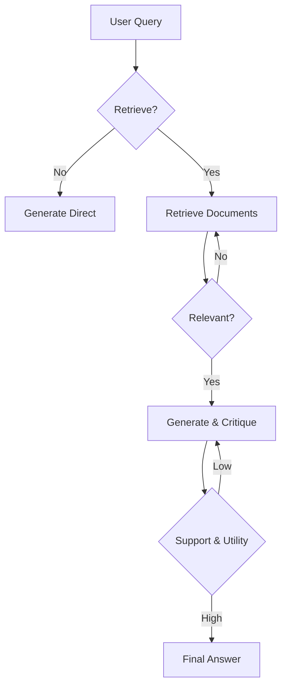

# 🤖 Self-RAG — Self-Critique & Adaptive Retrieval
> **Level:** Advanced | **Language:** Hinglish | **Goal:** Master the Self-RAG framework that enables an LLM to critique its own retrieval and generation using special "Reflection Tokens".

---

## 🧭 1. Beginner-Friendly Hinglish Explanation
Self-RAG ka matlab hai **"Apna Judge khud banna"**. 

Imagine ek student hai jo answer likhte waqt khud se pucha ja raha hai: 
1. "Kya mujhe book dekhni chahiye?" (**Is-Retrieve**)
2. "Jo main padh raha hoon, kya wo sawal se related hai?" (**Is-Rel**)
3. "Mera answer book ke hisaab se sahi hai?" (**Is-Sup**)
4. "Mera answer overall kitna acha hai?" (**Is-Use**)

Self-RAG mein AI in sawalon ke liye special tokens generate karta hai. Wo khud decide karta hai kab use search karna hai aur kab use apna answer rewrite karna hai. Ye RAG ka sabse "Smarter" version hai.

---

## 🧠 2. Deep Technical Explanation
Self-RAG uses a **Specialized LLM** (often fine-tuned) that outputs **Reflection Tokens**.
- **Retrieve Token:** Decides if external retrieval is needed based on the query.
- **Is-Rel Token:** Evaluates if the retrieved chunk is relevant.
- **Is-Sup Token:** Evaluates if the generated response is "Supported" by the retrieved chunk (Grounding).
- **Is-Use Token:** Scores the overall utility of the final answer.
- **Beam Search:** The model can generate multiple response candidates, score them using these reflection tokens, and select the highest-scoring path.
- **Fine-tuning:** Unlike normal RAG, Self-RAG often requires a model trained to output these special tokens (e.g., Self-RAG 7B or 13B).

---

## 🏗️ 3. Architecture Diagrams



---

## 💻 4. Production-Ready Code Example (Self-RAG Token Logic)

```python
def self_rag_step(query, state):
    # Hinglish Logic: Model se pucho kya use search karna hai
    # Prediction: "[Retrieve] Yes"
    
    # 1. Retrieve
    docs = ["Retrieval results..."]
    
    # 2. Generate with Critique Tokens
    # Prediction: "[Is-Rel] Relevant [Is-Sup] Supported [Is-Use] 5"
    
    response = "The result is XYZ."
    critique = {"relevance": "High", "support": "High", "utility": 5}
    
    if critique["utility"] < 3:
        # Retry with better context
        return "Retrying..."
    
    return response

# This pattern usually requires a fine-tuned model or very specific prompting.
```

---

## 🌍 5. Real-World Use Cases
- **Scientific Research:** Verifying that every claim in a paper is backed by a specific study.
- **Fact-Checking Portals:** Automatically grading the accuracy of an AI response.
- **Highly Reliable Tutors:** Ensuring the AI doesn't teach wrong formulas by constant self-critique.

---

## ❌ 6. Failure Cases
- **Over-Retrieval:** Model har choti cheez ke liye search karne lagta hai, jisse tokens aur time waste hote hain.
- **Critical Failure:** Model apne hi galat answer ko `[Is-Sup] Supported` bol deta hai (Hallucination of the judge).
- **Complexity in Parsing:** Response ke beech mein se reflection tokens ko extract karna aur clean karna mushkil hota hai.

---

## 🛠️ 7. Debugging Guide
- **Log Reflection Tokens:** Humesha dekhein ki model ne khud ko kya score diya.
- **Path Analysis:** Agar beam search use kar rahe hain, toh dekhein ki rejected paths kyu reject hue.

---

## ⚖️ 8. Tradeoffs
- **Precision:** Extremely high grounding (No hallucinations).
- **Inference Cost:** Bahut high (multiple generation paths aur tokens).
- **Dependency:** Requiring specialized models or very long prompts.

---

## ✅ 9. Best Practices
- **Thresholding:** Sirf high `Is-Use` scores wale answers hi user ko dikhayein.
- **Prompt Engineering:** Agar fine-tuned model nahi hai, toh few-shot prompting se model ko ye tokens sikhaein.

---

## 🛡️ 10. Security Concerns
- **Critique Manipulation:** Attacker query aisi likhta hai ki model ka internal judge humesha "High Score" de.

---

## 📈 11. Scaling Challenges
- **Beam Search Latency:** Multiple paths generate karna real-time apps ke liye slow ho sakta hai.

---

## 💰 12. Cost Considerations
- **High Token Consumption:** Reasoning aur evaluation tokens billing mein add hote hain.

---

## 📝 13. Interview Questions
1. **"Self-RAG aur Normal RAG mein key architectural difference kya hai?"**
2. **"Reflection tokens (Is-Rel, Is-Sup) ka use case kya hai?"**
3. **"Self-RAG grounding accuracy kaise ensure karta hai?"**

---

## ⚠️ 14. Common Mistakes
- **Ignoring Low Scores:** Model ne khud ko 1/5 diya, par aapne wahi answer user ko dikha diya.
- **Infinite Self-Correction:** Model ko loop mein phasa dena jahan wo hamesha khud ko critique karta rahe.

---

## 🚀 15. Latest 2026 Industry Patterns
- **Unified Self-RAG:** Models like GPT-5 or Claude 4 having built-in self-RAG capabilities without explicit tokens.
- **DPO for Self-RAG:** Fine-tuning models using Direct Preference Optimization to make their internal judging more accurate.

---

> **Expert Tip:** Self-RAG is for **Zero-Tolerance** environments. If you can't afford a single wrong fact, use Self-RAG.
