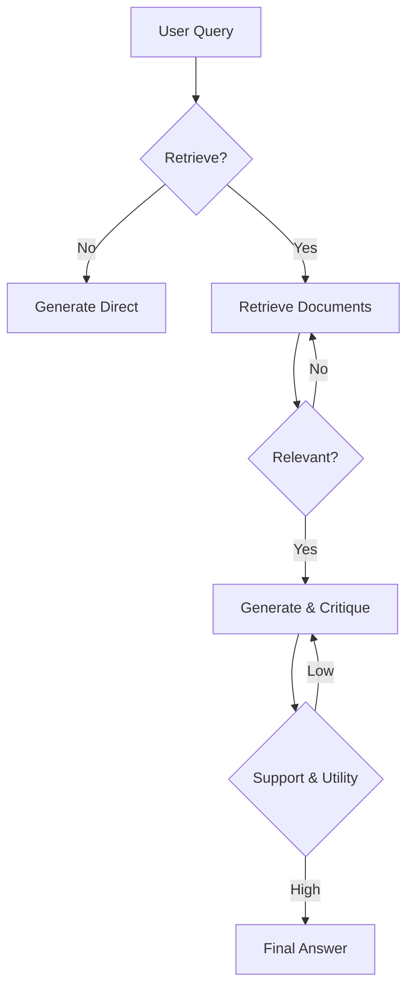

# 🤖 Self-RAG — Self-Critique & Adaptive Retrieval
> **Level:** Advanced | **Language:** Hinglish | **Goal:** Self-RAG framework ko master karein jo LLM ko special "Reflection Tokens" ka use karke khud ki retrieval aur generation ko critique karne enable karta hai.

---

## 🧭 1. Beginner-Friendly Hinglish Explanation
Self-RAG ka matlab hai **"Apna Judge khud banna"**. 

Imagine ek student hai jo answer likhte waqt khud se pucha ja raha hai: 
1. "Kya mujhe book dekhni chahiye?" (**Is-Retrieve**)
2. "Jo main padh raha hoon, kya wo sawal se related hai?" (**Is-Rel**)
3. "Mera answer book ke hisaab se sahi hai?" (**Is-Sup**)
4. "Mera answer overall kitna acha hai?" (**Is-Use**)

Self-RAG mein AI in sawalon ke liye special tokens generate karta hai. Wo khud decide karta hai kab use search karna hai aur kab use apna answer rewrite karna hai. Ye RAG ka sabse "Smarter" version hai.

---

## 🧠 2. Deep Technical Explanation
Self-RAG ek **Specialized LLM** (aksar fine-tuned) ka use karta hai jo **Reflection Tokens** output karta hai.
- **Retrieve Token:** Query ke basis par decide karta hai ki kya external retrieval ki zaroorat hai.
- **Is-Rel Token:** Evaluate karta hai ki kya retrieved chunk relevant hai.
- **Is-Sup Token:** Evaluate karta hai ki kya generated response retrieved chunk dwara "Supported" (Grounded) hai.
- **Is-Use Token:** Final answer ki overall utility ko score karta hai.
- **Beam Search:** Model multiple response candidates generate kar sakta hai, unhe in reflection tokens ka use karke score kar sakta hai, aur highest-scoring path select kar sakta hai.
- **Fine-tuning:** Normal RAG ke unlike, Self-RAG ke liye aksar ek aise model ki zaroorat hoti hai jo in special tokens ko output karne ke liye trained ho (e.g., Self-RAG 7B ya 13B).

---

## 🏗️ 3. Architecture Diagrams


```mermaid
graph TD
    U[User Query] --> T{Retrieve?}
    T -- No --> Gen[Generate Direct]
    T -- Yes --> R[Retrieve Documents]
    R --> Eval{Relevant?}
    Eval -- Yes --> G[Generate & Critique]
    Eval -- No --> R
    G --> Final{Support & Utility}
    Final -- Low --> G
    Final -- High --> End[Final Answer]
```

---

## 💻 4. Production-Ready Code Example (Self-RAG Token Logic)

```python
def self_rag_step(query, state):
    # Hinglish Logic: Model se pucho kya use search karna hai
    # Prediction: "[Retrieve] Yes"
    
    # 1. Retrieve
    docs = ["Retrieval results..."]
    
    # 2. Generate with Critique Tokens
    # Prediction: "[Is-Rel] Relevant [Is-Sup] Supported [Is-Use] 5"
    
    response = "The result is XYZ."
    critique = {"relevance": "High", "support": "High", "utility": 5}
    
    if critique["utility"] < 3:
        # Retry with better context
        return "Retrying..."
    
    return response

# This pattern usually requires a fine-tuned model or very specific prompting.
```

---

## 🌍 5. Real-World Use Cases
- **Scientific Research:** Verify karna ki paper ka har claim ek specific study dwara backed ho.
- **Fact-Checking Portals:** AI response ki accuracy ko automatically grade karna.
- **Highly Reliable Tutors:** Constant self-critique ke through ensure karna ki AI wrong formulas na sikhaye.

---

## ❌ 6. Failure Cases
- **Over-Retrieval:** Model har choti cheez ke liye search karne lagta hai, jisse tokens aur time waste hote hain.
- **Critical Failure:** Model apne hi galat answer ko `[Is-Sup] Supported` bol deta hai (Hallucination of the judge).
- **Complexity in Parsing:** Response ke beech mein se reflection tokens ko extract karna aur clean karna mushkil hota hai.

---

## 🛠️ 7. Debugging Guide
- **Log Reflection Tokens:** Humesha dekhein ki model ne khud ko kya score diya.
- **Path Analysis:** Agar beam search use kar rahe hain, toh dekhein ki rejected paths kyu reject hue.

---

## ⚖️ 8. Tradeoffs
- **Precision:** Extremely high grounding (No hallucinations).
- **Inference Cost:** Bahut high (multiple generation paths aur tokens).
- **Dependency:** Specialized models ya bahut long prompts ki zaroorat hona.

---

## ✅ 9. Best Practices
- **Thresholding:** Sirf high `Is-Use` scores wale answers hi user ko dikhayein.
- **Prompt Engineering:** Agar fine-tuned model nahi hai, toh few-shot prompting se model ko ye tokens sikhaein.

---

## 🛡️ 10. Security Concerns
- **Critique Manipulation:** Attacker query aisi likhta hai ki model ka internal judge humesha "High Score" de.

---

## 📈 11. Scaling Challenges
- **Beam Search Latency:** Multiple paths generate karna real-time apps ke liye slow ho sakta hai.

---

## 💰 12. Cost Considerations
- **High Token Consumption:** Reasoning aur evaluation tokens billing mein add hote hain.

---

## 📝 13. Interview Questions
1. **"Self-RAG aur Normal RAG mein key architectural difference kya hai?"**
2. **"Reflection tokens (Is-Rel, Is-Sup) ka use case kya hai?"**
3. **"Self-RAG grounding accuracy kaise ensure karta hai?"**

---

## ⚠️ 14. Common Mistakes
- **Ignoring Low Scores:** Model ne khud ko 1/5 diya, par aapne wahi answer user ko dikha diya.
- **Infinite Self-Correction:** Model ko loop mein phasa dena jahan wo hamesha khud ko critique karta rahe.

---

## 🚀 15. Latest 2026 Industry Patterns
- **Unified Self-RAG:** GPT-5 ya Claude 4 jaise models jinme explicit tokens ke bina built-in self-RAG capabilities hoti hain.
- **DPO for Self-RAG:** Models ke internal judging ko behtar banane ke liye Direct Preference Optimization (DPO) ka use karke unhe fine-tune karna.

---

> **Expert Tip:** Self-RAG is for **Zero-Tolerance** environments. If you can't afford a single wrong fact, use Self-RAG.
