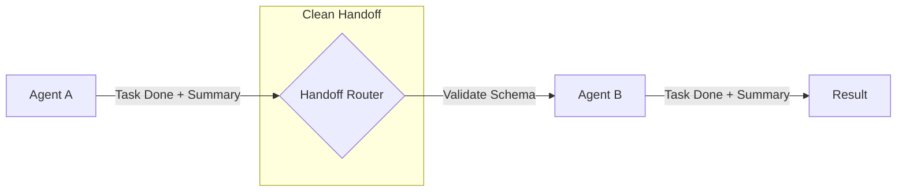

# 🤝 Agent Handoffs — Seamless State Transfer
> **Level:** Core Engineering | **Language:** Hinglish | **Goal:** Master the techniques of passing tasks and context between agents without losing information or increasing token bloat.

---

## 🧭 1. Beginner-Friendly Hinglish Explanation
Agent Handoff ka matlab hai **"Batten pass karna"**. 

Jaise Relay Race mein ek runner doosre ko danda (Batten) pakdata hai, agentic systems mein ek agent apna kaam pura karke doosre ko state pass karta hai. 
Example:
- Customer Support agent ne pucha "Aapka order ID kya hai?"
- User ne ID di.
- Support agent ne task **Handoff** kiya Billing Agent ko. 
- Billing agent ko ye pata hona chahiye ki Support agent ne pehle kya pucha tha taaki wo wahi sawal dobara na puche.

Handoff sahi hona chahiye taaki user ko "Loop" ya "Repetition" mehsoos na ho.

---

## 🧠 2. Deep Technical Explanation
Handoffs are the transitions between specialized nodes in a multi-agent graph.
- **Explicit Handoff:** Agent A outputs a specific signal (e.g., `GOTO: BillingAgent`) that the router interprets.
- **Context Summarization:** Instead of passing the entire chat history, Agent A passes a **State Summary**. This reduces token usage for Agent B.
- **Schema Validation:** Using Pydantic to ensure that the data passed from Agent A is exactly what Agent B expects (e.g., a valid UUID or a specific JSON structure).
- **Handoff Triggers:**
    - **Intent-based:** "I need help with my bill" → Handoff to Finance.
    - **Capability-based:** "Can you write Python?" → Handoff to Coder.

---

## 🏗️ 3. Architecture Diagrams



---

## 💻 4. Production-Ready Code Example (Structured Handoff)

```python
from pydantic import BaseModel

class HandoffData(BaseModel):
    # Hinglish Logic: Agle agent ko kya-kya chahiye?
    user_id: str
    issue_summary: str
    previous_steps: list[str]

def support_agent_to_billing(history):
    # Logic to prepare handoff
    data = HandoffData(
        user_id="123",
        issue_summary="User wants a refund for order #99",
        previous_steps=["Verified ID", "Checked Order Status"]
    )
    return data.dict()

def billing_agent(handoff_data: dict):
    print(f"Billing Agent: Handling {handoff_data['issue_summary']} for user {handoff_data['user_id']}")
    # Start working directly without re-asking basics
```

---

## 🌍 5. Real-World Use Cases
- **Medical Triage:** A basic bot hands off to a specialist agent after collecting symptoms.
- **E-commerce:** A chatbot handing off to a human agent or a specialized "Return" agent.
- **Multi-lingual Support:** An English router agent handing off to a "Hindi Specialist" agent.

---

## ❌ 6. Failure Cases
- **Context Loss:** Agent B ko ye nahi pata ki Agent A ne kya kiya, isliye wo user ko "Gussa" dila deta hai wahi sawal puchkar.
- **Validation Error:** Agent A ne "String" bheja par Agent B ko "Int" chahiye tha (System crash).
- **Infinite Handoff:** Agent A sends to B, B sends to A (Ping-pong loop).

---

## 🛠️ 7. Debugging Guide
- **Audit the Handoff Payload:** Har transition par `print(handoff_data)` karke dekhein.
- **State Snapshots:** Check karein ki handoff ke baad context window mein kitne tokens bache hain.

---

## ⚖️ 8. Tradeoffs
- **Full History Handoff:** Safest but most expensive (Token bloat).
- **Summary Handoff:** Cheapest but risky (Important details might be missing in the summary).

---

## ✅ 9. Best Practices
- **Standardized Schema:** Use a common `HandoffObject` across all agents in your company.
- **Confirmation Message:** Handoff ke waqt user ko batayein: "Passing you to our Billing specialist who has your order details."

---

## 🛡️ 10. Security Concerns
- **Data Leakage:** Summary banate waqt agent galti se PII (Private Info) agle agent ko bhej sakta hai jo use nahi dekhna chahiye tha.

---

## 📈 11. Scaling Challenges
- **Latency:** Har handoff ek extra processing step hai. Multi-step handoffs response time badhate hain.

---

## 💰 12. Cost Considerations
- **Summarization Cost:** Summary banane ke liye ek extra LLM call karni padti hai.

---

## 📝 13. Interview Questions
1. **"Multi-agent systems mein context bloat kaise manage karenge?"**
2. **"Agent handoffs mein state persistence kyu zaruri hai?"**
3. **"Explicit vs Implicit handoffs mein kya fark hai?"**

---

## ⚠️ 14. Common Mistakes
- **Broken Chain:** Handoff kar diya par agla agent "Active" nahi tha (Dead end).
- **Silent Handoff:** User ko pata hi nahi chala ki agent badal gaya, aur wo confuse ho gaya ki "Ab ye kaun hai?"

---

## 🚀 15. Latest 2026 Industry Patterns
- **Zero-Token Handoffs:** Using embeddings to pass context "Semantic pointers" instead of full text summaries.
- **Predicted Handoffs:** The system predicts the need for a handoff 2 steps before it happens to pre-load the next agent.

---

> **Expert Tip:** A handoff is a **Contract**. If the contract is clear, the collaboration is perfect.
