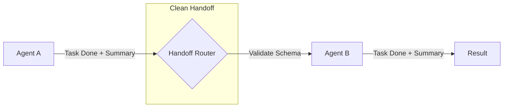

# 🤝 Agent Handoffs — Seamless State Transfer
> **Level:** Core Engineering | **Language:** Hinglish | **Goal:** Information khoye bina ya token bloat badhaye bina agents ke beech tasks aur context pass karne ki techniques ko master karein.

---

## 🧭 1. Beginner-Friendly Hinglish Explanation
Agent Handoff ka matlab hai **"Batten pass karna"**. 

Jaise Relay Race mein ek runner doosre ko danda (Batten) pakdata hai, agentic systems mein ek agent apna kaam pura karke doosre ko state pass karta hai. 
Example:
- Customer Support agent ne pucha "Aapka order ID kya hai?"
- User ne ID di.
- Support agent ne task **Handoff** kiya Billing Agent ko. 
- Billing agent ko ye pata hona chahiye ki Support agent ne pehle kya pucha tha taaki wo wahi sawal dobara na puche.

Handoff sahi hona chahiye taaki user ko "Loop" ya "Repetition" mehsoos na ho.

---

## 🧠 2. Deep Technical Explanation
Handoffs multi-agent graph mein specialized nodes ke beech ke transitions hote hain.
- **Explicit Handoff:** Agent A ek specific signal (e.g., `GOTO: BillingAgent`) output karta hai jise router interpret karta hai.
- **Context Summarization:** Poori chat history pass karne ke bajaye, Agent A ek **State Summary** pass karta hai. Ye Agent B ke liye token usage ko kam karta hai.
- **Schema Validation:** Pydantic ka use karke ensure karna ki Agent A se pass kiya gaya data wahi ho jo Agent B expect karta hai (e.g., ek valid UUID ya ek specific JSON structure).
- **Handoff Triggers:**
    - **Intent-based:** "I need help with my bill" → Finance ko handoff.
    - **Capability-based:** "Can you write Python?" → Coder ko handoff.

---

## 🏗️ 3. Architecture Diagrams


```mermaid
graph LR
    A[Agent A] -->|Task Done + Summary| H{Handoff Router}
    H -->|Validate Schema| B[Agent B]
    B -->|Task Done + Summary| Final[Result]
    
    subgraph "Clean Handoff"
    H
    end
```

---

## 💻 4. Production-Ready Code Example (Structured Handoff)

```python
from pydantic import BaseModel

class HandoffData(BaseModel):
    # Hinglish Logic: Agle agent ko kya-kya chahiye?
    user_id: str
    issue_summary: str
    previous_steps: list[str]

def support_agent_to_billing(history):
    # Logic to prepare handoff
    data = HandoffData(
        user_id="123",
        issue_summary="User wants a refund for order #99",
        previous_steps=["Verified ID", "Checked Order Status"]
    )
    return data.dict()

def billing_agent(handoff_data: dict):
    print(f"Billing Agent: Handling {handoff_data['issue_summary']} for user {handoff_data['user_id']}")
    # Start working directly without re-asking basics
```

---

## 🌍 5. Real-World Use Cases
- **Medical Triage:** Symptoms collect karne ke baad ek basic bot specialist agent ko handoff karta hai.
- **E-commerce:** Ek chatbot human agent ya specialized "Return" agent ko handoff karta hai.
- **Multi-lingual Support:** Ek English router agent "Hindi Specialist" agent ko handoff karta hai.

---

## ❌ 6. Failure Cases
- **Context Loss:** Agent B ko ye nahi pata ki Agent A ne kya kiya, isliye wo user ko wahi sawal poochkar irritate kar deta hai.
- **Validation Error:** Agent A ne "String" bheja par Agent B ko "Int" chahiye tha (System crash).
- **Infinite Handoff:** Agent A B ko bhejta hai, B A ko bhejta hai (Ping-pong loop).

---

## 🛠️ 7. Debugging Guide
- **Audit the Handoff Payload:** Har transition par `print(handoff_data)` karke dekhein.
- **State Snapshots:** Check karein ki handoff ke baad context window mein kitne tokens bache hain.

---

## ⚖️ 8. Tradeoffs
- **Full History Handoff:** Safest par sabse expensive (Token bloat).
- **Summary Handoff:** Cheapest par risky (Summary mein important details miss ho sakte hain).

---

## ✅ 9. Best Practices
- **Standardized Schema:** Apni company ke sabhi agents ke across ek common `HandoffObject` ka use karein.
- **Confirmation Message:** Handoff ke waqt user ko batayein: "Passing you to our Billing specialist who has your order details."

---

## 🛡️ 10. Security Concerns
- **Data Leakage:** Summary banate waqt agent galti se PII (Private Info) agle agent ko bhej sakta hai jo use nahi dekhna chahiye tha.

---

## 📈 11. Scaling Challenges
- **Latency:** Har handoff ek extra processing step hai. Multi-step handoffs response time badhate hain.

---

## 💰 12. Cost Considerations
- **Summarization Cost:** Summary banane ke liye ek extra LLM call karni padti hai.

---

## 📝 13. Interview Questions
1. **"Multi-agent systems mein context bloat kaise manage karenge?"**
2. **"Agent handoffs mein state persistence kyu zaruri hai?"**
3. **"Explicit vs Implicit handoffs mein kya fark hai?"**

---

## ⚠️ 14. Common Mistakes
- **Broken Chain:** Handoff kar diya par agla agent "Active" nahi tha (Dead end).
- **Silent Handoff:** User ko pata hi nahi chala ki agent badal gaya, aur wo confuse ho gaya ki "Ab ye kaun hai?"

---

## 🚀 15. Latest 2026 Industry Patterns
- **Zero-Token Handoffs:** Full text summaries ke bajaye context "Semantic pointers" pass karne ke liye embeddings ka use karna.
- **Predicted Handoffs:** Next agent ko pre-load karne ke liye system handoff ki zaroorat ko 2 steps pehle hi predict kar leta hai.

---

> **Expert Tip:** A handoff is a **Contract**. If the contract is clear, the collaboration is perfect.
