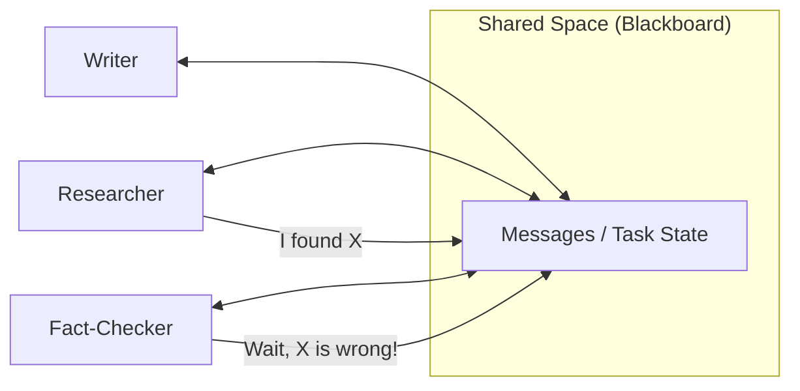

# 🤝 Collaborative Agent Systems — Peer-to-Peer Intelligence
> **Level:** Advanced | **Language:** Hinglish | **Goal:** Master the architecture where agents work as equals in a shared space, collaborating without a strict supervisor.

---

## 🧭 1. Beginner-Friendly Hinglish Explanation
Collaborative Agent Systems ka matlab hai **"Barabari ki dosti"**. 

Supervisor pattern mein ek Boss hota hai, lekin Collaborative system mein sab agents **Peers** (Barabar) hain. Ye bilkul waisa hi hai jaise 4 dost milkar ek trip plan kar rahe hon:
- Sab apni rai (input) dete hain.
- Ek doosre ki baat sunte hain.
- Agar koi galti karta hai, toh doosra use "Check" karta hai.
- Final decision "Group consensus" (Sabki sehmati) se hota hai.

Ye pattern **Creativity** aur **Peer-Review** ke liye best hai.

---

## 🧠 2. Deep Technical Explanation
Collaborative systems often use a **Blackboard Architecture** or a **Shared Chat Space**.
- **Shared Context:** All agents have access to the same `messages` list. They "Watch" the conversation and decide when to jump in.
- **Peer Review:** Every output from Agent A is immediately seen by Agent B, who can critique it before the next step.
- **Decentralized Logic:** There is no "Next" node logic. Instead, agents use **Self-Selection** or a simple round-robin to participate.
- **Broadcast Communication:** When an agent takes an action, the result is "Broadcast" to all other agents in the team.

---

## 🏗️ 3. Architecture Diagrams



---

## 💻 4. Production-Ready Code Example (Shared State Collaboration)

```python
# Simulated Shared State Collaboration
class TeamState:
    def __init__(self):
        self.history = []

def researcher(state):
    # Hinglish Logic: State dekho aur kuch add karo
    print("Researcher: Reading shared state...")
    state.history.append("Fact: AI is growing.")

def fact_checker(state):
    # Hinglish Logic: Pichle agent ki galti pakdo
    print("Fact-Checker: Verifying last entry...")
    if "growing" in state.history[-1]:
        state.history.append("Verification: Fact is CORRECT.")

# Shared instance
shared_state = TeamState()
researcher(shared_state)
fact_checker(shared_state)

print(f"Final Team Work: {shared_state.history}")
```

---

## 🌍 5. Real-World Use Cases
- **Creative Brainstorming:** Multiple agents generating ideas for a movie script or a marketing campaign.
- **Peer-to-Peer Debugging:** One agent writes code, another tries to hack it, and a third one fixes the vulnerabilities.
- **Debate-based Reasoning:** Two agents take opposite sides of an argument to find the most balanced truth.

---

## ❌ 6. Failure Cases
- **Group Think:** Saare agents ek doosre ki haan mein haan milane lagte hain (No critical thinking).
- **Chaos:** Sab agents ek saath bolne lagte hain, jisse context window "Noise" se bhar jati hai.
- **Bystander Effect:** Ek agent sochta hai doosra kaam karega, aur doosra sochta hai pehla karein—phir koi kaam nahi hota.

---

## 🛠️ 7. Debugging Guide
- **Who-said-what Tracking:** Ensure karein ki har message par `sender_id` ho.
- **Turn Analysis:** Check karein ki kya koi ek agent poori conversation "Hijack" kar raha hai.

---

## ⚖️ 8. Tradeoffs
- **Collaboration:** Highest creative output and built-in peer review.
- **Cost/Speed:** Very high token usage because everyone reads everyone's messages.

---

## ✅ 9. Best Practices
- **Max Turns:** Collaboration loop ko 5-10 turns ke baad end karein to prevent infinite debate.
- **Speak when relevant:** Agents ko instruct karein: "Only speak if you have a significant contribution or correction."

---

## 🛡️ 10. Security Concerns
- **Sybil Attack (AI version):** Ek compromised agent doosre agents ko "Peer Pressure" se manipulate kar sakta hai.

---

## 📈 11. Scaling Challenges
- **Context Limit:** 5 agents ki apas ki baatein 10 turns mein hi 20k tokens par kar sakti hain.

---

## 💰 12. Cost Considerations
- **Redundancy Cost:** You are paying for multiple agents to look at the same data. Ensure the quality boost justifies the cost.

---

## 📝 13. Interview Questions
1. **"Collaborative vs Supervisor systems mein key difference kya hai?"**
2. **"Shared state systems mein conflict resolution kaise handle karenge?"**
3. **"Peer-review pattern agents ki reliability kaise badhata hai?"**

---

## ⚠️ 14. Common Mistakes
- **No Leader:** Kabhi-kabhi final decision lene ke liye ek leader ki zarurat hoti hai jo "Debate" ko end kare.
- **Uniform Personas:** Sab agents ko ek jaisa banana (Give them conflicting goals for better collaboration).

---

## 🚀 15. Latest 2026 Industry Patterns
- **Multi-Agent Debate (MAD):** A formal framework where agents debate an answer until they converge on a consensus score.
- **Social Stigmergy for Agents:** Agents communicating indirectly by changing the environment (e.g., editing a shared document) rather than talking.

---

> **Expert Tip:** Collaboration is for **Nuance**. Use it when there is no "Single right answer" and you need diverse perspectives.
