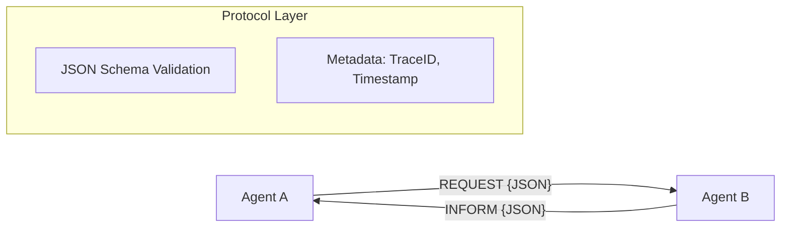

# 📡 Communication Protocols — Defining Agent Language
> **Level:** Advanced | **Language:** Hinglish | **Goal:** Master the structured formats and protocols (JSON, Markdown, Tool calls) that enable agents to exchange data reliably.

---

## 🧭 1. Beginner-Friendly Hinglish Explanation
Communication Protocol ka matlab hai **"Agents ki aapsi bhasha (Language)"**. 

Insaan jab baat karte hain toh wo emotions aur context use karte hain. Lekin agents ko kaam karne ke liye **Strict Rules** chahiye. 
- Agent A ko Agent B ko message kaise bhejna chahiye? 
- Kya wo normal English mein baat karenge? (Nahi, ye unreliable hai).
- Kya wo JSON format use karenge? (Haan, ye professional hai).

Jaise internet `HTTP` par chalta hai, agents ke aapsi kaam ke liye bhi humein "Protocols" set karne padte hain taaki koi confusion na ho.

---

## 🧠 2. Deep Technical Explanation
Protocols in Multi-Agent Systems (MAS) define the **Format** and **Semantics** of messages.
1. **JSON Schema:** Defining exactly which fields are required (e.g., `sender`, `task_id`, `priority`, `payload`).
2. **Tool-Calling Protocol:** Using the standard OpenAI/Anthropic tool-calling format where an agent outputs a "Call" and receives an "Observation".
3. **ACL (Agent Communication Language):** Traditional protocols like **FIPA-ACL** are being modernized for LLMs. They define "Performatives" like `REQUEST`, `INFORM`, `PROPOSE`, and `REJECT`.
4. **Markdown Tables:** Useful for sharing structured data between agents in a way that is easily readable by LLMs.
5. **State Synchronization:** How to ensure Agent A and Agent B are looking at the same version of the truth.

---

## 🏗️ 3. Architecture Diagrams



---

## 💻 4. Production-Ready Code Example (JSON Protocol)

```python
import json
from pydantic import BaseModel

class AgentMessage(BaseModel):
    # Hinglish Logic: Message ka structure define karo
    sender: str
    recipient: str
    action: str
    data: dict

def send_message(sender, recipient, action, data):
    msg = AgentMessage(sender=sender, recipient=recipient, action=action, data=data)
    # Convert to JSON string for the next agent
    return msg.json()

# protocol_msg = send_message("Researcher", "Writer", "WRITE_SUMMARY", {"topic": "AI"})
# print(f"Structured Message: {protocol_msg}")
```

---

## 🌍 5. Real-World Use Cases
- **Inter-Company Agents:** An agent from Company A (Buyer) talking to an agent from Company B (Seller) to negotiate prices.
- **Microservice Integration:** Agents acting as "Smart Wrappers" around traditional REST APIs.
- **Multi-Agent Coding:** A code generator agent sending structured `diff` formats to a reviewer agent.

---

## ❌ 6. Failure Cases
- **Protocol Mismatch:** Agent A `v2` protocol use kar raha hai, Agent B sirf `v1` samajhta hai (Version conflict).
- **Parsing Error:** LLM ne JSON generate karte waqt ek comma (`,`) miss kar diya, jisse agla agent crash ho gaya.
- **Semantic Ambiguity:** Protocol sahi hai par "Action" field ka matlab dono agents ke liye alag hai.

---

## 🛠️ 7. Debugging Guide
- **Schema Validation:** Use Pydantic to validate every incoming message.
- **Protocol Logging:** Save raw JSON messages to a central log for auditing.

---

## ⚖️ 8. Tradeoffs
- **Strict JSON:** Very reliable for code but consumes more tokens and can fail if the LLM makes a syntax error.
- **Natural Language:** Flexible and token-efficient but very hard for the system to parse and automate.

---

## ✅ 9. Best Practices
- **JSON Mode:** Use the LLM's "JSON Mode" feature if available to guarantee valid syntax.
- **Standard Performatives:** Use standard words like `REQUEST` or `TELL` instead of making up new ones.

---

## 🛡️ 10. Security Concerns
- **Message Injection:** Attacker galti se message payload mein malicious code insert karta hai. Always treat agent data as "Untrusted".

---

## 📈 11. Scaling Challenges
- **Serialization Latency:** Millions of messages ko JSON mein convert karna aur parse karna can add compute overhead.

---

## 💰 12. Cost Considerations
- **Metadata Bloat:** Har message ke saath lambi JSON metadata bhejne se context window jaldi bhar jati hai. Use compact keys.

---

## 📝 13. Interview Questions
1. **"Agents ke beech communication ke liye JSON better hai ya Natural Language?"**
2. **"Protocol versioning multi-agent systems mein kaise handle karenge?"**
3. **"FIPA-ACL concepts LLM agents mein kaise apply hote hain?"**

---

## ⚠️ 14. Common Mistakes
- **No Error Field:** Message structure mein galti (error) handle karne ka koi field na hona.
- **Dynamic Schemas:** Runtime par schema badalna (Always use static, pre-defined schemas).

---

## 🚀 15. Latest 2026 Industry Patterns
- **Protocol Buffers (Protobuf) for Agents:** Using binary formats like Protobuf for internal agent-to-agent talk to save 80% on token/bandwidth costs.
- **Universal Agent Protocol (UAP):** A standardized industry effort to make agents from different companies (OpenAI, Google, Anthropic) talk to each other seamlessly.

---

> **Expert Tip:** A protocol is a **Promise**. If you break it, the whole team falls apart.
