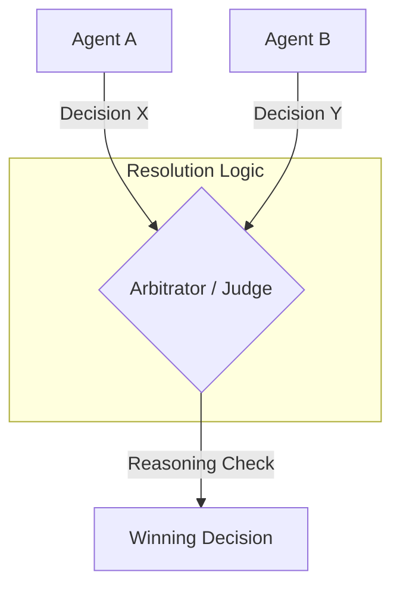

# ⚖️ Conflict Resolution between Agents — The Peacekeeper
> **Level:** Advanced | **Language:** Hinglish | **Goal:** Master the techniques for resolving disagreements, data inconsistencies, and resource competition in multi-agent systems.

---

## 🧭 1. Beginner-Friendly Hinglish Explanation
Conflict Resolution ka matlab hai **"Agents ki ladai suljhana"**. 

Imagine aapne do agents ko kaam diya:
- Agent A kehta hai: "User ka account balance $100 hai." (Database check kiya).
- Agent B kehta hai: "Nahi, $150 hai." (Puraani cache dekhi).
- **Conflict!** Ab kiska maanein?

Multi-agent systems mein agents ke beech disagreements ho sakte hain: data par, priority par, ya goal par. Conflict resolution humein sikhata hai ki bina system crash kiye "Final Decision" kaise lein.

---

## 🧠 2. Deep Technical Explanation
Conflicts in MAS (Multi-Agent Systems) are handled using **Arbitration** or **Consensus** algorithms.
1. **Priority-based Arbitration:** One agent is designated as "Primary". If there's a conflict, Primary's decision wins.
2. **Voting (Majority Rule):** 3-5 agents perform the same task, and the answer with the most "Votes" is selected.
3. **The Arbitrator Node:** A separate "Judge" agent reviews the reasoning of both conflicting agents and makes a final call based on evidence.
4. **Data Locking:** Preventing two agents from modifying the same resource at the same time (using Mutex or Distributed Locks).
5. **Conflict Metadata:** Adding "Confidence Scores" to agent outputs. High confidence wins.

---

## 🏗️ 3. Architecture Diagrams



---

## 💻 4. Production-Ready Code Example (Conflict Resolver)

```python
def resolve_conflict(agent_a_res: dict, agent_b_res: dict):
    # Hinglish Logic: Confidence score dekho aur faisla lo
    score_a = agent_a_res.get("confidence", 0)
    score_b = agent_b_res.get("confidence", 0)
    
    if score_a > score_b:
        print("Agent A wins by confidence.")
        return agent_a_res['data']
    elif score_b > score_a:
        print("Agent B wins by confidence.")
        return agent_b_res['data']
    else:
        # If equal, use a Judge LLM (Simplified)
        return "Calling Judge for final decision..."

# res_a = {"data": "Result X", "confidence": 0.9}
# res_b = {"data": "Result Y", "confidence": 0.7}
# print(f"Resolved: {resolve_conflict(res_a, res_b)}")
```

---

## 🌍 5. Real-World Use Cases
- **Financial Trading:** Different bots suggesting different stock prices. The "Executor" bot must resolve which price is the most accurate.
- **Autonomous Vehicles:** Sensors (Lidar vs Camera) giving conflicting data about an obstacle. The "Fusion" layer resolves it.
- **Shared Document Editing:** Two agents trying to edit the same paragraph.

---

## ❌ 6. Failure Cases
- **Deadlock:** Agents ek doosre ke decision ka wait kar rahe hain aur koi aage nahi badh raha.
- **The "Loudest" Wins:** Model biases ki wajah se hamesha wahi agent jeet raha hai jo zyada tokens generate karta hai.
- **Judge Hallucination:** Arbitrator node khud confuse hokar galat rasta chun leta hai.

---

## 🛠️ 7. Debugging Guide
- **Trace the Disagreement:** Logs mein save karein: "Why did Agent A and B disagree?"
- **Confidence Calibration:** Check karein ki kya agents apne confidence scores sahi de rahe hain (Audit scores vs actual truth).

---

## ⚖️ 8. Tradeoffs
- **Voting/Arbitration:** Very high accuracy but very high token cost (Multiple agents + Judge).
- **Static Rules:** Fast and cheap but can't handle complex semantic conflicts.

---

## ✅ 9. Best Practices
- **Tie-breaker Rules:** Humesha ek default rasta rakhein agar sab agents disagree karein.
- **Fact-over-Reasoning:** Data-driven agents ko preference dein over reasoning-only agents.

---

## 🛡️ 10. Security Concerns
- **Sybil Attacks:** Attacker 10 fake agents banata hai jo sab "Galat" vote dete hain to win the majority rule.

---

## 📈 11. Scaling Challenges
- **Latency:** 5 agents ko vote karwana and judge karna response time ko 5-10 seconds badha deta hai.

---

## 💰 12. Cost Considerations
- **Redundancy Pricing:** Conflict resolution is expensive. Only use it for "Mission Critical" decisions.

---

## 📝 13. Interview Questions
1. **"Multi-agent systems mein data inconsistency kaise handle karenge?"**
2. **"Voting mechanism LLM agents ke liye kyu useful hai?"**
3. **"Arbitrator node ki accuracy kaise verify karoge?"**

---

## ⚠️ 14. Common Mistakes
- **No Conflict Detection:** Sochna ki agents kabhi disagree nahi karenge.
- **Circular Logic:** Agent A ko Agent B ka judge bana dena aur vice versa.

---

## 🚀 15. Latest 2026 Industry Patterns
- **Proof-of-Stake for Agents:** Agents placing "Token Bets" on their answers. If they are wrong, they lose reputation/priority.
- **Nash Equilibrium in Agents:** Agents using Game Theory to find a solution that satisfies all constraints without a central judge.

---

> **Expert Tip:** Conflict is not a bug, it's a **Feature**. It means your agents are actually thinking. Your job is just to be a good Judge.
