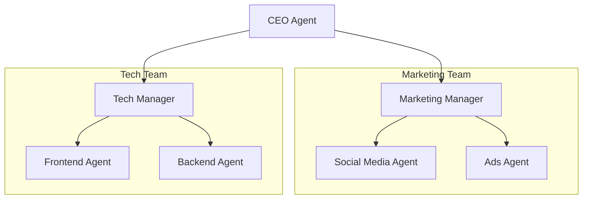

# 🧱 Hierarchical Agents — Scaling Team Complexity
> **Level:** Advanced | **Language:** Hinglish | **Goal:** Master the design of multi-layered agent teams where specialized squads report to mid-level managers, who report to a top-level orchestrator.

---

## 🧭 1. Beginner-Friendly Hinglish Explanation
Hierarchical Agents ka matlab hai **"Agents ki Hierarchy (Siddha)"**. 

Jaise ek badi company mein CEO hota hai, uske neeche Managers hote hain, aur Managers ke neeche Workers. 
Example:
- **CEO Agent:** Goal set karta hai "Ek naya product launch karo."
- **Marketing Manager Agent:** Marketing ki team handle karta hai (Social Media agent, Ads agent).
- **Tech Manager Agent:** Dev team handle karta hai (Frontend agent, Backend agent).

Ye pattern tab zaruri hai jab kaam itna bada ho ki ek manager (Supervisor) confuse ho jaye. Ise hum **"Team of Teams"** bhi kehte hain.

---

## 🧠 2. Deep Technical Explanation
Hierarchical systems implement **Nested State Graphs**.
- **The Orchestrator (Top Node):** Manages high-level milestones. It delegates "Epics" to Lead Agents.
- **Lead Agents (Sub-Managers):** Each Lead Agent is a Supervisor of its own **Sub-Graph**. They maintain their own local state and only report the "Summary" back to the Top Orchestrator.
- **Encapsulation:** Sub-agents don't need to know about the entire system. They only care about the task their Lead Agent gave them.
- **State Handoffs:** Reducing "Context Noise" by only bubbling up critical information to the higher layers.

---

## 🏗️ 3. Architecture Diagrams



---

## 💻 4. Production-Ready Code Example (Nested Graph Concept)

```python
# Simplified Logic for Hierarchical Teams
def tech_team_lead(task: str):
    # This agent manages its own sub-tasks
    print(f"Tech Lead: Delegating {task} to Frontend and Backend...")
    # frontend_res = frontend_agent(task)
    # backend_res = backend_agent(task)
    return "Tech Team: Module Complete."

def ceo_agent(goal: str):
    # Hinglish Logic: CEO sir manager ko kaam dete hain
    print(f"CEO: Goal is {goal}")
    res = tech_team_lead("Build UI")
    print(f"CEO: Received {res}")
    return "Goal Achieved."

# ceo_agent("Launch new CRM")
```

---

## 🌍 5. Real-World Use Cases
- **Autonomous Software Houses:** One agent architecting the system, and delegating specific microservices to sub-teams.
- **Large Content Production:** A Lead Producer managing a Research team, a Writing team, and a Video editing team.
- **Cybersecurity SOC:** A Master Analyst managing sub-agents for Network monitoring, Endpoint protection, and Threat hunting.

---

## ❌ 6. Failure Cases
- **Communication Lag:** CEO se worker tak baat pahuchne mein 5 layers lagti hain, jisse response bahut slow ho jata hai.
- **Information Silos:** Tech team ko pata hi nahi ki Marketing team kya kar rahi hai, jisse product inconsistent ho jata hai.
- **Management Overhead:** Tokens management nodes mein hi kharch ho jate hain, actual kaam par nahi.

---

## 🛠️ 7. Debugging Guide
- **Layered Logging:** Har layer ka apna log file ya trace rakhein.
- **Bottom-Up Verification:** Pehle workers ko test karein, phir manager ko, phir CEO ko.

---

## ⚖️ 8. Tradeoffs
- **Hierarchical:** Handles massive complexity, very organized, and modular.
- **Flat Team:** Faster and cheaper but gets confused by too many details.

---

## ✅ 9. Best Practices
- **Summary Reports:** Lead agents hamesha CEO ko "Summary" bhejien, poora chat history nahi.
- **Limit Depth:** Max 2-3 layers of hierarchy rakhein. Usse zyada "Telephone game" (info loss) ban jayega.

---

## 🛡️ 10. Security Concerns
- **Internal Sabotage:** Agar ek Manager agent compromised ho jaye, toh wo apni poori sub-team ko malicious actions ke liye use kar sakta hai.

---

## 📈 11. Scaling Challenges
- **State Syncing:** Nested graphs mein state ko "Parent" aur "Child" ke beech sync karna architecture-wise complex hai.

---

## 💰 12. Cost Considerations
- **Exponential Token Cost:** Every message bubbles up through layers, multiplying the cost. Use smaller models for mid-level managers.

---

## 📝 13. Interview Questions
1. **"Flat vs Hierarchical multi-agent systems mein kab kya choose karoge?"**
2. **"Hierarchical agents mein 'Context Bloat' kaise rokenge?"**
3. **"Sub-graphs production mein kaise implement hote hain?"**

---

## ⚠️ 14. Common Mistakes
- **CEO Micromanagement:** CEO agent ko workers ki choti-choti baaton mein involve karna.
- **No Feedback Loop:** Workers ka feedback CEO tak na pahuchna.

---

## 🚀 15. Latest 2026 Industry Patterns
- **Dynamic Hierarchy:** Teams that create or dissolve "Middle Management" layers based on the task complexity in real-time.
- **Agent Mesh:** A decentralized version of hierarchy where agents form temporary "Squads" to solve a task and then disperse.

---

> **Expert Tip:** Hierarchical Agents are for **Enterprise-Scale** problems. If your task can be done by 3 agents, stay flat. If it needs 30, build a hierarchy.
