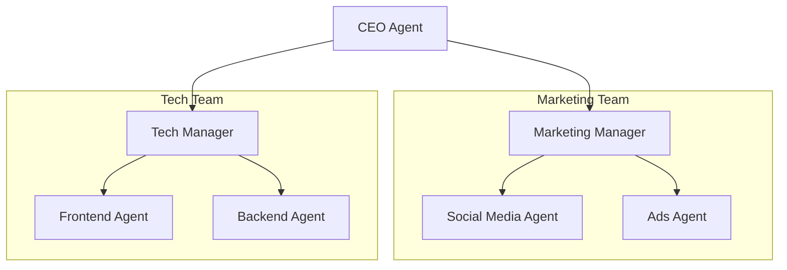

# 🧱 Hierarchical Agents — Scaling Team Complexity
> **Level:** Advanced | **Language:** Hinglish | **Goal:** Multi-layered agent teams ke design ko master karein jahan specialized squads mid-level managers ko aur manager top-level orchestrator ko report karte hain.

---

## 🧭 1. Beginner-Friendly Hinglish Explanation
Hierarchical Agents ka matlab hai **"Agents ki Hierarchy (Siddha)"**. 

Jaise ek badi company mein CEO hota hai, uske neeche Managers hote hain, aur Managers ke neeche Workers. 
Example:
- **CEO Agent:** Goal set karta hai "Ek naya product launch karo."
- **Marketing Manager Agent:** Marketing ki team handle karta hai (Social Media agent, Ads agent).
- **Tech Manager Agent:** Dev team handle karta hai (Frontend agent, Backend agent).

Ye pattern tab zaruri hai jab kaam itna bada ho ki ek manager (Supervisor) confuse ho jaye. Ise hum **"Team of Teams"** bhi kehte hain.

---

## 🧠 2. Deep Technical Explanation
Hierarchical systems **Nested State Graphs** ko implement karte hain.
- **The Orchestrator (Top Node):** High-level milestones ko manage karta hai. Ye Lead Agents ko "Epics" delegate karta hai.
- **Lead Agents (Sub-Managers):** Har Lead Agent apne **Sub-Graph** ka Supervisor hota hai. Wo apni local state maintain karte hain aur sirf "Summary" hi Top Orchestrator ko report karte hain.
- **Encapsulation:** Sub-agents ko poore system ke baare mein janne ki zaroorat nahi hoti. Wo sirf us task ki care karte hain jo unke Lead Agent ne unhe diya hai.
- **State Handoffs:** Sirf critical information ko higher layers tak bubble up karke "Context Noise" ko kam karna.

---

## 🏗️ 3. Architecture Diagrams


```mermaid
graph TD
    CEO[CEO Agent] --> MM[Marketing Manager]
    CEO --> TM[Tech Manager]
    
    subgraph "Marketing Team"
    MM --> S[Social Media Agent]
    MM --> A[Ads Agent]
    end
    
    subgraph "Tech Team"
    TM --> F[Frontend Agent]
    TM --> B[Backend Agent]
    end
```

---

## 💻 4. Production-Ready Code Example (Nested Graph Concept)

```python
# Simplified Logic for Hierarchical Teams
def tech_team_lead(task: str):
    # This agent manages its own sub-tasks
    print(f"Tech Lead: Delegating {task} to Frontend and Backend...")
    # frontend_res = frontend_agent(task)
    # backend_res = backend_agent(task)
    return "Tech Team: Module Complete."

def ceo_agent(goal: str):
    # Hinglish Logic: CEO sir manager ko kaam dete hain
    print(f"CEO: Goal is {goal}")
    res = tech_team_lead("Build UI")
    print(f"CEO: Received {res}")
    return "Goal Achieved."

# ceo_agent("Launch new CRM")
```

---

## 🌍 5. Real-World Use Cases
- **Autonomous Software Houses:** Ek agent jo system ko architect karta hai, aur sub-teams ko specific microservices delegate karta hai.
- **Large Content Production:** Research team, Writing team, aur Video editing team ko manage karne wala ek Lead Producer.
- **Cybersecurity SOC:** Network monitoring, Endpoint protection, aur Threat hunting ke sub-agents ko manage karne wala ek Master Analyst.

---

## ❌ 6. Failure Cases
- **Communication Lag:** CEO se worker tak baat pahuchne mein 5 layers lagti hain, jisse response bahut slow ho jata hai.
- **Information Silos:** Tech team ko pata hi nahi ki Marketing team kya kar rahi hai, jisse product inconsistent ho jata hai.
- **Management Overhead:** Tokens management nodes mein hi kharch ho jate hain, actual kaam par nahi.

---

## 🛠️ 7. Debugging Guide
- **Layered Logging:** Har layer ka apna log file ya trace rakhein.
- **Bottom-Up Verification:** Pehle workers ko test karein, phir manager ko, phir CEO ko.

---

## ⚖️ 8. Tradeoffs
- **Hierarchical:** Massive complexity handle karta hai, bahut organized aur modular hai.
- **Flat Team:** Fast aur cheap hai par bahut saari details se confuse ho jata hai.

---

## ✅ 9. Best Practices
- **Summary Reports:** Lead agents hamesha CEO ko "Summary" bhejien, poora chat history nahi.
- **Limit Depth:** Max 2-3 layers of hierarchy rakhein. Usse zyada "Telephone game" (info loss) ban jayega.

---

## 🛡️ 10. Security Concerns
- **Internal Sabotage:** Agar ek Manager agent compromised ho jaye, toh wo apni poori sub-team ko malicious actions ke liye use kar sakta hai.

---

## 📈 11. Scaling Challenges
- **State Syncing:** Nested graphs mein state ko "Parent" aur "Child" ke beech sync karna architecture-wise complex hai.

---

## 💰 12. Cost Considerations
- **Exponential Token Cost:** Har message layers ke through bubble up hota hai, jisse cost multiply hoti hai. Mid-level managers ke liye smaller models ka use karein.

---

## 📝 13. Interview Questions
1. **"Flat vs Hierarchical multi-agent systems mein kab kya choose karoge?"**
2. **"Hierarchical agents mein 'Context Bloat' kaise rokenge?"**
3. **"Sub-graphs production mein kaise implement hote hain?"**

---

## ⚠️ 14. Common Mistakes
- **CEO Micromanagement:** CEO agent ko workers ki choti-choti baaton mein involve karna.
- **No Feedback Loop:** Workers ka feedback CEO tak na pahuchna.

---

## 🚀 15. Latest 2026 Industry Patterns
- **Dynamic Hierarchy:** Aise teams jo real-time mein task complexity ke basis par "Middle Management" layers create ya dissolve karte hain.
- **Agent Mesh:** Hierarchy ka ek decentralized version jahan agents task solve karne ke liye temporary "Squads" banate hain aur fir disperse ho jate hain.

---

> **Expert Tip:** Hierarchical Agents are for **Enterprise-Scale** problems. If your task can be done by 3 agents, stay flat. If it needs 30, build a hierarchy.
