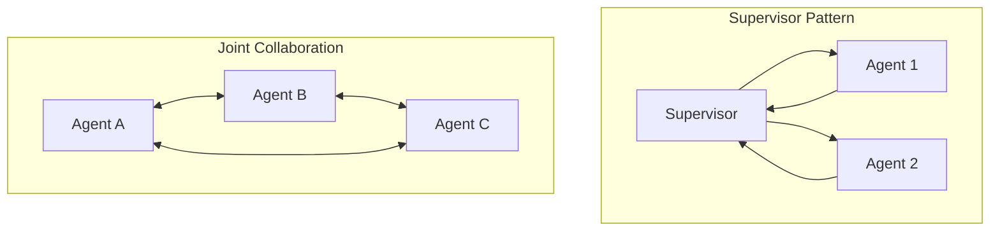

# 🏛️ Multi-Agent Architectures — Organizing the Collective
> **Level:** Core Engineering | **Language:** Hinglish | **Goal:** Master the design of systems where multiple specialized agents collaborate to solve complex, large-scale problems.

---

## 🧭 1. Beginner-Friendly Hinglish Explanation
Multi-Agent Architecture ka matlab hai **"Team Management"**. 

Ek akela agent (Single Agent) bahut saare kaamo mein confuse ho sakta hai. Multi-Agent systems mein hum kaam ko divide kar dete hain:
- Ek agent **Research** karta hai.
- Ek agent **Code** likhta hai.
- Ek agent **Test** karta hai.
- Ek **Manager** sabko dekhta hai.

Aapko bas ye decide karna hai ki team kaise kaam karegi: "Line mein" (Sequential), "Group mein" (Collaborative), ya "Ek boss ke neeche" (Hierarchical).

---

## 🧠 2. Deep Technical Explanation
Multi-Agent Systems (MAS) focus on **Separation of Concerns**.
- **The Orchestrator:** The logic that determines which agent speaks next. This can be static (fixed code) or dynamic (an LLM Supervisor).
- **Shared State vs Isolated State:** Do agents see each other's full conversation history, or only specific "Handoff" summaries?
- **Communication Topology:**
    - **Fully Connected:** Every agent can talk to every other agent.
    - **Hierarchical:** Agents only talk to their supervisor.
    - **Sequential:** Agent A → Agent B → Agent C.
- **Frameworks:** CrewAI (Task-based), AutoGen (Conversation-based), and LangGraph (State-graph based).

---

## 🏗️ 3. Architecture Diagrams



---

## 💻 4. Production-Ready Code Example (Basic Orchestrator)

```python
class Agent:
    def __init__(self, name, role):
        self.name = name
        self.role = role
    def work(self, task):
        return f"Result from {self.name} doing {self.role}: {task}"

def simple_orchestrator(query: str):
    # Hinglish Logic: Task ko divide karo aur sahi agents ko do
    researcher = Agent("R1", "Researching info")
    writer = Agent("W1", "Writing content")
    
    # Execution
    info = researcher.work(query)
    draft = writer.work(info)
    
    return draft

# print(simple_orchestrator("Write a history of AI."))
```

---

## 🌍 5. Real-World Use Cases
- **Software Agencies:** A team of `Coder`, `Reviewer`, and `DevOps` agents building full features.
- **Content Studios:** `Researcher`, `Script Writer`, `Voiceover`, and `Editor` agents producing videos.
- **Market Analysis:** `Data Fetcher`, `Statistician`, and `Report Writer` agents analyzing stock trends.

---

## ❌ 6. Failure Cases
- **Infinite Loops:** Agent A calls Agent B, who calls Agent A back forever.
- **Goal Drift:** Agents start arguing with each other and forget the original user query.
- **State Corruption:** Two agents update the same shared state at the same time, leading to inconsistent data.

---

## 🛠️ 7. Debugging Guide
- **Trace the Handshake:** Logs mein humesha dekhein: "Who passed what to whom?"
- **Visual Graph:** Use tools like LangGraph visualizer to see the flow of the team.

---

## ⚖️ 8. Tradeoffs
- **Multi-Agent:** High modularity and expertise but high latency and complex debugging.
- **Single Agent:** Fast and simple but limited by context and "Jack-of-all-trades" reasoning fatigue.

---

## ✅ 9. Best Practices
- **Explicit Personas:** Give every agent a very clear, distinct role.
- **Atomic Handoffs:** Handoff ke waqt sirf wahi info bhejien jo agle agent ke liye zaruri ho.

---

## 🛡️ 10. Security Concerns
- **Privilege Escalation:** A low-privilege worker agent tricking the supervisor agent into using admin tools.
- **Cross-Agent Injection:** Malicious input passed from a compromised agent to a clean one.

---

## 📈 11. Scaling Challenges
- **Latency Multiplier:** 5 agents = 5x wait time for the user. Use async/parallel execution where possible.

---

## 💰 12. Cost Considerations
- **Orchestration Overhead:** The "Management" calls consume a lot of tokens. Use smaller models for orchestration if possible.

---

## 📝 13. Interview Questions
1. **"Single vs Multi-Agent system mein decision factors kya hain?"**
2. **"Handoff mechanism production mein kaise implement karoge?"**
3. **"Multi-agent systems mein deadlocks kaise avoid karenge?"**

---

## ⚠️ 14. Common Mistakes
- **Too many agents:** 10 agents ka team banana simple task ke liye.
- **Vague Roles:** Agents ko same instructions dena.

---

## 🚀 15. Latest 2026 Industry Patterns
- **Agent Hierarchies:** A "CEO Agent" managing "Manager Agents" who manage "Worker Agents".
- **Dynamic Team Formation:** An agent that "Hires" other agents at runtime based on the specific skills needed for a task.

---

> **Expert Tip:** In Multi-Agent systems, **Communication is everything**. If your agents don't talk to each other correctly, they are just a bunch of lonely bots.
