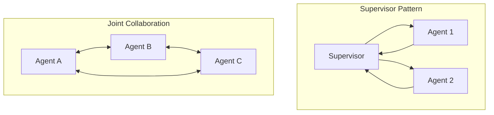

# 🏛️ Multi-Agent Architectures — Organizing the Collective
> **Level:** Core Engineering | **Language:** Hinglish | **Goal:** Aise systems ke design ko master karein jahan multiple specialized agents collaborate karke complex, large-scale problems ko solve karte hain.

---

## 🧭 1. Beginner-Friendly Hinglish Explanation
Multi-Agent Architecture ka matlab hai **"Team Management"**. 

Ek akela agent (Single Agent) bahut saare kaamo mein confuse ho sakta hai. Multi-Agent systems mein hum kaam ko divide kar dete hain:
- Ek agent **Research** karta hai.
- Ek agent **Code** likhta hai.
- Ek agent **Test** karta hai.
- Ek **Manager** sabko dekhta hai.

Aapko bas ye decide karna hai ki team kaise kaam karegi: "Line mein" (Sequential), "Group mein" (Collaborative), ya "Ek boss ke neeche" (Hierarchical).

---

## 🧠 2. Deep Technical Explanation
Multi-Agent Systems (MAS) **Separation of Concerns** par focus karte hain.
- **The Orchestrator:** Wo logic jo determine karta hai ki kaunsa agent agla bolega. Ye static (fixed code) ya dynamic (ek LLM Supervisor) ho sakta hai.
- **Shared State vs Isolated State:** Kya agents ek doosre ki full conversation history dekhte hain, ya sirf specific "Handoff" summaries?
- **Communication Topology:**
    - **Fully Connected:** Har agent har doosre agent se baat kar sakta hai.
    - **Hierarchical:** Agents sirf apne supervisor se baat karte hain.
    - **Sequential:** Agent A → Agent B → Agent C.
- **Frameworks:** CrewAI (Task-based), AutoGen (Conversation-based), aur LangGraph (State-graph based).

---

## 🏗️ 3. Architecture Diagrams


```mermaid
graph TD
    subgraph "Supervisor Pattern"
    S[Supervisor] --> A1[Agent 1]
    S --> A2[Agent 2]
    A1 --> S
    A2 --> S
    end
    
    subgraph "Joint Collaboration"
    B1[Agent A] <--> B2[Agent B]
    B2 <--> B3[Agent C]
    B3 <--> B1
    end
```

---

## 💻 4. Production-Ready Code Example (Basic Orchestrator)

```python
class Agent:
    def __init__(self, name, role):
        self.name = name
        self.role = role
    def work(self, task):
        return f"Result from {self.name} doing {self.role}: {task}"

def simple_orchestrator(query: str):
    # Hinglish Logic: Task ko divide karo aur sahi agents ko do
    researcher = Agent("R1", "Researching info")
    writer = Agent("W1", "Writing content")
    
    # Execution
    info = researcher.work(query)
    draft = writer.work(info)
    
    return draft

# print(simple_orchestrator("Write a history of AI."))
```

---

## 🌍 5. Real-World Use Cases
- **Software Agencies:** Coder, Reviewer, aur DevOps agents ki ek team jo full features build karti hai.
- **Content Studios:** Researcher, Script Writer, Voiceover, aur Editor agents jo videos produce karte hain.
- **Market Analysis:** Data Fetcher, Statistician, aur Report Writer agents jo stock trends analyze karte hain.

---

## ❌ 6. Failure Cases
- **Infinite Loops:** Agent A Agent B ko call karta hai, jo Agent A ko forever wapas call karta hai.
- **Goal Drift:** Agents aapas mein argue karne lagte hain aur original user query ko bhool jate hain.
- **State Corruption:** Do agents ek hi time par same shared state ko update karte hain, jisse inconsistent data ho jata hai.

---

## 🛠️ 7. Debugging Guide
- **Trace the Handshake:** Logs mein humesha dekhein: "Who passed what to whom?"
- **Visual Graph:** Team ke flow ko dekhne ke liye LangGraph visualizer jaise tools ka use karein.

---

## ⚖️ 8. Tradeoffs
- **Multi-Agent:** High modularity aur expertise par high latency aur complex debugging.
- **Single Agent:** Fast aur simple par context aur "Jack-of-all-trades" reasoning fatigue dwara limited.

---

## ✅ 9. Best Practices
- **Explicit Personas:** Har agent ko ek bahut clear aur alag role dein.
- **Atomic Handoffs:** Handoff ke waqt sirf wahi info bhejien jo agle agent ke liye zaruri ho.

---

## 🛡️ 10. Security Concerns
- **Privilege Escalation:** Ek low-privilege worker agent jo supervisor agent ko trick karke admin tools use karwa leta hai.
- **Cross-Agent Injection:** Ek compromised agent se clean agent par pass hone wala malicious input.

---

## 📈 11. Scaling Challenges
- **Latency Multiplier:** 5 agents = user ke liye 5x wait time. Jahan ho sake async/parallel execution ka use karein.

---

## 💰 12. Cost Considerations
- **Orchestration Overhead:** The "Management" calls consume a lot of tokens. Use smaller models for orchestration if possible.

---

## 📝 13. Interview Questions
1. **"Single vs Multi-Agent system mein decision factors kya hain?"**
2. **"Handoff mechanism production mein kaise implement karoge?"**
3. **"Multi-agent systems mein deadlocks kaise avoid karenge?"**

---

## ⚠️ 14. Common Mistakes
- **Too many agents:** 10 agents ka team banana simple task ke liye.
- **Vague Roles:** Agents ko same instructions dena.

---

## 🚀 15. Latest 2026 Industry Patterns
- **Agent Hierarchies:** Ek "CEO Agent" jo "Manager Agents" ko manage karta hai jo "Worker Agents" ko manage karte hain.
- **Dynamic Team Formation:** Ek aisa agent jo task ke liye zaroori specific skills ke basis par runtime par doosre agents ko "Hire" karta hai.

---

> **Expert Tip:** In Multi-Agent systems, **Communication is everything**. If your agents don't talk to each other correctly, they are just a bunch of lonely bots.
