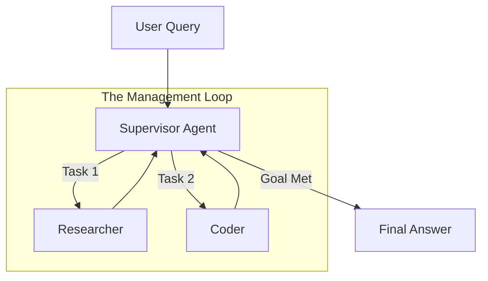

# 👨‍💼 Supervisor Agents — The Orchestrator Pattern
> **Level:** Core Engineering | **Language:** Hinglish | **Goal:** Master the Supervisor pattern where a central "Boss" agent manages a team of workers, delegating tasks and reviewing results.

---

## 🧭 1. Beginner-Friendly Hinglish Explanation
Supervisor Agent ka matlab hai **"Team ka Manager"**. 

Socho aap ek company chala rahe ho. Aapke paas ek Researcher hai aur ek Coder. Agar user pucha hai: "Ek news search karo aur uska python script banao." 
- **Supervisor** decide karega: "Pehle Researcher jayega news dhoondhne."
- Researcher kaam karke wapas Manager ko dikhayega.
- Manager phir Coder ko bolega: "Ab is news ke liye script likho."

Supervisor khud kaam nahi karta, wo sirf ye dekhta hai ki **"Kaunsa kaam kab aur kise dena hai"**.

---

## 🧠 2. Deep Technical Explanation
The Supervisor pattern centralizes the **Routing Logic** in a single LLM node.
- **Master Node (Supervisor):** Has access to the descriptions of all worker agents. It uses an LLM to decide the "Next" step: `Agent_A`, `Agent_B`, or `FINISH`.
- **Worker Nodes:** Specialized agents that execute a specific task and return their results back to the Supervisor.
- **State Flow:** The Supervisor is the only node that has a "Cyclic" edge back to itself from every worker. This ensures it stays in control.
- **State Redaction:** Workers shouldn't necessarily see everything. The Supervisor can "Clean" the state before passing it to a worker to save tokens.

---

## 🏗️ 3. Architecture Diagrams



---

## 💻 4. Production-Ready Code Example (LangGraph Supervisor)

```python
from typing import Literal
from pydantic import BaseModel

class SupervisorDecision(BaseModel):
    # Hinglish Logic: Supervisor decide karega agla banda kaun hai
    next_agent: Literal["researcher", "coder", "FINISH"]

def supervisor_node(state):
    # LLM logic to pick the next agent
    # res = llm.with_structured_output(SupervisorDecision).invoke(state['messages'])
    return {"next": "researcher"}

# Graph edges setup
# workflow.add_conditional_edges("supervisor", lambda x: x["next"], 
#    {"researcher": "research_node", "coder": "code_node", "FINISH": END})
```

---

## 🌍 5. Real-World Use Cases
- **Customer Support Hubs:** A supervisor identifies if a ticket is about "Refunds" or "Tech Issues" and sends it to the right specialist.
- **Content Agencies:** A manager agent overseeing a writer and an editor to produce a 100% accurate blog post.
- **Scientific R&D:** A supervisor managing multiple simulators to find the best material for a battery.

---

## ❌ 6. Failure Cases
- **Micromanagement:** Supervisor itni zyada baatein karta hai ki system slow ho jata hai.
- **Manager Blindness:** Supervisor worker ki galti nahi pakad pata aur "Final Answer" de deta hai.
- **Decision Loop:** Supervisor worker A ko kaam bhejta hai, worker A result deta hai, par supervisor phir se worker A ko hi wahi kaam bhej deta hai.

---

## 🛠️ 7. Debugging Guide
- **Trace the 'Next' Decision:** Har turn par dekhein ki supervisor ne "Next" kyu choose kiya.
- **Worker Independence:** Check karein ki workers bina supervisor ke interupt kiye apna kaam pura kar rahe hain ya nahi.

---

## ⚖️ 8. Tradeoffs
- **Supervisor:** Dynamic and smart but slow (every step needs a manager call) and expensive.
- **Hard-coded Routing:** Fast and cheap but can't handle unexpected user requests.

---

## ✅ 9. Best Practices
- **Clear Worker Specs:** Supervisor ko har worker ke baare mein bahut clear info dein: "Coder ONLY writes code, doesn't search."
- **Small Model for Workers:** Management smarter model se karein, execution saste model se.

---

## 🛡️ 10. Security Concerns
- **Supervisor Hijacking:** User supervisor ko convince kar leta hai ki wo hi boss hai, aur system ki safety limits bypass kar leta hai.

---

## 📈 11. Scaling Challenges
- **Throughput:** Supervisor bottlenecks the entire team. If the supervisor is slow, everyone waits.

---

## 💰 12. Cost Considerations
- **Double Tokens:** Every worker output is processed twice—once by the worker and once by the supervisor.

---

## 📝 13. Interview Questions
1. **"Supervisor pattern vs Sequential chain mein kya difference hai?"**
2. **"Supervisor decisions ko structured output se kaise protect karenge?"**
3. **"Hierarchy in agents production mein kaise implement karoge?"**

---

## ⚠️ 14. Common Mistakes
- **Dumb Supervisor:** Weak model use karna management ke liye.
- **Ignoring Feedback:** Worker ne kaha "I can't find this", par supervisor ne phir wahi task bhej diya.

---

## 🚀 15. Latest 2026 Industry Patterns
- **Multi-Level Supervision:** A "Department Manager" supervising 3 agents, who reports to a "CEO Agent".
- **Self-Improving Supervisor:** A manager that tracks which workers are "Failing" and updates their system prompts to fix them.

---

> **Expert Tip:** A Supervisor is the **Brain** of the team. If the brain is confused, the team is useless.
