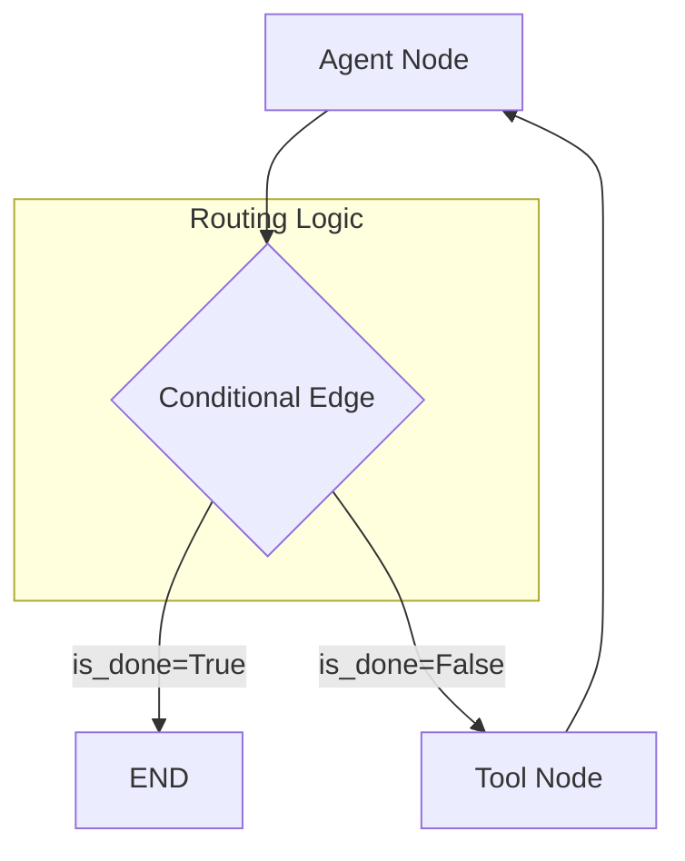

# 🔀 Conditional Edges Logic — The Decision Maker
> **Level:** Core Engineering | **Language:** Hinglish | **Goal:** Master the logic that allows LangGraph to dynamically route execution between nodes based on LLM outputs or state variables.

---

## 🧭 1. Beginner-Friendly Hinglish Explanation
Conditional Edges ka matlab hai **"Raste ka Chauraha (Intersection)"**. 

Imagine aap ek maze (bhul-bhulaiya) mein ho. Jab aap ek point par pahuchte ho, toh aapko decide karna hai: "Left jaun ya Right?"
- **Static Edge:** Humesha fix hota hai (A ke baad B hi aayega).
- **Conditional Edge:** AI decide karta hai state dekh kar. 
Example:
- Agar tool ne error diya, toh "Error Handling" node par jao.
- Agar answer mil gaya, toh "End" par jao.
- Agar aur info chahiye, toh "Search" node par wapas jao.

Ye hi wo cheez hai jo AI ko "Agentic" banati hai kyunki wo khud apna rasta chunta hai.

---

## 🧠 2. Deep Technical Explanation
Conditional edges are functions that take the **State** as input and return the **Name of the next node** (or a list of names).
- **Routing Function:** A pure Python function. It can use simple `if/else` logic or call an LLM to make a complex decision.
- **Mapping:** A dictionary that maps the router's output to the actual graph nodes.
    - Example: `{"tech": "tech_node", "billing": "billing_node"}`.
- **The Router Node:** Often, we use a "Router LLM" with structured output (Pydantic) to ensure the returned string matches one of our mapping keys.
- **Non-deterministic Routing:** Allowing the agent to decide when it's "Done" vs when it needs to "Retry".

---

## 🏗️ 3. Architecture Diagrams



---

## 💻 4. Production-Ready Code Example (LLM-based Router)

```python
from typing import Literal
from pydantic import BaseModel

# 1. Define the possible paths
class RouterDecision(BaseModel):
    # Hinglish Logic: LLM ko batao sirf in 2 options mein se choose kare
    next_step: Literal["continue", "end"]

# 2. The routing function
def should_continue(state):
    last_message = state['messages'][-1]
    if "FINAL ANSWER" in last_message.content:
        return "end"
    return "continue"

# 3. Add to Graph
# workflow.add_conditional_edges(
#    "agent_node", 
#    should_continue, 
#    {"continue": "tool_node", "end": END}
# )
```

---

## 🌍 5. Real-World Use Cases
- **Self-Correction:** If the code execution fails, route back to the "Fixer" agent.
- **Triage:** Routing a customer query to "Sales", "Support", or "Billing" based on the text.
- **Loop Termination:** Ending a search loop after 3 attempts or when enough info is found.

---

## ❌ 6. Failure Cases
- **Invalid Route:** Router ne "refund" return kiya par graph mein "refund" naam ka koi node hi nahi hai.
- **Infinite Looping:** Condition hamesha "continue" return kar rahi hai, jisse tokens aur paise barbad ho rahe hain.
- **LLM Hallucination:** Router LLM ne galat path choose kar liya because of a confusing user query.

---

## 🛠️ 7. Debugging Guide
- **Log the Decision:** Har conditional edge function ke andar `print(f"Router decided: {decision}")` karein.
- **Test with Mock States:** Routing function ko individually test karein with different state inputs.

---

## ⚖️ 8. Tradeoffs
- **LLM Routing:** Very smart and flexible but slow and adds to the cost.
- **Rule-based Routing (Regex/If-Else):** Very fast and free but "Dumb" and can easily break with minor text changes.

---

## ✅ 9. Best Practices
- **Default Path:** Humesha ek "else" ya default path rakhein taaki graph kabhi "Stuck" na ho.
- **Structured Output:** Router LLM ke liye hamesha Pydantic classes use karein to guarantee valid routes.

---

## 🛡️ 10. Security Concerns
- **Intent Hijacking:** Attacker query aisi banata hai jo router ko hamesha "Admin" path par bhej de.

---

## 📈 11. Scaling Challenges
- **Complex Graphs:** 20-30 conditional edges wale graphs ko maintain karna aur unki logic ko track karna mushkil ho jata hai.

---

## 💰 12. Cost Considerations
- **Decision Token Cost:** Every conditional check is a potential LLM call. Use a small, cheap model (GPT-4o-mini) for routing.

---

## 📝 13. Interview Questions
1. **"Conditional edges aur Static edges mein difference kya hai?"**
2. **"Router LLM reliability production mein kaise ensure karenge?"**
3. **"Graph mein infinite loop detection kaise implement karoge?"**

---

## ⚠️ 14. Common Mistakes
- **Typos in Mapping:** `{"continue": "tools_node"}` (extra 's') jabki node ka naam `tool_node` tha.
- **No Progress Tracking:** Router ko ye na batana ki kitne loops ho chuke hain, jisse wo loop mein phasa rahe.

---

## 🚀 15. Latest 2026 Industry Patterns
- **Multi-Factor Routing:** Router considers not just the text, but also the remaining token budget and latency constraints.
- **Semantic Routers:** Using embeddings to find the closest "Path Description" instead of an LLM call for faster decisions.

---

> **Expert Tip:** Conditional logic is the **GPS** of your agent. If the GPS is wrong, you'll never reach the destination.
