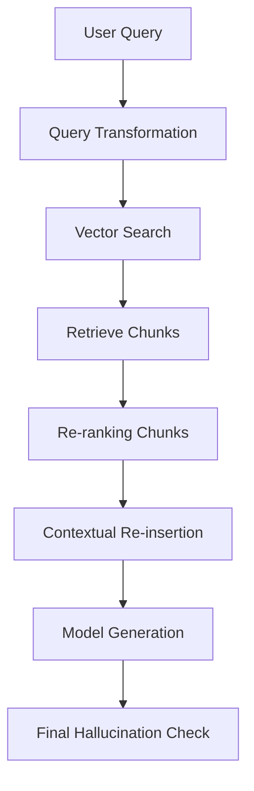

# 🦜 LangChain & LangGraph: AI Engineering (Expert Guide)
> **Level:** Beginner → Expert | **Language:** Hinglish | **Goal:** Build complex Agentic workflows & RAG pipelines

---

## 📋 Is Guide Se Kya Seekhoge

| Section | Topic | Why? |
|---------|-------|------|
| 1. LangChain Internals | LCEL, Prompt Templates, Runnables | Build chains fast |
| 2. Memory Deep Dive | Short-term vs Long-term persist | User context |
| 3. Tool Calling & Agents | Zero-shot, ReAct, Self-Correction | Smart automation |
| 4. LangGraph Mastering | State Machines & Loops | Next-gen agents |
| 5. Advanced RAG | VectorSearch, Re-ranking, Dense | Fast retrieval |
| 6. Mega Project | PDF Chatbot with persistent State | Production logic |

---

## 1. 🏗️ LangChain Internals: LCEL (LangChain Expression Language)

LangChain ka latest standard **LCEL** hai. Ye `pipe` (`|`) operator use karke clean, readable aur parallelizable chains banata hai.

### A. Simple Sequence
Input -> Prompt -> LLM -> Output Parser

```python
from langchain_openai import ChatOpenAI
from langchain_core.prompts import ChatPromptTemplate
from langchain_core.output_parsers import StrOutputParser

model = ChatOpenAI(model="gpt-4o")
prompt = ChatPromptTemplate.from_template("Translate {text} to Hinglish.")
parser = StrOutputParser()

# LangChain Expression Language (LCEL)
chain = prompt | model | parser

# response = chain.invoke({"text": "The weather is very hot today."})
# print(response) # "Aaj weather bahut hot hai."
```

---

## 2. 💾 Memory: Keep the Context Alive

AI by default bhool jata hai pichle kya baat hui thi. Hum memory use karke use brain dete hain.

### A. Short-term Memory (ConversationBufferMemory)
```python
from langchain.memory import ConversationBufferMemory

memory = ConversationBufferMemory(return_messages=True)
memory.save_context({"input": "Hi"}, {"output": "Hello! How can I help?"})
# history = memory.load_memory_variables({})
```

---

## 3. 🔧 Tool Calling & ReAct Agents

Agent khud decide karta hai **Kaunsa tool** kab use karna hai.

### A. Custom Tool Definition
```python
from langchain.tools import tool

@tool
def google_search(query: str) -> str:
    """Useful to search real-time info from the internet."""
    # Simulation: Real API call to Serper/Google Search
    return f"Search results for: {query}"

tools = [google_search]
# model = model.bind_tools(tools)
```

### B. ReAct Loop Concept
1. **Thought:** Socho kya karna hai.
2. **Action:** Tool call karo.
3. **Observation:** Result dekho aur goal se match karo.
4. **Repeat** (agar goal complete nahi hua).

---

## 4. 🕸️ LangGraph: Mastering Agentic Cycles

LangGraph stateful workflows allow karta hai jahan loops (cycles) ho sakte hain. Normal LangChain chains cycles manage nahi kar patien.

### A. Graph Nodes & Edges
- **Nodes:** Functions/Tasks (Agent, Tools, Finalizer).
- **Edges:** Rasta (Node A se Node B).
- **State:** Shared memory between all nodes.

```python
from typing import Annotated, TypedDict
from langgraph.graph import StateGraph, START, END

# Define shared stage schema
class GraphState(TypedDict):
    messages: Annotated[list[str], "Messages in the thread"]

# Create Node functions
def agent_node(state: GraphState):
    # Model reasoning logic
    return {"messages": state["messages"] + ["AI Thinking..."]}

# Design Graph
workflow = StateGraph(GraphState)
workflow.add_node("chatbot", agent_node)

workflow.add_edge(START, "chatbot")
workflow.add_edge("chatbot", END)

# Compile
# app = workflow.compile()
```

---

## 5. 📚 Advanced RAG (Retrieval Augmented Generation)

Sirf vector store load karna RAG nahi hai. Production mein multiple steps hote hain.



---

## 🏗️ Mega Project: PDF Research Agent with Memory

Isme hum LangGraph logic se PDF chatbot banayenge jo questions ke sources check karega.

```python
# Project Components overview logic
# 1. PdfLoader (PyPDF) se text load
# 2. TextSplitter (RecursiveCharacterTextSplitter) chunks
# 3. OpenAIEmbeddings + ChromaDB vector store
# 4. LangGraph state logic (search -> analyze -> answer)
# 5. Persistent database for session storage
```

---

## 🧪 Quick Test — Professional Level Check!

### Q1: LCEL vs Classic Chains
LCEL use karne ka sabse bada advantage kya hai?
<details><summary>Answer</summary>
LCEL **parallel execution** (multiple LLM calls same time), **streaming support**, aur code transparency (debuggable) improve karta hai.
</details>

### Q2: Agents logic
Agar agent tool result ke baad loop mein fas jaye, toh use kaise control karenge?
<details><summary>Answer</summary>
1. `max_iterations` parameter set karein.
2. `self-correction` logic add karein prompt mein (e.g. "Don't repeat same tool twice").
3. LangGraph use karein jahan manual interruption (Human-in-the-loop) lagaya ja sake.
</details>

---

## 🔗 Resources
- [LangChain Official Cookbook](https://github.com/langchain-ai/langchain/tree/master/cookbook)
- [LangGraph Deep Dive Tutorials](https://langchain-ai.github.io/langgraph/)
- [Pinecone RAG Mastery](https://www.pinecone.io/learn/retrieval-augmented-generation/)
