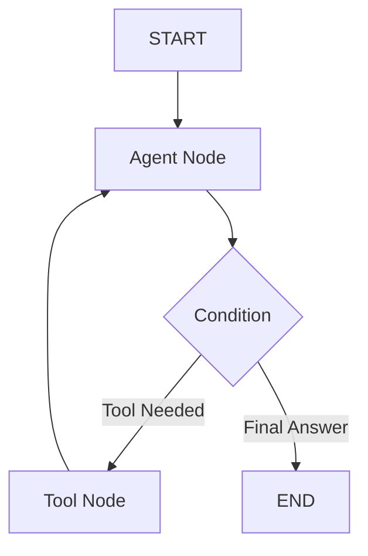

# 🕸️ LangGraph Fundamentals — The New Standard for Agents
> **Level:** Core Engineering | **Language:** Hinglish | **Goal:** Master the fundamental concepts of LangGraph: Nodes, Edges, State, and Cycles to build reliable autonomous agents.

---

## 🧭 1. Beginner-Friendly Hinglish Explanation
LangGraph ka matlab hai **"AI ka Flowchart"**. 

Ab tak humne LangChain mein "Chains" (Seedhi line) dekhi thi. Lekin agents hamesha seedhi line mein kaam nahi karte. Wo loops mein kaam karte hain:
- "Tool chalao -> Result dekho -> Phir se tool chalao."
LangGraph humein ek **Graph (Jal)** banane deta hai jisme AI peeche bhi ja sakta hai (Cycles).

Ye 2026 mein agents banane ka **Industry Standard** hai kyunki ye aapko "Fine-grained Control" deta hai.

---

## 🧠 2. Deep Technical Explanation
LangGraph is a library for building stateful, multi-actor applications with LLMs.
- **The State:** A shared dictionary or Pydantic object that represents the current world-view. Every node in the graph reads from and writes to this state.
- **Nodes:** Simple Python functions that take the state, do some work (like calling an LLM), and return the updated state.
- **Edges:** Define the transition between nodes.
    - **Normal Edges:** Always go from A to B.
    - **Conditional Edges:** Use an LLM to decide whether to go to B, C, or END.
- **Cycles:** The ability to loop back to a previous node. This is what enables "Self-correction" and "Iterative Search".
- **Compilation:** Converting the graph into a "Runnable" that can be invoked like any other LangChain component.

---

## 🏗️ 3. Architecture Diagrams



---

## 💻 4. Production-Ready Code Example (Simple Agentic Graph)

```python
from langgraph.graph import StateGraph, START, END

# 1. Define State
class State(dict):
    messages: list

# 2. Define Node Logic
def call_model(state: State):
    # LLM logic here
    return {"messages": state["messages"] + ["Model Response"]}

# 3. Define Graph Structure
builder = StateGraph(State)
builder.add_node("model", call_model)

builder.add_edge(START, "model")
builder.add_edge("model", END)

# 4. Compile
graph = builder.compile()

# res = graph.invoke({"messages": ["Hi"]})
# print(res)
```

---

## 🌍 5. Real-World Use Cases
- **Self-Correcting Code Agents:** Node A writes code, Node B runs tests. If tests fail, it goes back to Node A.
- **Research Agents:** Searching for info in a loop until enough data is collected.
- **Multi-step Reasoning:** Breaking a complex math problem into nodes for each logical step.

---

## ❌ 6. Failure Cases
- **Infinite Cycles:** Graph ek hi node mein phasa hua hai (No exit condition).
- **State Overwrite:** Do nodes same state key ko galat data se overwrite kar dete hain.
- **Graph Complexity:** Itne saare nodes aur edges ki debug karna mushkil ho jaye.

---

## 🛠️ 7. Debugging Guide
- **Breakpoint Debugging:** LangGraph allows you to set "Interrupts" at any node to inspect the state.
- **Visualizer:** Use `graph.get_graph().draw_mermaid()` to see if your logic matches your drawing.

---

## ⚖️ 8. Tradeoffs
- **LangGraph:** Perfect for complex, iterative, and stateful agents.
- **LangChain Chains:** Better for simple, one-off tasks without loops.

---

## ✅ 9. Best Practices
- **Use TypedDict for State:** Humesha state ka schema define karein taaki type errors na hon.
- **Add 'Max Iterations':** Conditional edges mein hamesha ek counter rakhein taaki loop 10 baar ke baad band ho jaye.

---

## 🛡️ 10. Security Concerns
- **Cycle Exploits:** Attacker query aisi likhta hai jo agent ko infinite loop mein phasa de to drain your API credits.

---

## 📈 11. Scaling Challenges
- **Serialization:** Graph state ko database mein save karna aur load karna (Check-pointing) in high-speed apps.

---

## 💰 12. Cost Considerations
- **Turn-based Billing:** Every edge transition is a potential LLM call. Monitor the number of "Hops" per query.

---

## 📝 13. Interview Questions
1. **"LangChain aur LangGraph mein difference kya hai?"**
2. **"Conditional edge ka role kya hota hai graph mein?"**
3. **"Cycles in LangGraph: Unhe handle kaise karte hain?"**

---

## ⚠️ 14. Common Mistakes
- **Mutating State Directly:** State ko return karne ki jagah function ke andar modify karna (Always return the update).
- **Missing START/END:** Graph ko start ya khatam karne ka rasta na dena.

---

## 🚀 15. Latest 2026 Industry Patterns
- **Human-in-the-loop Graphs:** Graphs that automatically pause at a specific node and wait for a human to click "Approve" before continuing.
- **Graph as a Service:** Deploying agentic graphs as independent microservices.

---

> **Expert Tip:** LangGraph turns a "Stupid Chain" into a **"Smart Workflow"**. If your agent needs to "Think again", you need LangGraph.
